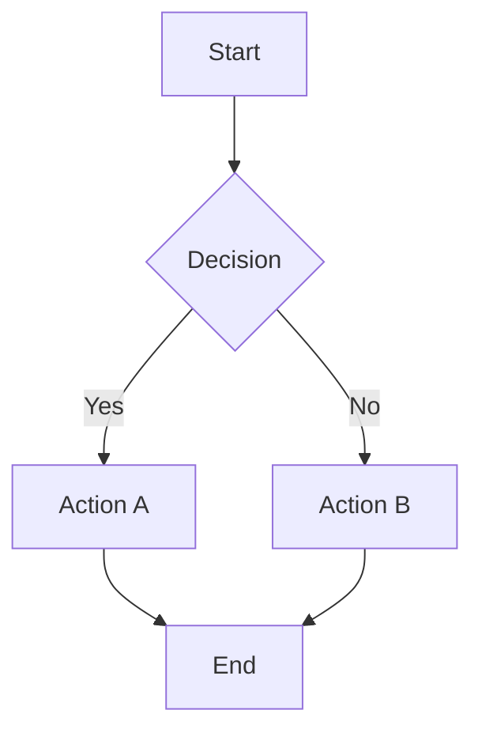
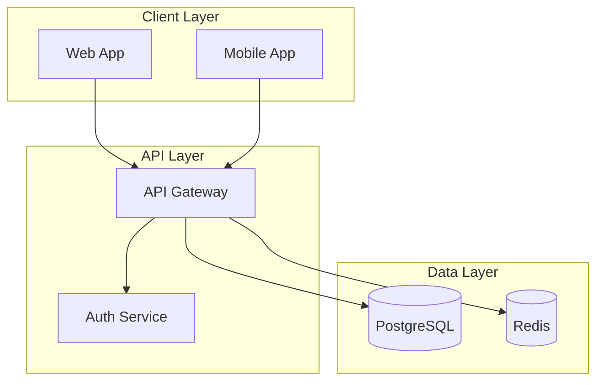
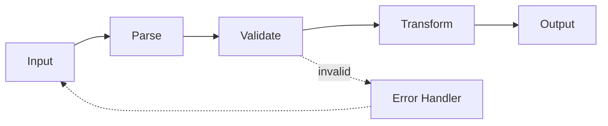
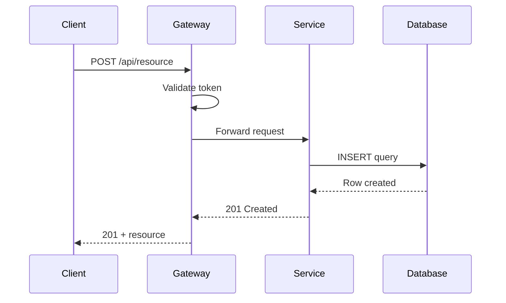
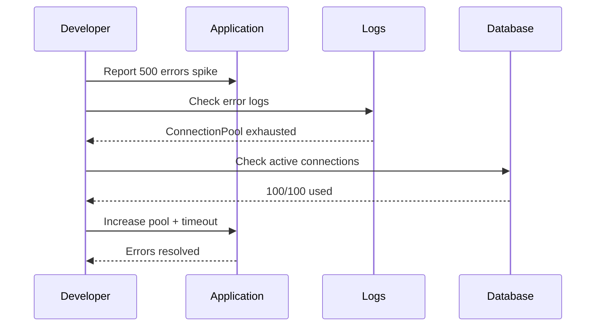
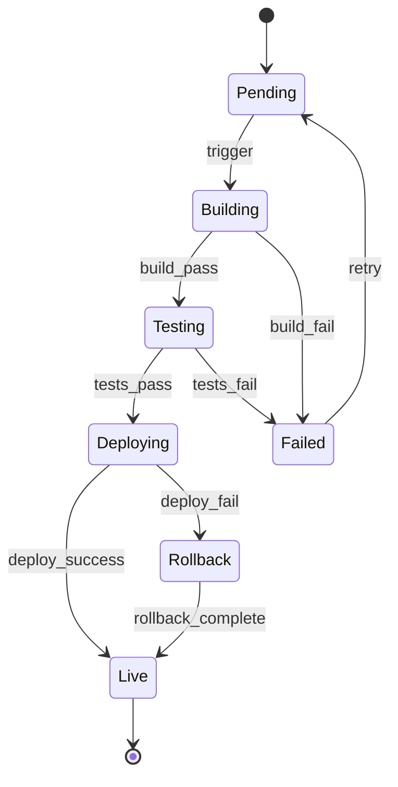
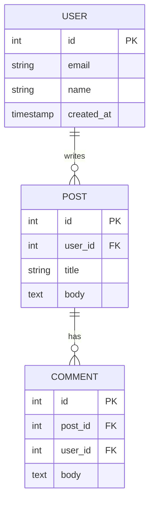
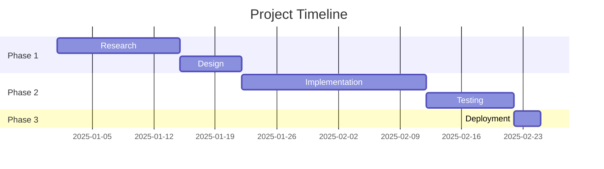
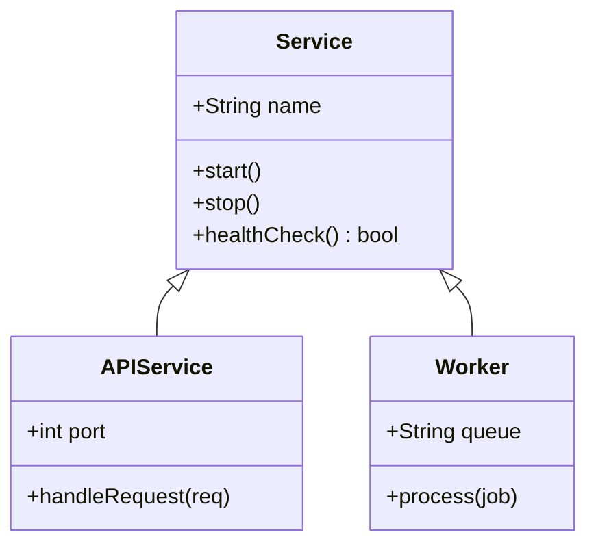

<mermaid_reference>

<syntax_rules>
**Critical Rules — Violating any causes render failures:**

1. **Node IDs**: Alphanumeric and underscores only. No spaces, hyphens, or dots.
   - GOOD: `nodeA`, `step_1`, `apiGateway`
   - BAD: `node-a`, `step 1`, `api.gateway`

2. **Text labels**: Always use square brackets `[Text]` or quotes inside shapes.
   - GOOD: `A[API Gateway]`, `B["Rate Limiter (500 req/s)"]`
   - BAD: `A(API Gateway)` in flowchart (use brackets)

3. **No nested quotes**: Use HTML entity `&quot;` or switch bracket styles.
   - GOOD: `A["Config says &quot;enabled&quot;"]`
   - BAD: `A["Config says "enabled""]`

4. **Arrow syntax**: `-->` solid, `-.->` dashed, `==>` thick. Space before labels.
   - GOOD: `A -->|label| B`
   - BAD: `A-->|label|B`

5. **Subgraph IDs**: Same rules as node IDs — no spaces, no special chars.
   - GOOD: `subgraph apiLayer[API Layer]`
   - BAD: `subgraph API Layer`

6. **Direction**: Declare after graph type: `flowchart TD`, `graph LR`.

7. **Escaping**: Parentheses in labels need quotes: `A["Process (main)"]`
</syntax_rules>

<flowchart_patterns>
**Basic decision flow:**

**Multi-layer architecture:**

**Pipeline / workflow:**

**Before/After**: Generate TWO separate mermaid blocks labeled "Before" and "After." Don't combine in one graph.
</flowchart_patterns>

<sequence_patterns>
**API request flow:**

**Debugging investigation:**

</sequence_patterns>

<state_diagram_patterns>

</state_diagram_patterns>

<er_diagram_patterns>

</er_diagram_patterns>

<gantt_patterns>

</gantt_patterns>

<class_diagram_patterns>

</class_diagram_patterns>

<common_pitfalls>
| Problem | Cause | Fix |
|---------|-------|-----|
| Won't render | Special chars in node ID | Alphanumeric + underscore only |
| Labels cut off | Text too long | Shorten or use line breaks with ` ` |
| Arrows crossing | Poor node ordering | Reorder nodes, switch LR vs TD |
| Subgraph overlap | Node in multiple subgraphs | Each node in exactly one subgraph |
| Quotes break | Nested quotes | Use `&quot;` entity |
| C4 fails | Old Mermaid version | Fall back to styled flowchart |
| Sequence participant collides | Duplicate alias | Unique aliases for all participants |
</common_pitfalls>

</mermaid_reference>
