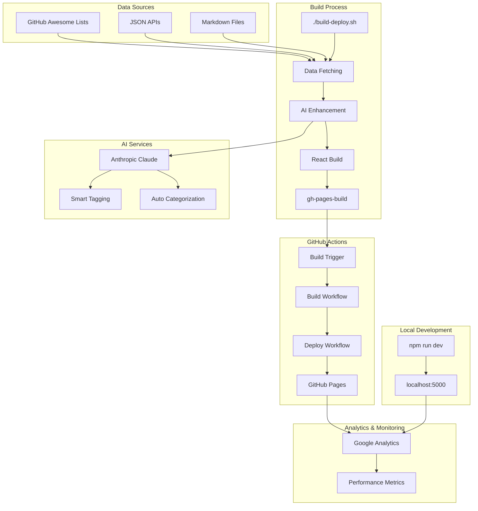
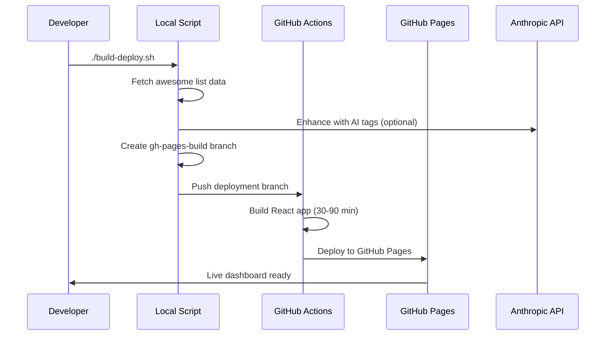

# Awesome List Dashboard

Transform any GitHub awesome list into a sophisticated, interactive web dashboard with AI-powered enhancements, advanced search, and modern UI components.

## System Architecture



## Features

- **Universal Awesome List Support** - Works with any GitHub awesome list format
- **AI-Powered Enhancement** - Smart tagging and categorization ($0.25-$15/month)
- **Advanced Search & Filtering** - Real-time fuzzy search with category filters
- **Mobile-First Design** - Touch-optimized responsive interface
- **Modern UI Components** - shadcn/ui with dark mode themes
- **Analytics Integration** - Google Analytics 4 tracking ready
- **Static Deployment** - GitHub Pages with automated builds
- **Performance Optimized** - Fast loading with code splitting
- **Keyboard Shortcuts** - Quick navigation with `/` for search

## Live Demo

Visit the live dashboard: [https://krzemienski.github.io/awesome-list-site](https://krzemienski.github.io/awesome-list-site)

## Quick Start

### Deploy Your Own Awesome List

1. **Fork this repository**
2. **Configure your list** in `awesome-list.config.yaml`:
   ```yaml
   site:
     title: "Your Awesome List Dashboard"
     url: "https://yourusername.github.io/awesome-list-site"
   source:
     url: "https://raw.githubusercontent.com/username/awesome-list/main/README.md"
     format: "markdown"  # or "json" for structured data
   features:
     ai_tags: true       # Requires ANTHROPIC_API_KEY
   ```
3. **Set up repository secrets** (optional but recommended):
   - `ANTHROPIC_API_KEY` - AI features ($0.25-$15/month)
   - `GA_MEASUREMENT_ID` - Google Analytics tracking
4. **Deploy**:
   ```bash
   ./build-deploy.sh
   ```
5. **Enable GitHub Pages** in repository settings → Pages → Source: GitHub Actions

Your dashboard will be live at: `https://yourusername.github.io/awesome-list-site`

### Local Development

```bash
npm install
npm run dev
# Visit http://localhost:5000
```

## Deployment Workflow



## Technology Stack

- **Frontend**: React 18, TypeScript, Tailwind CSS
- **UI Components**: Radix UI, shadcn/ui
- **Build System**: Vite, ESBuild (with 2-hour timeout handling)
- **AI Enhancement**: Anthropic Claude (Haiku/Sonnet/Opus)
- **Deployment**: GitHub Actions multi-job workflow
- **Hosting**: GitHub Pages
- **Analytics**: Google Analytics 4

## Development

### Local Development
```bash
npm install
npm run dev
```

### Static Build Testing
```bash
tsx scripts/build-static.ts
VITE_STATIC_BUILD=true npm run build
npm run preview
```

### Test Deployment System
```bash
tsx scripts/test-deployment.ts
```

## Configuration

The dashboard is configured via `awesome-list.config.yaml`:

```yaml
site:
  title: "Awesome Video Dashboard"
  description: "A curated collection of awesome video resources"
  url: "https://krzemienski.github.io/awesome-list-site"

source:
  url: "https://raw.githubusercontent.com/krzemienski/awesome-video/master/contents.json"
  refresh_interval: 3600

features:
  search: true
  categories: true
  analytics_dashboard: true
  pagination: true
  items_per_page: 24
```

## Analytics Tracking

Comprehensive analytics implementation tracks:
- Page views and user sessions
- Search queries and filter usage
- Resource clicks and category navigation
- Mobile interactions and touch events
- Performance metrics and Core Web Vitals
- Error tracking and API response times

## Deployment Process

The deployment uses a two-stage optimized build system:

### Local Script Deployment
```bash
./build-deploy.sh
```
- Fetches latest data from your awesome list
- Creates deployment branch with built assets
- Triggers GitHub Actions for containerized build

### GitHub Actions Build
- Builds React application with extended timeout (up to 2 hours)
- Handles complex dependency compilation automatically
- Deploys to GitHub Pages when complete

**Total deployment time**: 30-90 minutes depending on build complexity

## Documentation

- [SETUP-GUIDE.md](SETUP-GUIDE.md) - Complete setup guide for any awesome list
- [AI-FEATURES.md](AI-FEATURES.md) - AI-powered tagging and categorization ($0.25-$15/month)
- [ENVIRONMENT-VARIABLES.md](ENVIRONMENT-VARIABLES.md) - Configuration and API keys
- [DEVELOPER-BUILD-GUIDE.md](DEVELOPER-BUILD-GUIDE.md) - Local development and deployment
- [README-DEPLOYMENT.md](README-DEPLOYMENT.md) - Quick deployment reference

## Data Source

This dashboard uses the [awesome-video](https://github.com/krzemienski/awesome-video) curated list, which contains video-related tools and resources organized by:

- Video Processing Libraries
- Streaming Technologies
- Codecs and Formats
- Players and Frameworks
- APIs and Services
- Learning Resources

Data is automatically refreshed on each deployment to ensure the latest resources are always available.

## Contributing

1. Fork the repository
2. Create a feature branch
3. Make your changes
4. Test with `tsx scripts/test-deployment.ts`
5. Submit a pull request

## License

MIT License - see LICENSE file for details

## Acknowledgments

- [awesome-video](https://github.com/krzemienski/awesome-video) - Data source and curation
- [Sindre Sorhus](https://github.com/sindresorhus/awesome) - Awesome list format
- Shadcn/ui and Radix UI - Component libraries