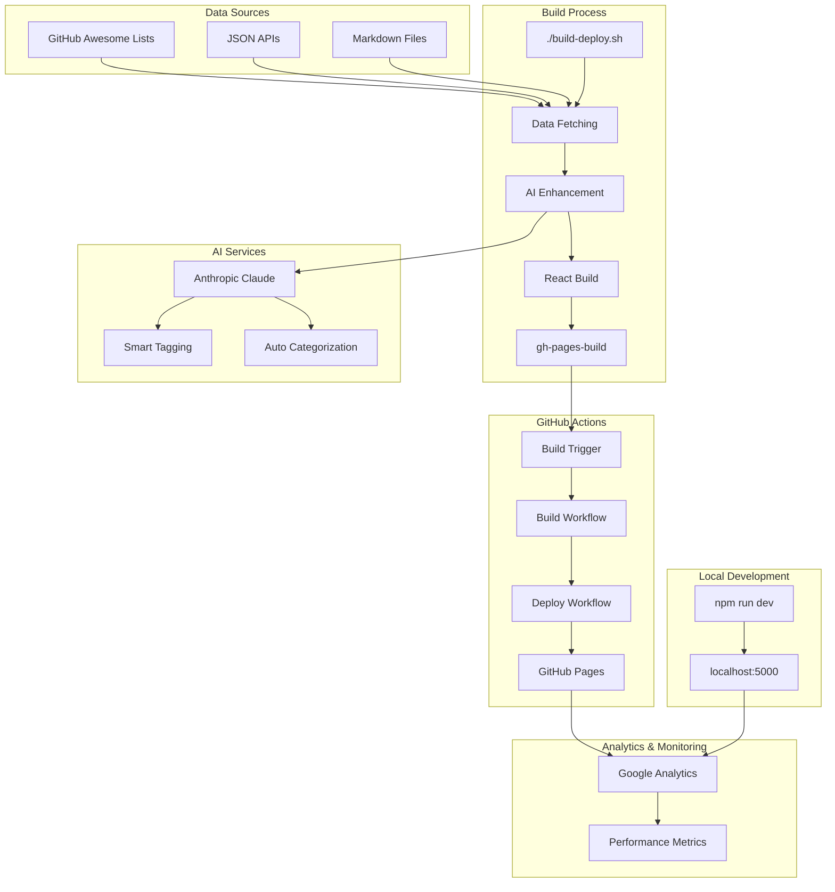
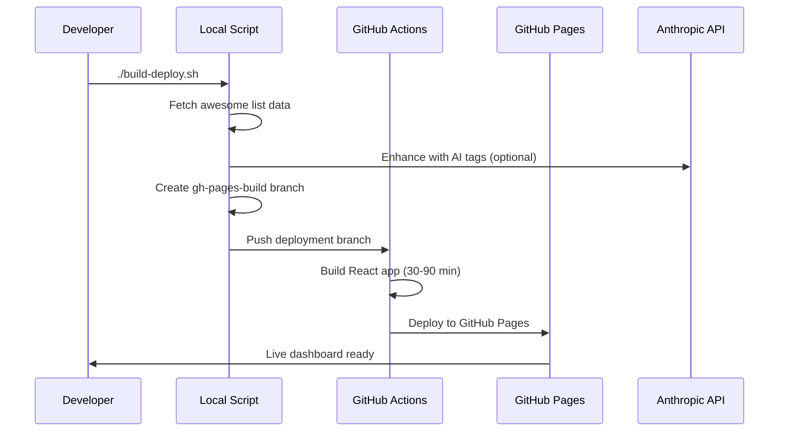
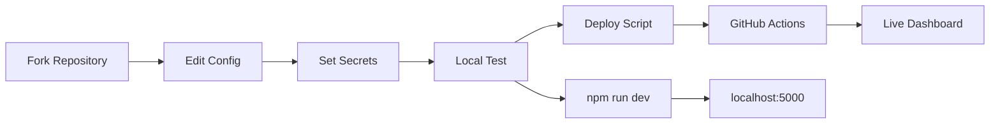

# Awesome List Dashboard

Transform any GitHub awesome list into a sophisticated, interactive web dashboard with AI-powered enhancements, advanced search, and modern UI components.

## System Architecture



## Features

- **Universal Awesome List Support** - Works with any GitHub awesome list format
- **AI-Powered Enhancement** - Smart tagging and categorization ($0.25-$15/month)
- **Advanced Search & Filtering** - Real-time fuzzy search with category filters
- **Mobile-First Design** - Touch-optimized responsive interface
- **Modern UI Components** - shadcn/ui with dark mode themes
- **Analytics Integration** - Google Analytics 4 tracking ready
- **Static Deployment** - GitHub Pages with automated builds
- **Performance Optimized** - Fast loading with code splitting
- **Keyboard Shortcuts** - Quick navigation with `/` for search

## Live Demo

Visit the live dashboard: [https://krzemienski.github.io/awesome-list-site](https://krzemienski.github.io/awesome-list-site)

## Quick Start

### Deploy Your Own Awesome List

### Interactive Setup (Recommended)

For new projects, use the interactive configuration wizard:

```bash
npx tsx scripts/init-project.ts
```

The wizard provides:
- Step-by-step project configuration
- Popular awesome list selection from curated options
- Theme and feature customization
- Environment variable guidance
- Automatic initial deployment

### Manual Setup

1. **Fork this repository**
2. **Configure your list** in `awesome-list.config.yaml`:
   ```yaml
   site:
     title: "Your Awesome List Dashboard"
     url: "https://yourusername.github.io/awesome-list-site"
   source:
     url: "https://raw.githubusercontent.com/username/awesome-list/main/README.md"
     format: "markdown"  # or "json" for structured data
   features:
     ai_tags: true       # Requires ANTHROPIC_API_KEY
   ```
3. **Set up repository secrets** (optional but recommended):
   - `ANTHROPIC_API_KEY` - AI features ($0.25-$15/month)
   - `GA_MEASUREMENT_ID` - Google Analytics tracking
4. **Deploy**:
   ```bash
   npx tsx scripts/build-and-deploy.ts
   ```
5. **Enable GitHub Pages** in repository settings → Pages → Source: GitHub Actions

Your dashboard will be live at: `https://yourusername.github.io/awesome-list-site`

### Local Development

```bash
npm install
npm run dev
# Visit http://localhost:5000
```

## Deployment Workflow



## Technology Stack

- **Frontend**: React 18, TypeScript, Tailwind CSS
- **UI Components**: Radix UI, shadcn/ui
- **Build System**: Vite, ESBuild (with 2-hour timeout handling)
- **AI Enhancement**: Anthropic Claude (Haiku/Sonnet/Opus)
- **Deployment**: GitHub Actions multi-job workflow
- **Hosting**: GitHub Pages
- **Analytics**: Google Analytics 4

## Primary Use Case: Awesome Video Dashboard

This platform was specifically designed for the [awesome-video](https://github.com/krzemienski/awesome-video) curated list, which contains 2,000+ video-related tools and resources. The awesome-video list provides structured JSON data making it ideal for rich dashboard features.

### Awesome Video Features
- **2,000+ Video Resources** - Comprehensive video tools collection
- **Structured Categories** - Video processing, streaming, codecs, players
- **AI-Enhanced Tags** - Smart categorization for video technologies
- **JSON Data Format** - Optimized for dashboard functionality
- **Regular Updates** - Curated by video industry professionals

### Video-Specific Categories
- **Video Processing** - FFmpeg, transcoding tools, format converters
- **Streaming Technologies** - HLS, DASH, WebRTC, live streaming
- **Codecs & Formats** - H.264, H.265, VP9, AV1, container formats
- **Video Players** - Web players, mobile SDKs, custom implementations
- **Editing Tools** - Timeline editors, effects, post-production
- **APIs & Services** - Video APIs, cloud processing, CDNs

## Configuration Examples

### 1. Awesome Video Dashboard (Primary Example)

```yaml
# awesome-list.config.yaml
site:
  title: "Awesome Video Dashboard"
  description: "A curated collection of video tools, libraries, and technologies for developers and creators"
  url: "https://yourusername.github.io/awesome-video-dashboard"
  author: "Your Name"

source:
  # Uses structured JSON format for rich features
  url: "https://raw.githubusercontent.com/krzemienski/awesome-video/master/contents.json"
  format: "json"
  refresh_interval: 3600

theme:
  default: "dark"
  primary_color: "#dc2626"  # Video industry red

analytics:
  google_analytics: "G-YOUR-MEASUREMENT-ID"

features:
  search: true
  categories: true
  ai_tags: true           # Generates video-specific tags
  ai_descriptions: true   # Enhanced descriptions for video tools
  analytics_dashboard: true
  pagination: true
  items_per_page: 24
  resource_previews: true

# AI will generate tags like:
# "ffmpeg", "h264", "streaming", "transcoding", "webrtc", "hls"
```

**AI Enhancement for Video**: The system understands video terminology and generates relevant tags like `codec`, `streaming`, `transcoding`, `live-video`, `webrtc`, `hls`, `dash`.

**Expected Monthly AI Cost**: $3 (Sonnet) for 2,000 video resources

### 2. Awesome Python Dashboard

```yaml
site:
  title: "Awesome Python Dashboard"
  description: "Comprehensive Python libraries, frameworks, and development tools"
  url: "https://yourusername.github.io/awesome-python-dashboard"

source:
  # Uses markdown format (most common)
  url: "https://raw.githubusercontent.com/vinta/awesome-python/master/README.md"
  format: "markdown"

theme:
  primary_color: "#306998"  # Python blue

features:
  ai_tags: true
  ai_categories: true
  search: true
  categories: true

# AI generates Python-specific tags:
# "web-framework", "data-science", "machine-learning", "django", "flask"
```

**Python Categories**: Web Frameworks, Data Science, Machine Learning, DevOps, Testing, GUI Development

**Expected Resources**: ~1,500 Python tools and libraries

### 3. Awesome JavaScript Dashboard

```yaml
site:
  title: "Awesome JavaScript Dashboard"
  description: "Modern JavaScript libraries, frameworks, and development tools"
  url: "https://yourusername.github.io/awesome-js-dashboard"

source:
  url: "https://raw.githubusercontent.com/sorrycc/awesome-javascript/master/README.md"
  format: "markdown"

theme:
  primary_color: "#f7df1e"  # JavaScript yellow

features:
  ai_tags: true
  ai_descriptions: true
  search: true
  categories: true
  items_per_page: 36      # More browsing for frontend developers

# AI generates JS-specific tags:
# "frontend-framework", "nodejs", "build-tool", "react", "vue", "webpack"
```

**JavaScript Categories**: Frontend Frameworks, Node.js Libraries, Build Tools, Testing, UI Components

**Expected Resources**: ~1,200 JavaScript tools and packages

### 4. Awesome Go Dashboard

```yaml
site:
  title: "Awesome Go Dashboard"
  description: "Go packages, tools, and resources for systems programming"
  url: "https://yourusername.github.io/awesome-go-dashboard"

source:
  url: "https://raw.githubusercontent.com/avelino/awesome-go/main/README.md"
  format: "markdown"

theme:
  primary_color: "#00add8"  # Go cyan

features:
  ai_tags: true
  ai_categories: true
  search: true
  categories: true

# AI generates Go-specific tags:
# "microservices", "cli-tool", "web-framework", "database", "concurrency"
```

**Go Categories**: Web Frameworks, CLI Tools, Database Drivers, Microservices, System Programming

**Expected Resources**: ~2,500 Go packages and tools

## Deployment Instructions by List Type

### Deploy Awesome Video Dashboard (Recommended)

1. **Fork this repository** as `awesome-video-dashboard`
2. **Configure for video resources**:
   ```yaml
   # Keep existing awesome-video configuration
   source:
     url: "https://raw.githubusercontent.com/krzemienski/awesome-video/master/contents.json"
     format: "json"
   ```
3. **Add repository secrets**:
   - `ANTHROPIC_API_KEY` - For video-specific AI tagging
   - `GA_MEASUREMENT_ID` - Track video tool usage
4. **Deploy**:
   ```bash
   ./build-deploy.sh
   ```
5. **Result**: Live at `https://yourusername.github.io/awesome-video-dashboard`

### Deploy Awesome Python Dashboard

1. **Fork** as `awesome-python-dashboard`
2. **Update configuration**:
   ```yaml
   site:
     title: "Awesome Python Dashboard"
   source:
     url: "https://raw.githubusercontent.com/vinta/awesome-python/master/README.md"
     format: "markdown"
   theme:
     primary_color: "#306998"
   ```
3. **Deploy**: `./build-deploy.sh`
4. **Result**: Python-focused dashboard with ML/data science categories

### Deploy Awesome JavaScript Dashboard

1. **Fork** as `awesome-js-dashboard`
2. **Update configuration**:
   ```yaml
   site:
     title: "Awesome JavaScript Dashboard"
   source:
     url: "https://raw.githubusercontent.com/sorrycc/awesome-javascript/master/README.md"
     format: "markdown"
   theme:
     primary_color: "#f7df1e"
   ```
3. **Deploy**: `./build-deploy.sh`
4. **Result**: Frontend/Node.js focused dashboard

### Deploy Awesome Go Dashboard

1. **Fork** as `awesome-go-dashboard`
2. **Update configuration**:
   ```yaml
   site:
     title: "Awesome Go Dashboard"
   source:
     url: "https://raw.githubusercontent.com/avelino/awesome-go/main/README.md"
     format: "markdown"
   theme:
     primary_color: "#00add8"
   ```
3. **Deploy**: `./build-deploy.sh`
4. **Result**: Go ecosystem dashboard with systems programming focus

## AI Enhancement System

### Setup and Costs

1. **Get Anthropic API Key**: [console.anthropic.com](https://console.anthropic.com)
2. **Add to repository secrets**: `ANTHROPIC_API_KEY`
3. **Choose model based on budget**:

| Model | Cost per 1K resources | Quality | Speed | Use Case |
|-------|----------------------|---------|-------|----------|
| Claude 3 Haiku | $0.25/month | Good | Fast | Budget deployments |
| Claude 3.5 Sonnet | $3.00/month | Excellent | Medium | Production (default) |
| Claude 3 Opus | $15.00/month | Premium | Slow | High-quality analysis |

### AI Features in Detail

**Smart Tagging**: Generates relevant tags like `web-framework`, `machine-learning`, `open-source`

**Auto Categorization**: Intelligently sorts resources into categories:
- **Python lists**: Web Frameworks, Data Science, DevOps Tools
- **JavaScript lists**: Frontend Libraries, Node.js, Build Tools  
- **Video lists**: Codecs, Streaming, Processing, Players

**Enhanced Descriptions**: Improves resource descriptions for better searchability

**Fallback System**: When AI is unavailable, uses rule-based tagging automatically

### AI Enhancement by List Type

#### Video-Specific AI Features
- **Technology Detection**: Recognizes codecs (H.264, VP9, AV1), streaming protocols (HLS, DASH)
- **Category Intelligence**: Distinguishes between processing, streaming, editing, and playback tools
- **Quality Assessment**: Identifies enterprise vs developer tools, open-source vs commercial

#### Programming Language AI Features
- **Framework Classification**: Web, mobile, desktop, CLI applications
- **Domain Expertise**: Web development, data science, systems programming
- **Maturity Assessment**: Production-ready vs experimental projects

## Environment Variables and Secrets

### Interactive Setup Process

The deployment script automatically checks and validates environment variables:

```bash
npx tsx scripts/build-and-deploy.ts
```

During the interactive setup, the script will:
- Detect existing environment variables
- Validate API key formats (ANTHROPIC_API_KEY must start with `sk-ant-`)
- Show status for each variable (Found ✅, Missing ⚠️, Invalid ❌)
- Prompt for confirmation before proceeding

### Environment Variables Reference

#### AI Features (Optional)
```bash
ANTHROPIC_API_KEY=sk-ant-your-key-here
```
- **Purpose**: Enables AI-powered tagging and categorization
- **Format**: Must start with `sk-ant-`
- **Cost**: $0.25-$15/month depending on model choice
- **Setup**: Get from [console.anthropic.com](https://console.anthropic.com)

#### Analytics (Optional)
```bash
VITE_GA_MEASUREMENT_ID=G-XXXXXXXXXX
```
- **Purpose**: Google Analytics 4 tracking
- **Format**: Must start with `G-`
- **Setup**: Get from Google Analytics dashboard

#### Theme Configuration (Optional)
```bash
VITE_DEFAULT_THEME=red
```
- **Options**: red, blue, green, purple
- **Default**: Uses theme from awesome-list.config.yaml

### Repository Secrets Setup

For GitHub Actions deployment, add these secrets:

1. Go to repository **Settings → Secrets and variables → Actions**
2. Click **"New repository secret"**
3. Add each secret:

| Secret Name | Required | Description |
|-------------|----------|-------------|
| `ANTHROPIC_API_KEY` | Optional | AI features (starts with `sk-ant-`) |
| `GA_MEASUREMENT_ID` | Optional | Google Analytics (starts with `G-`) |

### Local Development Environment

For local testing, set environment variables:

```bash
# Option 1: Export in terminal
export ANTHROPIC_API_KEY="sk-ant-your-key"
export VITE_GA_MEASUREMENT_ID="G-YOUR-ID"

# Option 2: Create .env file (not committed)
echo "ANTHROPIC_API_KEY=sk-ant-your-key" > .env
echo "VITE_GA_MEASUREMENT_ID=G-YOUR-ID" >> .env
```

### Deployment Branch Configuration

The interactive script allows you to specify the deployment branch:

**Default Branch**: `gh-pages-build`
**Alternative Options**: `gh-pages`, `deploy`, `build`, or any custom name

**Important**: The GitHub Actions workflow automatically detects pushes to:
- `gh-pages-build` (default)
- `gh-pages` (alternative)
- Any branch specified during interactive setup

This ensures the deployment workflow matches your chosen branch name exactly.

## Configuration Wizard Guide

### Interactive Setup Process

The configuration wizard (`npx tsx scripts/init-project.ts`) provides a complete guided setup experience:

#### Step 1: Project Information
- **Title**: Display name for your dashboard
- **Description**: Brief summary of your awesome list content  
- **Author**: Your name or organization
- **URL**: GitHub Pages URL (auto-detected from git remote)

#### Step 2: Awesome List Source Selection

Choose from popular curated lists:

| List | Category | Stars | Description |
|------|----------|-------|-------------|
| Awesome Video | Media & Entertainment | 1.5K | Video frameworks, libraries, and tools |
| Awesome JavaScript | Programming Languages | 33K | Browser-side JavaScript libraries |
| Awesome Python | Programming Languages | 220K | Python frameworks and software |
| Awesome React | Frontend Frameworks | 64K | React ecosystem resources |
| Awesome Vue.js | Frontend Frameworks | 72K | Vue.js related tools |
| Awesome Node.js | Backend Development | 58K | Node.js packages and resources |
| Awesome Machine Learning | AI & ML | 65K | ML frameworks and libraries |
| Awesome Docker | DevOps & Infrastructure | 30K | Docker resources and projects |

Or provide a custom URL for any GitHub awesome list.

#### Step 3: Theme Selection

**Available Themes:**
- **Red**: Bold high-contrast theme (default)
- **Blue**: Professional business theme
- **Green**: Nature-inspired theme
- **Purple**: Creative and modern theme
- **Orange**: Energetic and vibrant theme
- **Teal**: Modern minimalist theme

#### Step 4: Feature Configuration

**Core Features (Recommended):**
- **Search**: Real-time search with filters and sorting
- **Categories**: Category-based navigation and filtering
- **Analytics Dashboard**: Built-in usage statistics

**AI-Powered Features (Optional - Requires API Key):**
- **AI Tags**: Automatic tagging based on content analysis
- **AI Descriptions**: Enhanced descriptions using AI analysis
- **AI Categories**: Intelligent categorization of resources

**Cost Estimate for AI Features**: $0.25-$15/month depending on list size and model choice

#### Step 5: Analytics Setup

**Google Analytics 4 Integration:**
- Provides detailed visitor analytics
- Tracks user interactions and popular resources
- Requires GA4 Measurement ID (format: G-XXXXXXXXXX)

### Configuration Examples

#### Basic Setup (No AI Features)
```yaml
site:
  title: "My Development Resources"
  description: "Curated tools for developers"
  url: "https://username.github.io/dev-resources"
  author: "Developer Name"

source:
  url: "https://raw.githubusercontent.com/sindresorhus/awesome/main/readme.md"
  format: "markdown"
  refresh_interval: 24

theme:
  default: "blue"
  primary_color: "#3b82f6"

features:
  search: true
  categories: true
  analytics_dashboard: true
  ai_tags: false
  ai_descriptions: false
  ai_categories: false
```

#### Full-Featured Setup (With AI)
```yaml
site:
  title: "AI-Enhanced Awesome List"
  description: "Intelligent curation of development resources"
  url: "https://username.github.io/ai-awesome"
  author: "Tech Curator"

source:
  url: "https://raw.githubusercontent.com/awesome-machine-learning/awesome-machine-learning/master/README.md"
  format: "markdown"
  refresh_interval: 12

theme:
  default: "purple"
  primary_color: "#8b5cf6"

features:
  search: true
  categories: true
  analytics_dashboard: true
  ai_tags: true
  ai_descriptions: true
  ai_categories: true

analytics:
  google_analytics: "G-XXXXXXXXXX"
```

#### JSON-based Configuration (Awesome Video)
```yaml
site:
  title: "Video Tools Dashboard"
  description: "Comprehensive video development resources"
  url: "https://username.github.io/video-tools"
  author: "Video Engineer"

source:
  url: "https://raw.githubusercontent.com/krzemienski/awesome-video/master/contents.json"
  format: "json"
  refresh_interval: 24

theme:
  default: "red"
  primary_color: "#ef4444"

features:
  search: true
  categories: true
  analytics_dashboard: true
  ai_tags: true
  ai_descriptions: false
  ai_categories: false

analytics:
  google_analytics: "G-383541848"
```

## Configuration Reference

Configure your dashboard by editing `awesome-list.config.yaml`:

### Basic Configuration
```yaml
site:
  title: "Your Awesome List Dashboard"
  description: "Description of your awesome resources"
  url: "https://yourusername.github.io/awesome-list-site"
  author: "Your Name"

source:
  # For markdown awesome lists (most common)
  url: "https://raw.githubusercontent.com/user/awesome-repo/main/README.md"
  format: "markdown"
  
  # For JSON format lists (like awesome-video)
  # url: "https://raw.githubusercontent.com/user/awesome-repo/main/data.json"
  # format: "json"
  
  refresh_interval: 3600  # seconds

theme:
  default: "dark"        # light, dark, or auto
  primary_color: "#dc2626"  # hex color code
```

### AI-Powered Features
```yaml
features:
  ai_tags: true           # Smart tagging based on content analysis
  ai_descriptions: true   # Enhanced descriptions for searchability
  ai_categories: true     # Intelligent auto-categorization
  search: true           # Enable search functionality
  categories: true       # Show category filters
  analytics_dashboard: true
  pagination: true
  items_per_page: 24
```

### Multi-List Support
```yaml
source:
  url: "https://raw.githubusercontent.com/main/awesome-list/README.md"
  additional_lists:
    - name: "Awesome Alternative"
      url: "https://raw.githubusercontent.com/other/awesome-alt/README.md"
      category: "Alternative"
      icon: "🔀"
```

## Supported Awesome Lists

Works with 1000+ awesome lists including:

### Popular Examples
- [awesome-video](https://github.com/krzemienski/awesome-video) - Video tools and technologies (Primary)
- [awesome-python](https://github.com/vinta/awesome-python) - Python libraries and frameworks
- [awesome-javascript](https://github.com/sorrycc/awesome-javascript) - JavaScript resources
- [awesome-react](https://github.com/enaqx/awesome-react) - React ecosystem
- [awesome-vue](https://github.com/vuejs/awesome-vue) - Vue.js resources
- [awesome-go](https://github.com/avelino/awesome-go) - Go packages

## Supported List Formats

### JSON Format (Like awesome-video)
```json
{
  "categories": [{"title": "Video Processing", "id": "processing"}],
  "projects": [{"title": "FFmpeg", "homepage": "...", "description": "..."}]
}
```

### Markdown Format (Most awesome lists)
```markdown
# Awesome Python
## Web Frameworks
- [Django](https://github.com/django/django) - High-level web framework
```

The system automatically detects and parses both formats.

## Development Workflow



### Interactive Deployment

Run the interactive deployment script:

```bash
npx tsx scripts/build-and-deploy.ts
```

The interactive script will:
1. **Check Prerequisites** - Validates git repository and configuration files
2. **Environment Review** - Checks API keys and environment variables
3. **Configuration Confirmation** - Reviews settings with user confirmation
4. **Branch Selection** - Prompts for deployment branch name (default: gh-pages-build)
5. **Data Fetching** - Downloads latest awesome list data
6. **Build Process** - Attempts local React build or creates GitHub Actions trigger
7. **Git Operations** - Handles all branch creation, commits, and pushes

### Available Commands

```bash
# Project Setup
npx tsx scripts/init-project.ts       # Complete project initialization with wizard
npx tsx scripts/setup-wizard.ts       # Configuration wizard only

# Development
npm install                            # Install dependencies
npm run dev                           # Start development server
npx tsx scripts/build-static.ts      # Test data fetching

# Deployment  
npx tsx scripts/build-and-deploy.ts  # Interactive deployment with validation
./build-deploy.sh                    # Simple deployment (legacy)
```

## Configuration Wizard Troubleshooting

### Common Setup Issues

**"Script not found" or permission errors**
```bash
# Ensure you're in the project root directory
pwd  # Should show your project path
ls scripts/  # Should list setup-wizard.ts and init-project.ts
```

**"Configuration wizard failed"**
- Check internet connection for awesome list validation
- Ensure git repository is properly initialized
- Verify write permissions in project directory

**"Invalid awesome list URL" during wizard**
- URL must point to raw GitHub content, not the UI
- Test URL accessibility: `curl -I [your-url]`
- Ensure repository is public

**"AI features require API key" warnings**
- Expected behavior if ANTHROPIC_API_KEY not set
- Features will be disabled automatically
- Add API key later in repository secrets

### Wizard Recovery

If the wizard is interrupted:
```bash
# Remove incomplete configuration
rm awesome-list.config.yaml

# Restart wizard
npx tsx scripts/setup-wizard.ts
```

### Manual Configuration After Wizard

Edit `awesome-list.config.yaml` directly:
```yaml
# Add custom settings not available in wizard
theme:
  custom_themes:
    - name: "corporate"
      primary: "#1e40af" 
      secondary: "#64748b"

features:
  pagination: true
  items_per_page: 50
```

### Deployment Issues

**Build timeouts**: Expected behavior - GitHub Actions handles extended build time automatically

**Data not loading**: 
- Verify awesome list URL is accessible
- Check format setting (markdown vs json)
- Ensure repository is public

**AI features not working**:
- Verify `ANTHROPIC_API_KEY` is set in repository secrets
- Check API key format starts with `sk-ant-`
- Monitor usage at console.anthropic.com

**Analytics not tracking**:
- Add `GA_MEASUREMENT_ID` to repository secrets
- Verify measurement ID format `G-XXXXXXXXXX`
- Allow 24-48 hours for data to appear

## Performance and Analytics

### Tracked Events
- Page views and user sessions
- Search queries and filter usage  
- Resource clicks and downloads
- Category navigation patterns
- AI tag usage and effectiveness
- Mobile interactions and performance

### Performance Features
- Code splitting for faster loading
- Lazy loading of images and components
- Service worker for offline support
- Optimized bundle sizes with chunking
- Fast search with Fuse.js fuzzy matching

## Contributing

1. Fork the repository
2. Create feature branch: `git checkout -b feature-name`
3. Make changes and test locally
4. Ensure deployment works: `./build-deploy.sh`
5. Submit pull request

## License

MIT License - Create awesome list dashboards for any project

Built for the awesome list community to make curated resources more discoverable and engaging.

Optimized for awesome-video but supports any awesome list format.