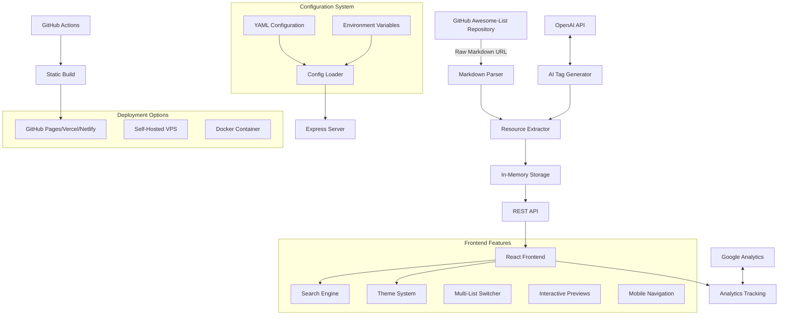

# 🚀 AwesomeList Generator

Transform any GitHub "Awesome-List" into a beautiful, searchable, and mobile-optimized website. Think **mkdocs for Awesome Lists** - a self-hosted generator that creates stunning sites from remote markdown URLs.

## 🌟 What This Does

This tool converts GitHub Awesome-List README.md files into dynamic, SEO-friendly websites featuring:

- **📱 Mobile-first responsive design** - Perfect experience on all devices
- **🔍 Advanced search & filtering** - Find resources by title, description, category
- **🎨 Custom themes** - Dark/light mode + custom theme editor
- **📊 Analytics dashboard** - Track resource popularity and usage patterns
- **🚀 Multi-list support** - Switch between different awesome lists
- **⚡ Fast loading** - Optimized performance with animated skeletons
- **🔗 Rich previews** - Interactive hover cards with GitHub stats
- **♿ SEO optimized** - Proper meta tags and structured data
- **🤖 AI-powered enhancements** - Automatic tag suggestions and descriptions
- **📈 Google Analytics integration** - Track user behavior and popular resources

## 🏗️ System Architecture



## 🔧 Configuration System

### Environment Variables

Create a `.env` file or set environment variables:

```bash
# Required - Source awesome list
AWESOME_RAW_URL="https://raw.githubusercontent.com/your-org/awesome-list/main/README.md"

# Site Configuration
VITE_SITE_TITLE="Your Awesome List"
VITE_SITE_DESCRIPTION="A curated list of awesome resources"
VITE_SITE_URL="https://your-domain.com"

# Analytics (Optional)
VITE_GA_MEASUREMENT_ID="G-XXXXXXXXXX"

# AI Features (Optional)
OPENAI_API_KEY="sk-..."

# Theme
VITE_DEFAULT_THEME="dark"  # light, dark, or auto
```

### YAML Configuration

Create `awesome-list.config.yaml` for advanced configuration:

```yaml
site:
  title: "Awesome Self-Hosted"
  description: "A curated list of self-hosted applications"
  url: "https://awesome-selfhosted.net"

source:
  url: "https://raw.githubusercontent.com/awesome-selfhosted/awesome-selfhosted/master/README.md"
  refresh_interval: 60  # minutes

analytics:
  google_analytics: "${VITE_GA_MEASUREMENT_ID}"
  events: ["resource_clicks", "category_views", "search_queries"]

theme:
  default: "auto"
  primary_color: "#dc2626"

features:
  search: true
  analytics_dashboard: true
  # Layout configuration
  default_layout: "list"  # Options: "cards", "list", "compact"
  allow_layout_switching: true
  # Pagination settings
  pagination: true
  items_per_page: 24
  page_size_options: [12, 24, 48, 96]
  ai_tags: true  # Requires OpenAI API key
```

## 🎯 Recent Enhancements & Features

### ✨ Latest Updates

**🔧 CLI Validation Tool**
- `tsx server/cli/parse-list.ts <url>` - Validate awesome lists before deployment
- Comprehensive error reporting and fix suggestions
- Integration ready for CI/CD pipelines

**📱 Mobile Experience Improvements**
- Fixed tooltip behavior on touch devices
- Enhanced tag display showing multiple tags per resource
- Improved analytics dashboard mobile responsiveness

**📋 Layout System Overhaul**
- Three layout options: List (default), Cards, and Compact Grid
- Configurable default layouts via `awesome-list.config.yaml`
- Smart responsive behavior adapting to device capabilities

**⚡ Performance & UX**
- Pagination system with configurable page sizes
- Contextual hover tooltips with resource metadata
- Robust error handling with detailed parsing logs

**🚀 Deployment Ready**
- Comprehensive GitHub Pages deployment guide
- Environment variable configuration for static builds
- Automated validation in deployment pipelines

## 📊 Analytics & Tracking

The system tracks key metrics for awesome lists:

### Resource Analytics
- **Most clicked resources** - Which tools are most popular
- **Category performance** - Which categories get most engagement
- **Search patterns** - What users are looking for
- **Geographic usage** - Where your audience is located

### User Behavior
- **Session duration** - How long users explore
- **Navigation patterns** - Popular user journeys
- **Device types** - Mobile vs desktop usage
- **Time-based usage** - Peak usage hours

### Custom Events
- `resource_click` - When users click external links
- `category_view` - Category page visits
- `search_query` - Search terms used
- `theme_change` - Theme preferences
- `list_switch` - Multi-list navigation

## 🏗️ Technical Architecture

### Data Flow

1. **Configuration Loading**
   - Load YAML config file
   - Override with environment variables
   - Set up site metadata and features

2. **Content Parsing**
   - Fetch raw markdown from GitHub
   - Parse using Remark AST
   - Extract resources, categories, metadata
   - Filter out navigation/TOC items

3. **Storage & API**
   - Store in memory for fast access
   - Provide REST endpoints
   - Handle list switching dynamically

4. **Frontend Rendering**
   - React SPA with routing
   - Real-time search and filtering
   - Analytics event tracking
   - Responsive design system

### Build Process

```bash
# Development
npm run dev          # Start dev server with hot reload

# Production Build
npm run build        # Build optimized static files
npm start           # Serve production build

# Static Generation
npm run generate    # Generate static site for GitHub Pages
```

## 🚀 Quick Start

### Prerequisites

- Node.js 18+ and npm
- Git

### Installation

1. **Clone the repository**
   ```bash
   git clone <your-repo-url>
   cd awesome-list-generator
   ```

2. **Install dependencies**
   ```bash
   npm install
   ```

3. **Configure your awesome list** (Optional)
   
   Set the `AWESOME_RAW_URL` environment variable to point to your awesome list:
   ```bash
   export AWESOME_RAW_URL="https://raw.githubusercontent.com/your-org/your-awesome-list/main/README.md"
   ```
   
   Default: `https://raw.githubusercontent.com/awesome-selfhosted/awesome-selfhosted/master/README.md`

4. **Start development server**
   ```bash
   npm run dev
   ```
   
   The site will be available at `http://localhost:5000`

### Production Deployment

1. **Build the application**
   ```bash
   npm run build
   ```

2. **Start production server**
   ```bash
   npm start
   ```

## 📝 Awesome List Parsing & Validation

### Supported Markdown Formats

The parser automatically handles standard awesome-list markdown formats:

#### Basic Resource Entry
```markdown
- [Resource Name](https://example.com) - Description of the resource. `License` `Language/Platform`
```

#### With Additional Links
```markdown
- [Resource Name](https://example.com) - Description. ([Demo](https://demo.com), [Source Code](https://github.com/user/repo)) `MIT` `JavaScript`
```

#### Category Structure
```markdown
## Main Category

### Subcategory (Optional)

- [Resource 1](https://example.com) - Description.
- [Resource 2](https://example.com) - Another description.
```

### Parser Validation & Error Handling

The system includes comprehensive validation and error reporting:

#### ✅ Successful Parsing Indicators
- **Resource Count**: `Parsed X resources from Y categories`
- **Structure Validation**: Detected proper heading hierarchy
- **Link Validation**: All resource URLs are accessible
- **Format Compliance**: Follows awesome-list conventions

#### ❌ Common Parsing Issues & Solutions

**1. Empty or Invalid URL**
```
❌ Error: Unable to fetch awesome list from URL
💡 Solution: Verify the raw GitHub URL is correct and accessible
   Example: https://raw.githubusercontent.com/user/repo/main/README.md
```

**2. Invalid Markdown Structure**
```
❌ Error: No valid resources found in markdown
💡 Solution: Ensure your list follows the standard format:
   - Use ## for main categories
   - Use ### for subcategories (optional)
   - Start resource items with - [Name](url) - Description
```

**3. Missing or Malformed Links**
```
❌ Warning: Found X items without valid links
💡 Solution: Check that all resources have proper markdown links:
   ✅ - [Resource](https://example.com) - Description
   ❌ - Resource without link - Description
```

**4. Network/Access Issues**
```
❌ Error: GitHub rate limit exceeded or repository is private
💡 Solution: 
   - Ensure repository is public
   - Use raw.githubusercontent.com URLs
   - Check repository exists and is accessible
```

#### 🔍 Debugging Parser Issues

Enable detailed logging by setting:
```bash
NODE_ENV=development
DEBUG_PARSER=true
```

The parser will output:
- **Fetch Status**: URL accessibility and response codes
- **Structure Analysis**: Category/subcategory detection
- **Resource Extraction**: Individual item parsing results
- **Validation Warnings**: Non-critical formatting issues
- **Performance Metrics**: Parsing time and resource counts

#### 📊 Parser Statistics

After successful parsing, the system reports:
```
✅ Successfully parsed awesome list:
   📄 Source: https://github.com/user/awesome-list
   📊 Found 1,247 resources across 23 categories
   🏷️ Extracted 156 unique tags
   ⏱️ Parsing completed in 1.2s
   🔗 Repository detection: 89% GitHub, 8% GitLab, 3% other
```

#### 🛠️ Custom Parser Rules

For non-standard markdown formats, you can customize parsing in `server/parser.ts`:

```javascript
// Custom resource pattern matching
const CUSTOM_RESOURCE_PATTERN = /^- \[([^\]]+)\]\(([^)]+)\)(.*)/;

// Custom category detection
const CUSTOM_CATEGORY_PATTERN = /^#{2,3}\s+(.+)/;

// Skip unwanted sections
const SKIP_PATTERNS = [
  /table of contents/i,
  /contributing/i,
  /license/i
];
```

## 🛠️ Available Scripts

- `npm run dev` - Start development server (both frontend and backend)
- `npm run build` - Build for production
- `npm start` - Start production server
- `npm run preview` - Preview production build locally
- `tsx server/cli/parse-list.ts <url>` - Validate and test an awesome list

## 🔍 Awesome List Validation Tool

Before deploying your site, validate your awesome list using our built-in CLI tool:

### Basic Usage

```bash
# Validate any awesome list
tsx server/cli/parse-list.ts https://raw.githubusercontent.com/sindresorhus/awesome/main/readme.md

# Test your own repository
tsx server/cli/parse-list.ts https://raw.githubusercontent.com/your-username/your-awesome-list/main/README.md
```

### Example Validation Output

**✅ Successful Validation:**
```
🚀 Awesome List Parser & Validator
=====================================

🔍 Validating: https://raw.githubusercontent.com/avelino/awesome-go/main/README.md
⏳ Fetching and parsing...

📊 Parsing Results:
===================
✅ Status: SUCCESS
📄 Title: Awesome Go
📝 Description: A curated list of awesome Go frameworks, libraries and software
📊 Resources found: 2,752
📁 Categories: 47
🏷️  Tags extracted: 156
⏱️  Parse time: 1.23s

🎉 Your awesome list is ready to deploy!
```

**❌ Failed Validation:**
```
📊 Parsing Results:
===================
❌ Status: FAILED

❌ Errors found:
   - Invalid URL: Please use the raw GitHub URL
   - No valid resources found in markdown

💡 Common fixes:
   - Ensure the URL is a raw GitHub/GitLab URL
   - Check that the repository is public
   - Verify the markdown follows awesome-list format
   - Use ## for main categories and ### for subcategories
   - Format resources as: - [Name](url) - Description
```

### Testing Different Lists

```bash
# Test popular awesome lists
tsx server/cli/parse-list.ts https://raw.githubusercontent.com/sindresorhus/awesome/main/readme.md
tsx server/cli/parse-list.ts https://raw.githubusercontent.com/vinta/awesome-python/master/README.md
tsx server/cli/parse-list.ts https://raw.githubusercontent.com/awesome-selfhosted/awesome-selfhosted/master/README.md

# Get help
tsx server/cli/parse-list.ts --help
```

### Validation Checklist

Before deploying, ensure your awesome list passes these checks:

- ✅ **URL Format**: Uses `raw.githubusercontent.com` or similar raw URL
- ✅ **Repository Access**: Public repository that's accessible
- ✅ **Markdown Structure**: Proper heading hierarchy (## categories, ### subcategories)
- ✅ **Resource Format**: Links formatted as `- [Name](url) - Description`
- ✅ **Minimum Content**: At least 5 resources across categories
- ✅ **Valid Links**: All resource URLs are accessible

### Integration with Deployment

Use the validator in your deployment pipeline:

```yaml
# In .github/workflows/deploy.yml
- name: Validate Awesome List
  run: tsx server/cli/parse-list.ts ${{ env.AWESOME_RAW_URL }}

- name: Deploy if validation passes
  run: npm run build
```

## 🎨 Customization & Layout Options

### Default Layout Configuration

Configure how your awesome list appears to visitors by default:

```yaml
# In awesome-list.config.yaml
features:
  # Choose default layout when users first visit
  default_layout: "list"  # Options: "cards", "list", "compact"
  
  # Allow users to switch between layouts
  allow_layout_switching: true
  
  # Pagination settings
  pagination: true
  items_per_page: 24
  page_size_options: [12, 24, 48, 96]
```

### Layout Options Explained

**📋 List View (Recommended Default)**
- Clean, scannable format perfect for browsing many resources
- Shows title, description, and tags in compact rows
- Fastest loading and most accessible option
- Best for mobile devices and quick scanning

**🃏 Card View**
- Rich visual layout with full descriptions
- Great for showcasing detailed resource information
- More visual appeal but requires more scrolling
- Best for sites with fewer, high-quality resources

**⚡ Compact Grid**
- Maximum density - shows the most resources at once
- Truncated descriptions for space efficiency
- Perfect for power users who want to see everything
- Ideal for large lists with 500+ resources

### Responsive Behavior

The layout system automatically adapts:
- **Mobile**: Always uses optimized compact layouts regardless of setting
- **Tablet**: Respects user's layout choice with mobile-friendly adjustments  
- **Desktop**: Full layout switching capabilities with hover tooltips

### Environment Variables

- `AWESOME_RAW_URL` - URL to the raw markdown file of your awesome list
- `PORT` - Server port (default: 5000)
- `NODE_ENV` - Environment (development/production)

### Theme System

The application includes:
- **Light/Dark mode toggle** - Automatic system preference detection
- **Custom theme editor** - Create and save your own color schemes
- **Pre-built themes** - Several beautiful themes included
- **Theme persistence** - Themes saved to localStorage

### Adding New Lists

The multi-list switcher supports switching between different awesome lists. To add new lists:

1. Update the `predefinedLists` array in `client/src/components/ui/list-switcher.tsx`
2. Add the raw GitHub URL and metadata for your list
3. The parser will automatically handle different markdown formats

## 🔧 Advanced Configuration

### Custom Parser Rules

To modify how resources are parsed, edit `server/parser.ts`:

- `extractMetadata()` - Customize license/language extraction
- `parseListItems()` - Modify resource parsing logic
- `parseMarkdown()` - Adjust category/subcategory handling

### Styling

The design system uses:
- **Tailwind CSS** - Utility-first CSS framework
- **shadcn/ui** - High-quality React components
- **CSS Variables** - Easy theme customization
- **Dark mode** - Built-in dark/light mode support

Custom styles can be added in `client/src/index.css`.

## 📊 Analytics Features

The built-in analytics dashboard provides:
- **Resource popularity** - Most viewed and trending resources
- **Category distribution** - Visual breakdown of categories
- **Search trends** - Popular search terms and patterns
- **Usage patterns** - Time-based usage analytics
- **Performance metrics** - Loading times and user engagement

## 🤝 Contributing

1. Fork the repository
2. Create a feature branch: `git checkout -b feature/amazing-feature`
3. Commit changes: `git commit -m 'Add amazing feature'`
4. Push to branch: `git push origin feature/amazing-feature`
5. Open a Pull Request

## 📜 License

This project is licensed under the MIT License - see the [LICENSE](LICENSE) file for details.

## 🙋‍♂️ Support

- **Issues**: Report bugs and request features via GitHub Issues
- **Discussions**: Join community discussions for help and ideas
- **Documentation**: This README and inline code comments

## 🌍 Examples

### Live Examples

- [Awesome Self-Hosted](https://your-domain.com) - Default configuration
- [Awesome Go](https://your-domain.com) - Go programming resources
- [Awesome Python](https://your-domain.com) - Python ecosystem tools

### Custom Deployments

This generator works with any properly formatted awesome list. Popular formats include:

- **Awesome-\*** lists from the [Awesome](https://github.com/sindresorhus/awesome) ecosystem
- **Curated-\*** lists following similar markdown patterns
- **Custom resource lists** using the supported markdown format

## 🚀 Deployment Options

### GitHub Pages (Static Deployment) - Recommended

This repository includes a GitHub Actions workflow for automatic deployment to GitHub Pages:

1. **Fork this repository** to your GitHub account

2. **Configure your awesome list** by editing `awesome-list.config.yaml`:
   ```yaml
   site:
     title: "Your Awesome List Title"
     description: "Your description"
     url: "https://yourusername.github.io/your-repo-name"
   
   source:
     url: "https://raw.githubusercontent.com/your-org/your-awesome-list/main/README.md"
   
   deploy:
     method: "github-pages"
     github:
       repository: "yourusername/your-repo-name"
       branch: "gh-pages"
   ```

3. **Enable GitHub Pages** in your repository:
   - Go to Settings → Pages
   - Source: Deploy from a branch
   - Branch: `gh-pages` / `/ (root)`

4. **Set up environment variables** (optional):
   - Go to Settings → Secrets and variables → Actions
   - Add secrets like `VITE_GA_MEASUREMENT_ID` for analytics

5. **Deploy**: Push changes to trigger automatic deployment via GitHub Actions

The workflow (`.github/workflows/deploy.yml`) will:
- Build the static site
- Parse your awesome list
- Deploy to GitHub Pages
- Run on every push to main branch

### Build Configuration for Static Deployment

The static build process handles:
- **Environment variable substitution** for GitHub Pages
- **Base URL configuration** for subdirectory deployment
- **Asset optimization** and minification
- **SEO meta tag generation** from config
- **Sitemap generation** for search engines

### Environment Variables for Static Builds

Set these in GitHub repository secrets:

```bash
# Analytics (Optional)
VITE_GA_MEASUREMENT_ID=G-XXXXXXXXXX

# Site Configuration
VITE_SITE_TITLE="Your Site Title"
VITE_SITE_DESCRIPTION="Your site description"
VITE_SITE_URL="https://yourusername.github.io/repo-name"

# Theme
VITE_DEFAULT_THEME=auto

# AI Features (Optional)
OPENAI_API_KEY=sk-...
```

### Alternative Deployment Methods

#### Vercel
1. Connect your GitHub repository to Vercel
2. Set environment variables in project settings
3. Build command: `npm run build`
4. Output directory: `dist`

#### Netlify
1. Connect repository to Netlify
2. Build command: `npm run build`
3. Publish directory: `dist`
4. Set environment variables in site settings

#### Docker
```dockerfile
FROM node:18-alpine
WORKDIR /app
COPY package*.json ./
RUN npm ci --only=production
COPY . .
RUN npm run build
EXPOSE 5000
CMD ["npm", "start"]
```

#### Traditional VPS
1. Clone repository on your server
2. Install dependencies with `npm ci`
3. Build with `npm run build`
4. Use PM2 or similar for process management
5. Set up reverse proxy (nginx/Apache) for production

---

**Made with ❤️ for the awesome list community**