# AI Services Architecture

Technical documentation for AI-powered resource analysis and enrichment in the Awesome Video Resource Viewer application.

## Overview

The AI Services layer provides intelligent resource analysis, metadata extraction, and content enrichment using Anthropic's Claude API. The system is designed for cost-effective operation with comprehensive caching, rate limiting, and security controls.

### AI Services Architecture Diagram

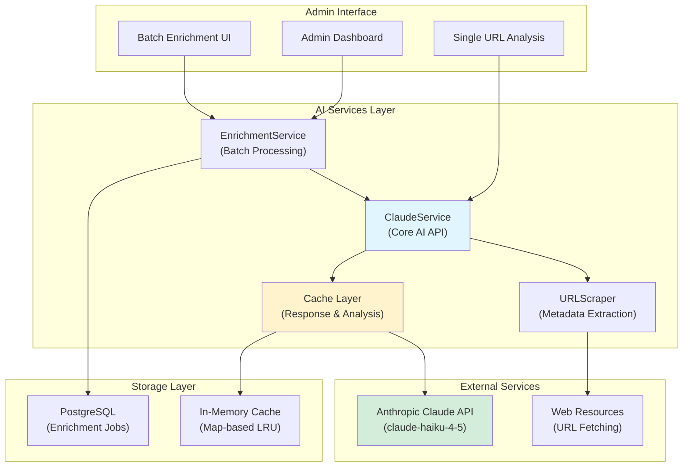
```mermaid
graph TB
    subgraph Admin["Admin Interface"]
        UI["Admin Dashboard"]
        Batch["Batch Enrichment UI"]
        Single["Single URL Analysis"]
    end

    subgraph Services["AI Services Layer"]
        Claude["ClaudeService<br/>(Core AI API)"]
        Enrich["EnrichmentService<br/>(Batch Processing)"]
        Scraper["URLScraper<br/>(Metadata Extraction)"]
        Cache["Cache Layer<br/>(Response & Analysis)"]
    end

    subgraph External["External Services"]
        API["Anthropic Claude API<br/>(claude-haiku-4-5)"]
        Web["Web Resources<br/>(URL Fetching)"]
    end

    subgraph Storage["Storage Layer"]
        DB["PostgreSQL<br/>(Enrichment Jobs)"]
        Memory["In-Memory Cache<br/>(Map-based LRU)"]
    end

    UI --> Enrich
    Batch --> Enrich
    Single --> Claude
    Enrich --> Claude
    Claude --> Cache
    Cache --> Memory
    Cache --> API
    Claude --> Scraper
    Scraper --> Web
    Enrich --> DB

    style Claude fill:#e1f5ff
    style Cache fill:#fff3cd
    style API fill:#d4edda
```

## ClaudeService - Core AI Integration

The `ClaudeService` class (`server/ai/claudeService.ts`) is the foundational AI service providing Claude API integration with intelligent caching and security controls.

### Architecture Pattern

**Design**: Singleton pattern with lazy initialization
- Single instance shared across application lifecycle
- `getInstance()` provides global access point
- Private constructor prevents direct instantiation

```typescript
// Usage throughout the application
import { claudeService } from './server/ai/claudeService';

const analysis = await claudeService.analyzeURL(url);
```

### API Initialization

The service initializes the Anthropic API client on first instantiation with graceful degradation when API keys are unavailable.

#### Initialization Flow

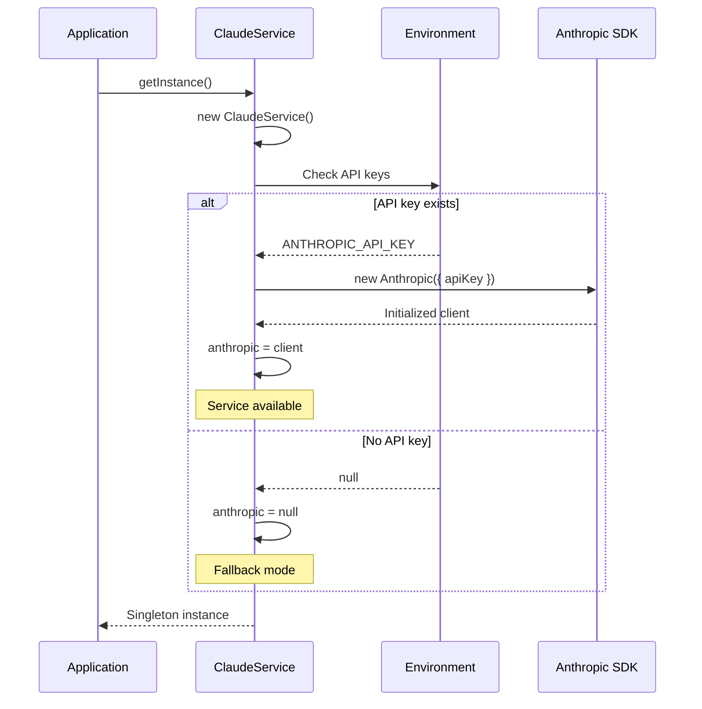
```mermaid
sequenceDiagram
    participant App as Application
    participant CS as ClaudeService
    participant Env as Environment
    participant API as Anthropic SDK

    App->>CS: getInstance()
    CS->>CS: new ClaudeService()
    CS->>Env: Check API keys

    alt API key exists
        Env-->>CS: ANTHROPIC_API_KEY
        CS->>API: new Anthropic({ apiKey })
        API-->>CS: Initialized client
        CS->>CS: anthropic = client
        Note over CS: Service available
    else No API key
        Env-->>CS: null
        CS->>CS: anthropic = null
        Note over CS: Fallback mode
    end

    CS-->>App: Singleton instance
```

#### Environment Variables

| Variable | Purpose | Required |
|----------|---------|----------|
| `AI_INTEGRATIONS_ANTHROPIC_API_KEY` | Primary API key | Yes* |
| `ANTHROPIC_API_KEY` | Fallback API key | Yes* |
| `AI_INTEGRATIONS_ANTHROPIC_BASE_URL` | Custom API endpoint | No |

*At least one API key variable must be set for AI features to function.

#### Availability Checking

```typescript
if (claudeService.isAvailable()) {
  // AI features enabled
  const result = await claudeService.analyzeURL(url);
} else {
  // Fallback to manual curation
  console.log('AI service unavailable - using manual workflow');
}
```

### Caching Strategy

The service implements a **dual-cache architecture** optimized for different use cases with LRU (Least Recently Used) eviction.

#### Cache Architecture

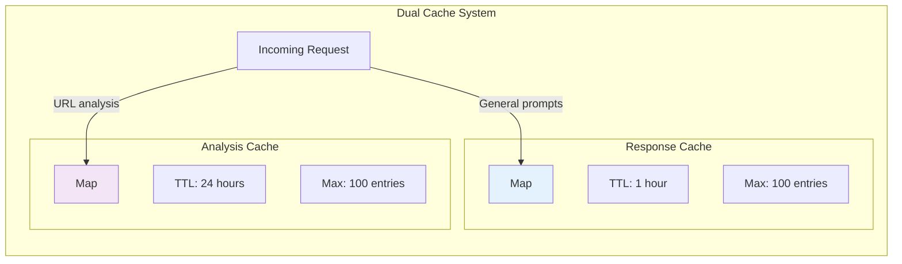
```mermaid
graph LR
    subgraph "Dual Cache System"
        Request["Incoming Request"]

        subgraph "Response Cache"
            RC["Map<string, CacheEntry>"]
            RCTTL["TTL: 1 hour"]
            RCSize["Max: 100 entries"]
        end

        subgraph "Analysis Cache"
            AC["Map<string, AnalysisCache>"]
            ACTTL["TTL: 24 hours"]
            ACSize["Max: 100 entries"]
        end

        Request -->|General prompts| RC
        Request -->|URL analysis| AC
    end

    style RC fill:#e3f2fd
    style AC fill:#f3e5f5
```

#### Response Cache (1 Hour TTL)

**Purpose**: Deduplicates identical AI requests across the application

**Use Cases**:
- General Claude responses
- Repeated similar queries
- Development/testing scenarios

**Implementation**:
```typescript
private readonly CACHE_TTL = 60 * 60 * 1000; // 1 hour in milliseconds
private responseCache: Map<string, CacheEntry>;

interface CacheEntry {
  response: string;      // Cached Claude response
  timestamp: number;     // Creation time for TTL checking
}
```

**Cache Key Generation**: Simple hash function creates unique keys from prompt + system prompt combination
```typescript
private createCacheKey(prompt: string): string {
  let hash = 0;
  for (let i = 0; i < prompt.length; i++) {
    const char = prompt.charCodeAt(i);
    hash = ((hash << 5) - hash) + char;
    hash = hash & hash; // Convert to 32-bit integer
  }
  return `claude_${hash}`;
}
```

#### Analysis Cache (24 Hour TTL)

**Purpose**: Stores URL analysis results for extended periods

**Use Cases**:
- URL metadata extraction
- Resource enrichment results
- Category suggestions
- Tag generation

**Implementation**:
```typescript
private readonly ANALYSIS_CACHE_TTL = 24 * 60 * 60 * 1000; // 24 hours
private analysisCache: Map<string, AnalysisCache>;

interface AnalysisCache {
  result: any;          // Structured analysis result
  timestamp: number;    // Creation time for TTL checking
}
```

**Cache Key**: URL strings are used directly as cache keys (after validation)

#### LRU Eviction Strategy

When cache exceeds `MAX_CACHE_SIZE = 100` entries, the **oldest entry is removed** before adding new ones.

```typescript
private addToCache(key: string, response: string): void {
  // LRU eviction: remove oldest entry if cache is full
  if (this.responseCache.size >= this.MAX_CACHE_SIZE) {
    const oldestKey = this.responseCache.keys().next().value;
    if (oldestKey) {
      this.responseCache.delete(oldestKey);
    }
  }

  this.responseCache.set(key, {
    response,
    timestamp: Date.now()
  });
}
```

**Limitation**: JavaScript Map maintains insertion order, so `.keys().next().value` returns the oldest entry. This provides simple LRU behavior without additional complexity.

#### Cache Performance

| Metric | Value | Impact |
|--------|-------|--------|
| Cache hit (response) | 1-5ms | ~1000x faster than API call |
| Cache hit (analysis) | 1-5ms | ~1000x faster than API + URL fetch |
| Cache miss | 500-2000ms | Full API roundtrip |
| TTL check overhead | <1ms | Negligible |
| Eviction cost | O(1) | Single deletion operation |

### Rate Limiting

The service implements **request-level rate limiting** to prevent API throttling and manage costs.

#### Rate Limit Configuration

```typescript
private readonly RATE_LIMIT_DELAY = 1000; // 1 second between requests
private requestCount = 0;
private lastRequestTime = 0;
```

#### Rate Limit Flow

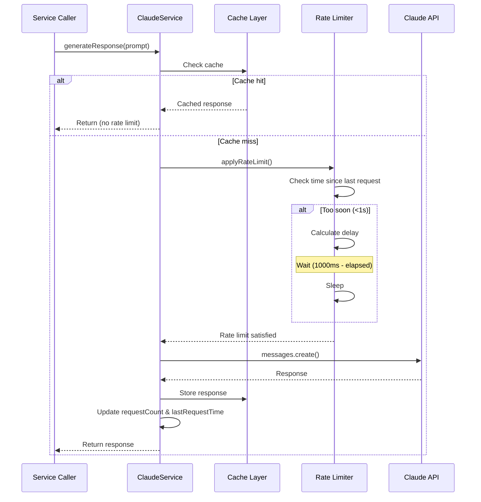
```mermaid
sequenceDiagram
    participant Caller as Service Caller
    participant CS as ClaudeService
    participant Cache as Cache Layer
    participant RL as Rate Limiter
    participant API as Claude API

    Caller->>CS: generateResponse(prompt)
    CS->>Cache: Check cache

    alt Cache hit
        Cache-->>CS: Cached response
        CS-->>Caller: Return (no rate limit)
    else Cache miss
        CS->>RL: applyRateLimit()
        RL->>RL: Check time since last request

        alt Too soon (<1s)
            RL->>RL: Calculate delay
            Note over RL: Wait (1000ms - elapsed)
            RL->>RL: Sleep
        end

        RL-->>CS: Rate limit satisfied
        CS->>API: messages.create()
        API-->>CS: Response
        CS->>Cache: Store response
        CS->>CS: Update requestCount & lastRequestTime
        CS-->>Caller: Return response
    end
```

#### Implementation

```typescript
private async applyRateLimit(): Promise<void> {
  const timeSinceLastRequest = Date.now() - this.lastRequestTime;
  if (timeSinceLastRequest < this.RATE_LIMIT_DELAY) {
    const delay = this.RATE_LIMIT_DELAY - timeSinceLastRequest;
    console.log(`Rate limiting: waiting ${delay}ms before next request`);
    await new Promise(resolve => setTimeout(resolve, delay));
  }
}
```

**Key Features**:
- Automatic delay injection between consecutive requests
- Cache hits bypass rate limiting (instant response)
- Logging for visibility into rate limit behavior
- No external dependencies (pure JavaScript timing)

### SSRF Protection

The service implements **domain allowlisting** to prevent Server-Side Request Forgery (SSRF) attacks when analyzing URLs.

#### Security Model

**Threat**: Malicious users could submit URLs pointing to internal services, cloud metadata endpoints, or other restricted resources.

**Defense**: Only URLs from trusted, video-streaming-related domains can be analyzed.

#### Allowed Domains Whitelist

```typescript
const ALLOWED_DOMAINS = [
  // Version control & code hosting
  'github.com',

  // Video platforms
  'youtube.com',
  'youtu.be',
  'vimeo.com',
  'twitch.tv',
  'dailymotion.com',

  // Streaming infrastructure
  'bitmovin.com',
  'cloudflare.com',
  'akamai.com',
  'fastly.com',
  'wowza.com',
  'encoding.com',
  'zencoder.com',
  'mux.com',

  // Media players & libraries
  'jwplayer.com',
  'videojs.com',
  'npmjs.com',
  'unpkg.com',
  'cdn.jsdelivr.net',

  // Documentation & communities
  'stackoverflow.com',
  'medium.com',
  'dev.to',
  'docs.microsoft.com',
  'developer.mozilla.org',

  // Standards organizations
  'w3.org',
  'ietf.org',
  'whatwg.org'
];
```

**Total**: 27 trusted domains (as of current implementation)

#### Domain Validation Flow

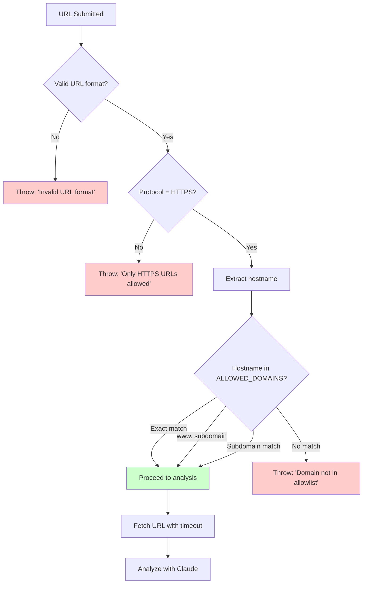
```mermaid
flowchart TD
    A[URL Submitted] --> B{Valid URL format?}
    B -->|No| C[Throw: 'Invalid URL format']
    B -->|Yes| D{Protocol = HTTPS?}
    D -->|No| E[Throw: 'Only HTTPS URLs allowed']
    D -->|Yes| F[Extract hostname]
    F --> G{Hostname in ALLOWED_DOMAINS?}

    G -->|Exact match| H[Proceed to analysis]
    G -->|www. subdomain| H
    G -->|Subdomain match| H
    G -->|No match| I[Throw: 'Domain not in allowlist']

    H --> J[Fetch URL with timeout]
    J --> K[Analyze with Claude]

    style C fill:#ffcccc
    style E fill:#ffcccc
    style I fill:#ffcccc
    style H fill:#ccffcc
```

#### Implementation

```typescript
public async analyzeURL(url: string): Promise<AnalysisResult | null> {
  // Parse and validate URL format
  let parsedUrl: URL;
  try {
    parsedUrl = new URL(url);
  } catch (error) {
    throw new Error('Invalid URL format');
  }

  // Only allow HTTPS (not http, file://, ftp://, etc.)
  if (parsedUrl.protocol !== 'https:') {
    throw new Error('Only HTTPS URLs are allowed');
  }

  // SECURITY: Domain allowlist (eliminates ALL SSRF risks)
  const hostname = parsedUrl.hostname.toLowerCase();
  const isAllowed = ALLOWED_DOMAINS.some(allowedDomain => {
    // Match exact domain or subdomain
    return hostname === allowedDomain ||
           hostname === `www.${allowedDomain}` ||
           hostname.endsWith(`.${allowedDomain}`);
  });

  if (!isAllowed) {
    throw new Error(
      `Domain "${hostname}" is not in the allowlist of trusted domains. ` +
      `Allowed domains include: ${ALLOWED_DOMAINS.slice(0, 5).join(', ')}, etc.`
    );
  }

  // Safe to proceed with URL analysis
  // ...
}
```

#### Subdomain Matching Logic

The validation supports three matching patterns:

1. **Exact match**: `github.com` matches `github.com`
2. **www prefix**: `www.github.com` matches when `github.com` is allowed
3. **Subdomain match**: `api.github.com` matches when `github.com` is allowed

This allows flexibility while maintaining security (e.g., `docs.github.com`, `gist.github.com` are all valid).

#### Additional URL Security

Beyond domain validation, the service implements:

**Timeout Protection**: 10-second timeout prevents hanging on slow/malicious responses
```typescript
const controller = new AbortController();
const timeoutId = setTimeout(() => controller.abort(), 10000);

const response = await fetch(url, { signal: controller.signal });
```

**Size Limits**: Maximum 5MB content size prevents memory exhaustion
```typescript
const contentLength = response.headers.get('content-length');
if (contentLength && parseInt(contentLength) > 5 * 1024 * 1024) {
  throw new Error('Content too large (max 5MB)');
}
```

**Redirect Following**: Limited to 5 redirects to prevent redirect loops
```typescript
const response = await fetch(url, {
  redirect: 'follow',
  follow: 5  // Maximum 5 redirects
});
```

### Batch Processing

The service provides efficient batch processing for analyzing multiple URLs with built-in rate limiting.

#### Batch Processing Flow

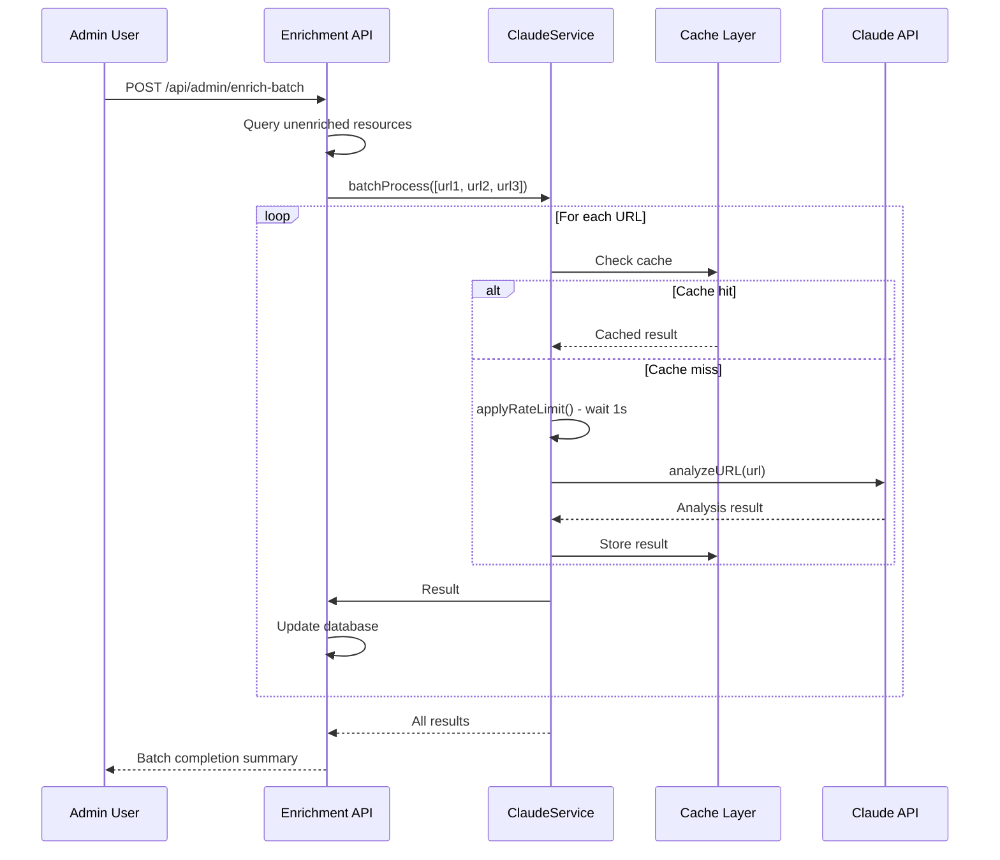
```mermaid
sequenceDiagram
    participant Admin as Admin User
    participant API as Enrichment API
    participant CS as ClaudeService
    participant Cache as Cache Layer
    participant Claude as Claude API

    Admin->>API: POST /api/admin/enrich-batch
    API->>API: Query unenriched resources
    API->>CS: batchProcess([url1, url2, url3])

    loop For each URL
        CS->>Cache: Check cache
        alt Cache hit
            Cache-->>CS: Cached result
        else Cache miss
            CS->>CS: applyRateLimit() - wait 1s
            CS->>Claude: analyzeURL(url)
            Claude-->>CS: Analysis result
            CS->>Cache: Store result
        end
        CS->>API: Result
        API->>API: Update database
    end

    CS-->>API: All results
    API-->>Admin: Batch completion summary
```

#### Batch Method Signature

```typescript
public async batchProcess(
  prompts: string[],
  maxTokensPerPrompt: number = 500,
  systemPrompt?: string
): Promise<(string | null)[]> {
  const results: (string | null)[] = [];

  for (const prompt of prompts) {
    const response = await this.generateResponse(
      prompt,
      maxTokensPerPrompt,
      systemPrompt
    );
    results.push(response);

    // Add delay between batch requests to respect rate limits
    if (prompts.indexOf(prompt) < prompts.length - 1) {
      await new Promise(resolve => setTimeout(resolve, this.RATE_LIMIT_DELAY));
    }
  }

  return results;
}
```

#### Batch Processing Characteristics

| Feature | Behavior | Rationale |
|---------|----------|-----------|
| Processing order | Sequential (not parallel) | Respects rate limits, predictable order |
| Inter-request delay | 1 second (RATE_LIMIT_DELAY) | Prevents API throttling |
| Cache utilization | Checked for each URL | Skips API calls for cached results |
| Error handling | Null result for failures | Continues processing remaining items |
| Progress tracking | Database updates per item | Admin can monitor progress |

#### Batch Size Recommendations

| Batch Size | Estimated Time | Use Case |
|------------|----------------|----------|
| 10 URLs | ~10-20 seconds | Quick enrichment, testing |
| 50 URLs | ~1-2 minutes | Medium batch, acceptable wait time |
| 100 URLs | ~2-5 minutes | Large batch, background job |
| 500+ URLs | ~10+ minutes | Consider splitting into multiple jobs |

**Note**: Actual time depends on cache hit rate. With high cache hits, batch processing is significantly faster.

## EnrichmentService - Queue Processing & Batch Enrichment

The `EnrichmentService` class (`server/ai/enrichmentService.ts`) orchestrates large-scale resource enrichment through an asynchronous queue-based architecture with retry logic, progress tracking, and cancellation support.

### Architecture Pattern

**Design**: Singleton pattern with concurrent job management
- Single instance manages multiple enrichment jobs simultaneously
- In-memory job tracking prevents duplicate processing
- Asynchronous processing with graceful error handling

```typescript
// Usage throughout the application
import { enrichmentService } from './server/ai/enrichmentService';

// Queue batch enrichment
const jobId = await enrichmentService.queueBatchEnrichment({
  filter: 'unenriched',
  batchSize: 10,
  startedBy: 'admin@example.com'
});

// Monitor progress
const status = await enrichmentService.getJobStatus(jobId);
console.log(`Progress: ${status.progress}%`);

// Cancel if needed
await enrichmentService.cancelJob(jobId);
```

### Job Lifecycle Management

The enrichment system uses a comprehensive state machine to track job execution from creation through completion or failure.

#### Job States

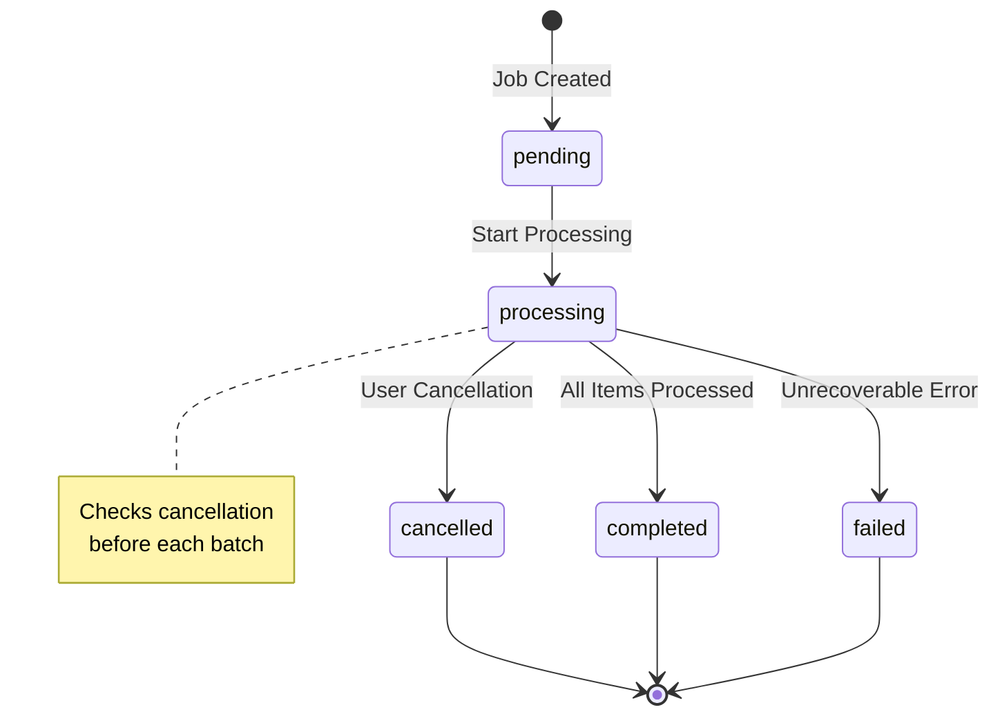
```mermaid
stateDiagram-v2
    [*] --> pending: Job Created
    pending --> processing: Start Processing
    processing --> completed: All Items Processed
    processing --> failed: Unrecoverable Error
    processing --> cancelled: User Cancellation
    cancelled --> [*]
    completed --> [*]
    failed --> [*]

    note right of processing
        Checks cancellation
        before each batch
    end note
```

| State | Description | Next States |
|-------|-------------|-------------|
| `pending` | Job created, queue items added, waiting to start | `processing` |
| `processing` | Actively processing resources in batches | `completed`, `failed`, `cancelled` |
| `completed` | All resources processed successfully | Terminal state |
| `failed` | Unrecoverable error occurred during processing | Terminal state |
| `cancelled` | User requested cancellation | Terminal state |

#### Job Creation Flow

```typescript
async queueBatchEnrichment(options: QueueBatchEnrichmentOptions): Promise<number> {
  // 1. Load approved resources (max 10,000)
  const { resources } = await storage.listResources({
    status: 'approved',
    limit: 10000
  });

  // 2. Filter resources based on criteria
  let resourcesToEnrich = resources;
  if (filter === 'unenriched') {
    resourcesToEnrich = resources.filter(resource => {
      const metadata = resource.metadata || {};
      return !metadata.aiEnriched &&
             (!resource.description || resource.description.trim() === '');
    });
  }

  // 3. Create job record
  const job = await storage.createEnrichmentJob({
    filter,
    batchSize,
    startedBy
  });

  // 4. Create queue items for each resource
  for (const resource of resourcesToEnrich) {
    await storage.createEnrichmentQueueItem({
      jobId: job.id,
      resourceId: resource.id,
      status: 'pending'
    });
  }

  // 5. Start asynchronous processing (non-blocking)
  this.startProcessing(job.id).catch(error => {
    console.error(`Error processing enrichment job ${job.id}:`, error);
    storage.updateEnrichmentJob(job.id, {
      status: 'failed',
      errorMessage: error.message,
      completedAt: new Date()
    });
  });

  return job.id;
}
```

**Key Design Decisions**:
- **Non-Blocking**: `startProcessing()` runs asynchronously, immediately returning the job ID
- **Resource Filtering**: Support for "all" or "unenriched" resources
- **Queue Item Creation**: Each resource gets a dedicated queue item for fine-grained tracking
- **Error Recovery**: Top-level error handler marks job as failed if startup fails

### Batch Processing Architecture

The service processes resources in configurable batches with inter-batch delays to prevent API rate limiting and allow for graceful cancellation.

#### Batch Processing Flow

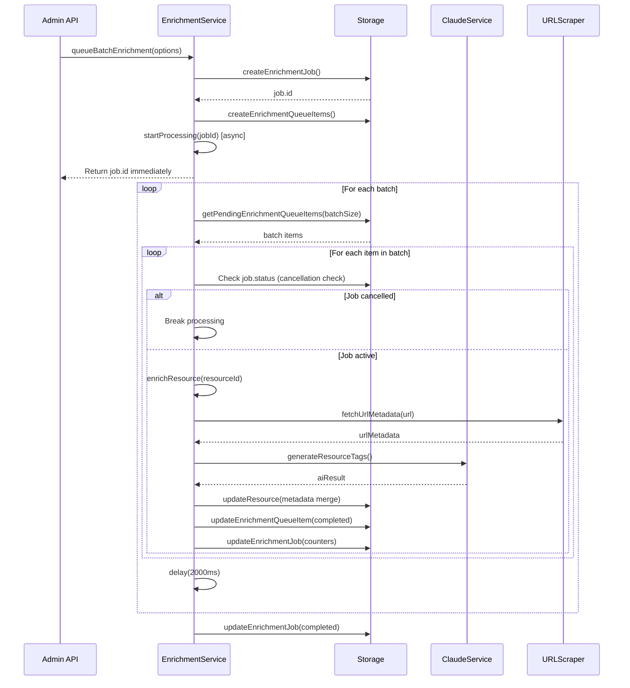
```mermaid
sequenceDiagram
    participant API as Admin API
    participant ES as EnrichmentService
    participant DB as Storage
    participant Claude as ClaudeService
    participant Web as URLScraper

    API->>ES: queueBatchEnrichment(options)
    ES->>DB: createEnrichmentJob()
    DB-->>ES: job.id

    ES->>DB: createEnrichmentQueueItems()
    ES->>ES: startProcessing(jobId) [async]
    ES-->>API: Return job.id immediately

    loop For each batch
        ES->>DB: getPendingEnrichmentQueueItems(batchSize)
        DB-->>ES: batch items

        loop For each item in batch
            ES->>DB: Check job.status (cancellation check)

            alt Job cancelled
                ES->>ES: Break processing
            else Job active
                ES->>ES: enrichResource(resourceId)
                ES->>Web: fetchUrlMetadata(url)
                Web-->>ES: urlMetadata
                ES->>Claude: generateResourceTags()
                Claude-->>ES: aiResult
                ES->>DB: updateResource(metadata merge)
                ES->>DB: updateEnrichmentQueueItem(completed)
                ES->>DB: updateEnrichmentJob(counters)
            end
        end

        ES->>ES: delay(2000ms)
    end

    ES->>DB: updateEnrichmentJob(completed)
```

#### Batch Configuration

```typescript
interface QueueBatchEnrichmentOptions {
  filter?: 'all' | 'unenriched';  // Resource selection criteria
  batchSize?: number;              // Items per batch (default: 10)
  startedBy?: string;              // User email for audit trail
}
```

**Default Batch Size**: 10 resources per batch

**Inter-Batch Delay**: 2000ms (2 seconds)

#### Processing Loop

```typescript
private async processJobBatches(jobId: number, batchSize: number): Promise<void> {
  while (true) {
    // Check for cancellation before each batch
    const job = await storage.getEnrichmentJob(jobId);
    if (!job || job.status === 'cancelled') {
      console.log(`Job ${jobId} was cancelled or not found`);
      break;
    }

    // Fetch next batch of pending items
    const pendingItems = await storage.getPendingEnrichmentQueueItems(jobId, batchSize);

    // Exit when no more items to process
    if (pendingItems.length === 0) {
      break;
    }

    // Process batch sequentially
    await this.processBatch(jobId, pendingItems);

    // Wait before next batch (rate limiting + cancellation opportunity)
    await this.delay(2000);
  }
}
```

**Why Batching?**
- **Rate Limiting**: Prevents overwhelming external APIs (Claude, URL scrapers)
- **Cancellation Windows**: 2-second delays provide frequent cancellation check points
- **Progress Visibility**: Admin can see incremental progress updates
- **Resource Management**: Limits concurrent database connections and memory usage

### Retry Logic with Exponential Backoff

Each resource enrichment attempt implements retry logic to handle transient failures from network issues, API rate limits, or temporary service unavailability.

#### Retry Configuration

```typescript
async enrichResource(resourceId: number, jobId?: number): Promise<EnrichmentOutcome> {
  let retryCount = 0;
  const maxRetries = 3;
  let lastError: Error | null = null;

  while (retryCount < maxRetries) {
    try {
      // Attempt enrichment...
      return 'success';
    } catch (error: any) {
      lastError = error;
      retryCount++;

      if (retryCount < maxRetries) {
        console.log(`Retry ${retryCount}/${maxRetries} for resource ${resourceId}`);
        await this.delay(1000 * retryCount); // Exponential backoff
      } else {
        // Log final failure
        await storage.logResourceAudit(
          resourceId,
          'ai_enrichment_failed',
          undefined,
          { error: error.message },
          `AI enrichment failed after ${maxRetries} retries`
        );
        return 'failed';
      }
    }
  }

  return 'failed';
}
```

#### Retry Schedule

| Attempt | Delay Before Retry | Cumulative Time |
|---------|-------------------|-----------------|
| 1st attempt | 0ms (immediate) | 0ms |
| 2nd attempt | 1000ms (1s) | 1s |
| 3rd attempt | 2000ms (2s) | 3s |
| Final failure | - | 3s total |

**Exponential Backoff Formula**: `delay = 1000ms * retryCount`

**Why This Approach?**
- **Transient Failures**: Network hiccups, temporary API unavailability
- **Rate Limit Recovery**: Gives rate-limited APIs time to reset
- **Gradual Backoff**: Increases delay with each retry to avoid hammering failing services
- **Audit Trail**: Logs final failure with retry count for debugging

#### Enrichment Outcomes

Each resource enrichment returns one of three outcomes:

```typescript
type EnrichmentOutcome = 'success' | 'skipped' | 'failed';
```

| Outcome | Condition | Queue Item Status | Job Counter |
|---------|-----------|-------------------|-------------|
| `success` | AI analysis completed, metadata updated | `completed` | `successfulResources++` |
| `skipped` | Invalid URL or manually curated | `skipped` | `skippedResources++` |
| `failed` | Exceeded max retries or unrecoverable error | `failed` | `failedResources++` |

All outcomes increment `processedResources` counter.

### URL Validation

Before attempting enrichment, the service validates URLs to skip non-HTTP resources and malformed links.

#### Validation Logic

```typescript
private isValidUrl(url: string): boolean {
  try {
    new URL(url);
    return true;
  } catch {
    return false;
  }
}

// Usage in enrichResource
if (!this.isValidUrl(resource.url)) {
  console.log(`Skipping resource ${resourceId} - invalid URL: ${resource.url}`);
  return 'skipped';
}
```

**Invalid URL Examples**:
- `#readme` (hash fragment only)
- `mailto:support@example.com` (non-HTTP protocol)
- `javascript:void(0)` (JavaScript pseudo-protocol)
- `ftp://files.example.com` (unsupported protocol)
- Malformed URLs without proper scheme

**Valid URL Examples**:
- `https://github.com/user/repo`
- `http://example.com/resource`
- `https://docs.example.com/guide`

### Metadata Merging Strategy

The enrichment process combines data from multiple sources into a unified metadata object, preserving existing manual curation and avoiding overwrites.

#### Metadata Sources

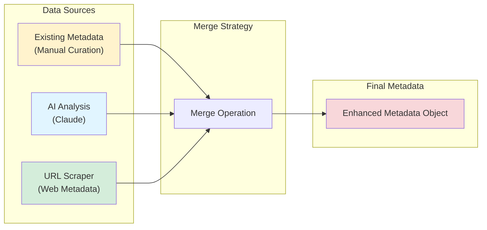
```mermaid
graph LR
    subgraph "Data Sources"
        Existing["Existing Metadata<br/>(Manual Curation)"]
        AI["AI Analysis<br/>(Claude)"]
        Scraper["URL Scraper<br/>(Web Metadata)"]
    end

    subgraph "Merge Strategy"
        Merge["Merge Operation"]
    end

    subgraph "Final Metadata"
        Result["Enhanced Metadata Object"]
    end

    Existing --> Merge
    AI --> Merge
    Scraper --> Merge
    Merge --> Result

    style Existing fill:#fff3cd
    style AI fill:#e1f5ff
    style Scraper fill:#d4edda
    style Result fill:#f8d7da
```

#### Merge Implementation

```typescript
// Fetch URL metadata first
let urlMetadata: UrlMetadata | null = null;
try {
  urlMetadata = await fetchUrlMetadata(resource.url);
} catch (error) {
  console.error(`Error fetching URL metadata:`, error);
}

// Then call Claude AI
const aiResult = await generateResourceTags(
  resource.title,
  resource.description,
  resource.url
);

// Merge all sources (spread operator preserves existing metadata)
const enhancedMetadata = {
  ...metadata,                    // Preserve existing fields
  aiEnriched: true,
  aiEnrichedAt: new Date().toISOString(),
  suggestedTags: aiResult.tags,
  suggestedCategory: aiResult.category,
  suggestedSubcategory: aiResult.subcategory,
  confidence: aiResult.confidence,
  aiModel: 'claude-haiku-4-5',

  // Conditionally add URL metadata if scraping succeeded
  ...(urlMetadata && !urlMetadata.error && {
    urlScraped: true,
    urlScrapedAt: new Date().toISOString(),
    scrapedTitle: urlMetadata.title,
    scrapedDescription: urlMetadata.description,
    ogImage: urlMetadata.ogImage,
    ogTitle: urlMetadata.ogTitle,
    ogDescription: urlMetadata.ogDescription,
    twitterCard: urlMetadata.twitterCard,
    twitterImage: urlMetadata.twitterImage,
    favicon: urlMetadata.favicon,
    author: urlMetadata.author,
    keywords: urlMetadata.keywords,
  }),
};
```

#### Metadata Fields

| Field | Source | Type | Description |
|-------|--------|------|-------------|
| `aiEnriched` | System | boolean | Marks resource as AI-processed |
| `aiEnrichedAt` | System | ISO timestamp | When AI enrichment occurred |
| `suggestedTags` | Claude AI | string[] | AI-generated tags |
| `suggestedCategory` | Claude AI | string | Primary category suggestion |
| `suggestedSubcategory` | Claude AI | string | Subcategory suggestion |
| `confidence` | Claude AI | string | AI confidence level |
| `aiModel` | System | string | Model version used |
| `urlScraped` | System | boolean | Indicates successful URL scraping |
| `urlScrapedAt` | System | ISO timestamp | When URL was scraped |
| `scrapedTitle` | URL Scraper | string | Page title from HTML |
| `scrapedDescription` | URL Scraper | string | Meta description |
| `ogImage` | URL Scraper | string | Open Graph image URL |
| `ogTitle` | URL Scraper | string | Open Graph title |
| `ogDescription` | URL Scraper | string | Open Graph description |
| `twitterCard` | URL Scraper | string | Twitter card type |
| `twitterImage` | URL Scraper | string | Twitter image URL |
| `favicon` | URL Scraper | string | Site favicon URL |
| `author` | URL Scraper | string | Page author metadata |
| `keywords` | URL Scraper | string[] | Meta keywords |
| `manuallyEnriched` | Manual | boolean | Preserves manual curation |

**Critical: Manual Curation Protection**

```typescript
const metadata = resource.metadata || {};
if (metadata.manuallyEnriched) {
  console.log(`Skipping resource ${resourceId} - manually curated`);
  return 'skipped';
}
```

Resources marked with `manuallyEnriched: true` are automatically skipped to prevent AI from overwriting human curation.

### Progress Tracking

The service provides real-time progress tracking through counters and calculated metrics updated after each resource is processed.

#### Progress Metrics

```typescript
interface JobStatus {
  id: number;
  status: string;                    // Job state
  totalResources: number;            // Total items to process
  processedResources: number;        // Items completed (success + failed + skipped)
  successfulResources: number;       // Successfully enriched
  failedResources: number;           // Failed after retries
  skippedResources: number;          // Invalid URLs or manually curated
  progress: number;                  // Percentage (0-100)
  errorMessage?: string;             // Error details if failed
  startedAt?: Date;                  // Processing start time
  completedAt?: Date;                // Processing end time
  estimatedTimeRemaining?: string;   // Calculated ETA
}
```

#### Progress Calculation

```typescript
async getJobStatus(jobId: number): Promise<JobStatus> {
  const job = await storage.getEnrichmentJob(jobId);

  const totalResources = job.totalResources || 0;
  const processedResources = job.processedResources || 0;

  // Calculate percentage complete
  const progress = totalResources > 0
    ? Math.round((processedResources / totalResources) * 100)
    : 0;

  // Calculate estimated time remaining (ETA)
  let estimatedTimeRemaining: string | undefined;
  if (job.status === 'processing' && job.startedAt && processedResources > 0) {
    const elapsedMs = Date.now() - new Date(job.startedAt).getTime();
    const avgTimePerResource = elapsedMs / processedResources;
    const remainingResources = totalResources - processedResources;
    const estimatedRemainingMs = avgTimePerResource * remainingResources;

    const minutes = Math.floor(estimatedRemainingMs / 60000);
    const seconds = Math.floor((estimatedRemainingMs % 60000) / 1000);
    estimatedTimeRemaining = `${minutes}m ${seconds}s`;
  }

  return { id, status, totalResources, processedResources, ... };
}
```

**ETA Calculation Logic**:
1. Measure elapsed time since job start
2. Calculate average time per processed resource
3. Multiply by remaining resources
4. Format as human-readable time (e.g., "5m 30s")

#### Counter Updates

Counters are updated immediately after each resource is processed based on the outcome:

```typescript
// Success outcome
await storage.updateEnrichmentJob(jobId, {
  processedResources: (currentJob.processedResources || 0) + 1,
  successfulResources: (currentJob.successfulResources || 0) + 1,
  processedResourceIds: [...(currentJob.processedResourceIds || []), resourceId]
});

// Skipped outcome
await storage.updateEnrichmentJob(jobId, {
  processedResources: (currentJob.processedResources || 0) + 1,
  skippedResources: (currentJob.skippedResources || 0) + 1
});

// Failed outcome
await storage.updateEnrichmentJob(jobId, {
  processedResources: (currentJob.processedResources || 0) + 1,
  failedResources: (currentJob.failedResources || 0) + 1,
  failedResourceIds: [...(currentJob.failedResourceIds || []), resourceId]
});
```

**Invariant**: `processedResources = successfulResources + failedResources + skippedResources`

### Cancellation Handling

The service supports graceful job cancellation with multiple check points throughout the processing pipeline to ensure quick response to cancellation requests.

#### Cancellation Flow

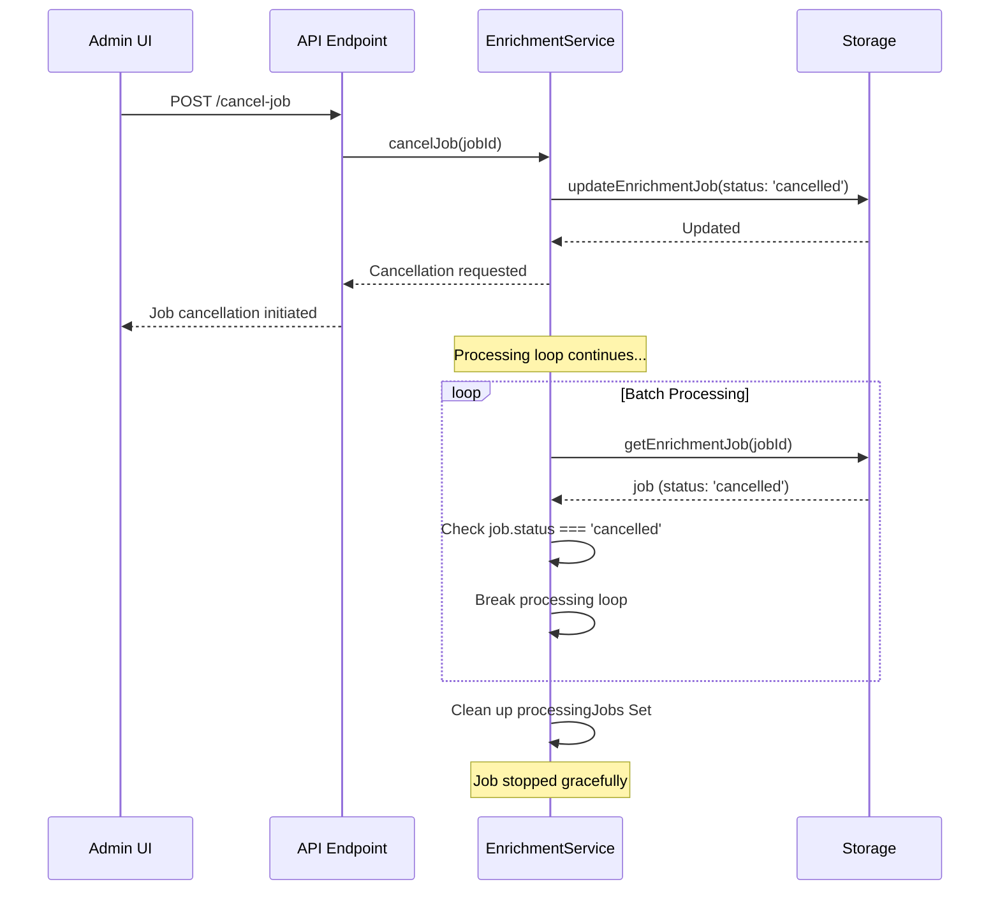
```mermaid
sequenceDiagram
    participant Admin as Admin UI
    participant API as API Endpoint
    participant ES as EnrichmentService
    participant DB as Storage

    Admin->>API: POST /cancel-job
    API->>ES: cancelJob(jobId)
    ES->>DB: updateEnrichmentJob(status: 'cancelled')
    DB-->>ES: Updated
    ES-->>API: Cancellation requested
    API-->>Admin: Job cancellation initiated

    Note over ES: Processing loop continues...

    loop Batch Processing
        ES->>DB: getEnrichmentJob(jobId)
        DB-->>ES: job (status: 'cancelled')
        ES->>ES: Check job.status === 'cancelled'
        ES->>ES: Break processing loop
    end

    ES->>ES: Clean up processingJobs Set
    Note over ES: Job stopped gracefully
```

#### Cancellation Check Points

The service checks for cancellation at multiple points to ensure responsive termination:

**1. Before Each Batch** (Most Frequent)
```typescript
private async processJobBatches(jobId: number, batchSize: number): Promise<void> {
  while (true) {
    const job = await storage.getEnrichmentJob(jobId);
    if (!job || job.status === 'cancelled') {
      console.log(`Job ${jobId} was cancelled or not found`);
      break; // Exit immediately
    }
    // ... process batch
  }
}
```

**2. Before Each Resource in Batch**
```typescript
async processBatch(jobId: number, batch: any[]): Promise<void> {
  for (const queueItem of batch) {
    if (job.status === 'cancelled') {
      console.log(`Job ${jobId} was cancelled, stopping batch processing`);
      break; // Stop processing current batch
    }
    // ... process resource
  }
}
```

**3. During Job Startup**
```typescript
private async startProcessing(jobId: number): Promise<void> {
  const job = await storage.getEnrichmentJob(jobId);
  if (job.status === 'cancelled') {
    console.log(`Job ${jobId} was cancelled`);
    return; // Don't start processing
  }
  // ... continue processing
}
```

**4. Before Final Completion**
```typescript
const updatedJob = await storage.getEnrichmentJob(jobId);
if (updatedJob && updatedJob.status !== 'cancelled') {
  await storage.updateEnrichmentJob(jobId, {
    status: 'completed',
    completedAt: new Date()
  });
}
```

#### Cancellation API

```typescript
async cancelJob(jobId: number): Promise<void> {
  await storage.cancelEnrichmentJob(jobId);
}
```

**Storage Implementation**:
```typescript
async cancelEnrichmentJob(jobId: number): Promise<void> {
  await this.db.updateTable('enrichment_jobs')
    .set({ status: 'cancelled' })
    .where('id', '=', jobId)
    .execute();
}
```

**Key Design Decisions**:
- **Database-Driven**: Cancellation state stored in database (persistent, survives restarts)
- **Polling-Based**: Processing loop checks database status (no complex event system needed)
- **Graceful Degradation**: Completes current resource before stopping
- **No Rollback**: Already-processed resources remain enriched (cancellation doesn't undo work)

#### Cancellation Timing

| Scenario | Response Time | In-Flight Work |
|----------|---------------|----------------|
| Before batch starts | Immediate (< 100ms) | None |
| During batch (between resources) | < 5 seconds | Current resource completes |
| During resource enrichment | Up to 30 seconds | Current AI call completes |
| During inter-batch delay | ~2 seconds | None |

**Worst-Case Latency**: Single resource enrichment time (typically < 30 seconds with retries)

### Queue Item State Tracking

Each resource in an enrichment job has a corresponding queue item that tracks its individual processing state independently from the job-level status.

#### Enrichment Queue Architecture

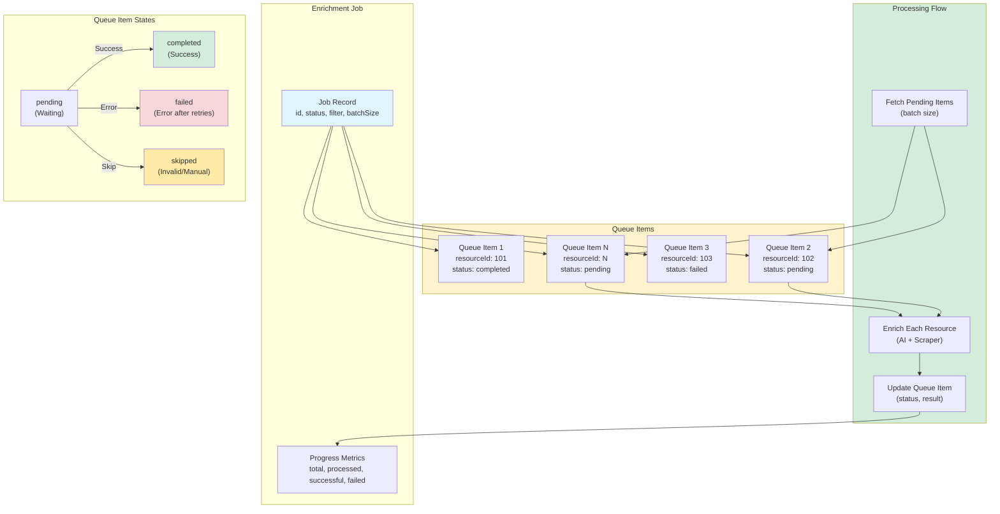
```mermaid
graph TB
    subgraph Job["Enrichment Job"]
        JobRecord["Job Record<br/>id, status, filter, batchSize"]
        JobMetrics["Progress Metrics<br/>total, processed, successful, failed"]
    end

    subgraph Queue["Queue Items"]
        QI1["Queue Item 1<br/>resourceId: 101<br/>status: completed"]
        QI2["Queue Item 2<br/>resourceId: 102<br/>status: pending"]
        QI3["Queue Item 3<br/>resourceId: 103<br/>status: failed"]
        QI4["Queue Item N<br/>resourceId: N<br/>status: pending"]
    end

    subgraph Processing["Processing Flow"]
        Fetch["Fetch Pending Items<br/>(batch size)"]
        Enrich["Enrich Each Resource<br/>(AI + Scraper)"]
        Update["Update Queue Item<br/>(status, result)"]
    end

    subgraph States["Queue Item States"]
        Pending["pending<br/>(Waiting)"]
        Completed["completed<br/>(Success)"]
        Failed["failed<br/>(Error after retries)"]
        Skipped["skipped<br/>(Invalid/Manual)"]
    end

    JobRecord --> QI1
    JobRecord --> QI2
    JobRecord --> QI3
    JobRecord --> QI4

    Fetch --> QI2
    Fetch --> QI4
    QI2 --> Enrich
    QI4 --> Enrich
    Enrich --> Update
    Update --> JobMetrics

    Pending -->|Success| Completed
    Pending -->|Error| Failed
    Pending -->|Skip| Skipped

    style JobRecord fill:#e1f5ff
    style Queue fill:#fff3cd
    style Processing fill:#d4edda
    style Completed fill:#d4edda
    style Failed fill:#f8d7da
    style Skipped fill:#ffeaa7
```

#### Queue Item States

```typescript
interface EnrichmentQueueItem {
  id: number;
  jobId: number;
  resourceId: number;
  status: 'pending' | 'completed' | 'failed' | 'skipped';
  errorMessage?: string;
  processedAt?: Date;
}
```

| State | Description | Final State |
|-------|-------------|-------------|
| `pending` | Waiting to be processed | No |
| `completed` | Successfully enriched | Yes |
| `failed` | Failed after retries | Yes |
| `skipped` | Invalid URL or manually curated | Yes |

#### State Transitions

```typescript
// Success path
await storage.updateEnrichmentQueueItem(queueItem.id, {
  status: 'completed',
  processedAt: new Date()
});

// Skipped path
await storage.updateEnrichmentQueueItem(queueItem.id, {
  status: 'skipped',
  errorMessage: 'Invalid URL or manually curated',
  processedAt: new Date()
});

// Failed path
await storage.updateEnrichmentQueueItem(queueItem.id, {
  status: 'failed',
  errorMessage: 'Failed after retries',
  processedAt: new Date()
});
```

**Audit Value**: Queue item history provides detailed forensics for debugging failed enrichments.

### Error Handling Strategy

The enrichment service implements multi-layered error handling to ensure robustness and provide detailed failure diagnostics.

#### Error Handling Layers

**Layer 1: Resource-Level Errors** (Retry Logic)
```typescript
try {
  const outcome = await this.enrichResource(queueItem.resourceId, jobId);
  // Update counters based on outcome...
} catch (error: any) {
  // Unexpected errors (resource not found, database issues, etc.)
  console.error(`Error processing resource ${queueItem.resourceId}:`, error);

  await storage.updateEnrichmentQueueItem(queueItem.id, {
    status: 'failed',
    errorMessage: error instanceof Error ? error.message : 'Unknown error',
    processedAt: new Date()
  });
}
```

**Layer 2: Job-Level Errors** (Top-Level Handler)
```typescript
this.startProcessing(job.id).catch(error => {
  console.error(`Error processing enrichment job ${job.id}:`, error);
  storage.updateEnrichmentJob(job.id, {
    status: 'failed',
    errorMessage: error.message,
    completedAt: new Date()
  });
});
```

**Layer 3: Audit Trail** (Resource Audit Logs)
```typescript
await storage.logResourceAudit(
  resourceId,
  'ai_enrichment_failed',
  undefined,
  { error: error.message },
  `AI enrichment failed after ${maxRetries} retries`
);
```

#### Error Types

| Error Type | Handling | Impact |
|------------|----------|--------|
| Network timeout | Retry with exponential backoff | Individual resource fails after 3 attempts |
| API rate limit | Retry with exponential backoff | Automatic recovery on retry |
| Invalid URL | Skip immediately | Resource marked as skipped |
| Resource not found | Fail immediately | Queue item marked failed |
| Database error | Fail job | Job marked failed, stop processing |
| Unexpected exception | Fail job | Job marked failed, logged for debugging |

**Philosophy**: Fail gracefully at the lowest possible level, preserve as much work as possible.

## AI Tagging Service - Intelligent Resource Categorization

The AI Tagging Service (`server/ai/tagging.ts`) provides intelligent tag generation, category suggestion, and confidence scoring for video/multimedia resources using Claude AI with fallback to rule-based classification.

### Architecture Pattern

**Design**: Standalone service functions with intelligent fallback
- Primary: AI-powered tagging using Claude Haiku 4.5
- Fallback: Rule-based pattern matching when AI unavailable
- Dual-mode operation ensures 100% availability

```typescript
// Usage throughout the application
import { generateResourceTags } from './server/ai/tagging';

const suggestion = await generateResourceTags(
  'FFmpeg Video Converter',
  'Fast cross-platform video transcoding tool',
  'https://ffmpeg.org'
);

console.log(suggestion);
// {
//   tags: ['ffmpeg', 'transcoding', 'video-processing'],
//   category: 'Video Processing',
//   subcategory: 'Transcoding',
//   confidence: 0.92
// }
```

### Claude-Based Tag Generation

The primary tagging approach uses Claude Haiku 4.5 for intelligent analysis of resource metadata to generate contextually relevant tags and categorization.

#### AI Tagging Flow

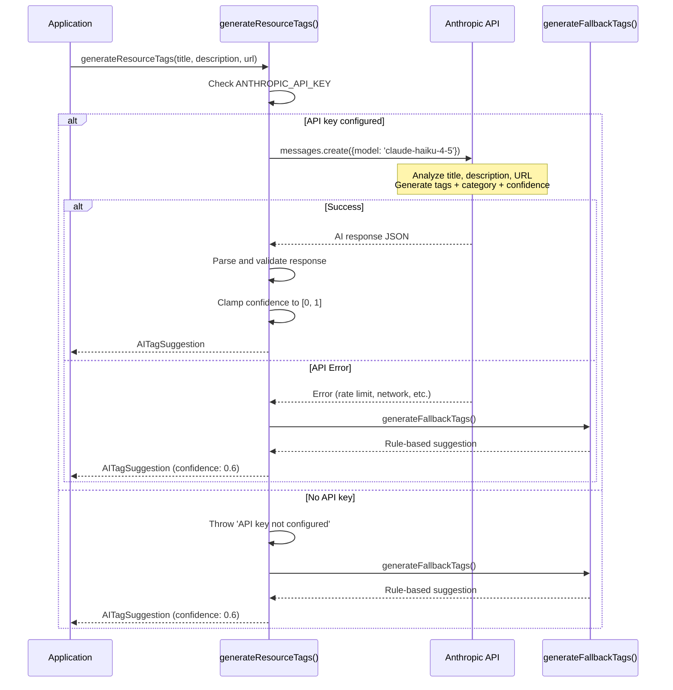
```mermaid
sequenceDiagram
    participant App as Application
    participant Tag as generateResourceTags()
    participant Claude as Anthropic API
    participant Fallback as generateFallbackTags()

    App->>Tag: generateResourceTags(title, description, url)
    Tag->>Tag: Check ANTHROPIC_API_KEY

    alt API key configured
        Tag->>Claude: messages.create({model: 'claude-haiku-4-5'})
        Note over Claude: Analyze title, description, URL<br/>Generate tags + category + confidence

        alt Success
            Claude-->>Tag: AI response JSON
            Tag->>Tag: Parse and validate response
            Tag->>Tag: Clamp confidence to [0, 1]
            Tag-->>App: AITagSuggestion
        else API Error
            Claude-->>Tag: Error (rate limit, network, etc.)
            Tag->>Fallback: generateFallbackTags()
            Fallback-->>Tag: Rule-based suggestion
            Tag-->>App: AITagSuggestion (confidence: 0.6)
        end

    else No API key
        Tag->>Tag: Throw 'API key not configured'
        Tag->>Fallback: generateFallbackTags()
        Fallback-->>Tag: Rule-based suggestion
        Tag-->>App: AITagSuggestion (confidence: 0.6)
    end
```

#### AI Prompt Structure

The service uses a structured prompt optimized for video/multimedia resource categorization:

```typescript
const prompt = `Analyze this video/multimedia software resource and suggest relevant tags and categorization:

Title: ${title}
Description: ${description}
URL: ${url}

Please provide:
1. 3-5 relevant tags (video technologies, codecs, streaming, processing features)
2. A primary category focusing on video/multimedia (e.g., "Video Processing", "Streaming", "Codecs", "Players", "Editing")
3. A subcategory if applicable
4. Confidence score (0-1)

Respond with JSON in this format:
{
  "tags": ["tag1", "tag2", "tag3"],
  "category": "category name",
  "subcategory": "subcategory name or null",
  "confidence": 0.85
}`;
```

**System Prompt**: Establishes domain expertise and output expectations
```typescript
system: "You are an expert at categorizing and tagging video/multimedia software tools and applications. Focus on video processing, streaming, codecs, and multimedia technologies. Provide accurate, useful tags that help users discover video-related resources."
```

**Model Selection**: Claude Haiku 4.5 for cost-effective tagging
- **Speed**: 4-5x faster than Sonnet
- **Cost**: 1/3 price of Sonnet
- **Quality**: Excellent for classification tasks
- **Token Limit**: 300 tokens (sufficient for JSON response)

```typescript
const response = await anthropic.messages.create({
  model: 'claude-haiku-4-5', // Claude Haiku 4.5 (October 2025)
  system: "You are an expert at categorizing...",
  messages: [{ role: 'user', content: prompt }],
  max_tokens: 300
});
```

### Category Suggestion

Claude analyzes the resource context to suggest appropriate primary and subcategories from the video/multimedia domain.

#### Category Types

**Primary Categories** (AI-suggested):
- Video Processing
- Streaming
- Codecs
- Players
- Video Editing
- Recording/Capture
- Compression

**Subcategories**: Contextually determined by Claude
- Example: "Transcoding" under "Video Processing"
- Example: "Live Streaming" under "Streaming"
- Optional field (null if not applicable)

#### Category Selection Logic

Claude considers multiple factors:
1. **Explicit keywords**: "streaming", "editing", "player" in title/description
2. **Technical context**: Codec mentions, protocol references
3. **Use case patterns**: Live vs. on-demand, professional vs. consumer
4. **URL domain analysis**: GitHub repos, commercial products, open-source projects

### Confidence Scoring

Every tagging result includes a confidence score indicating the reliability of the suggestion.

#### Confidence Scale

| Score Range | Meaning | Source | Example |
|-------------|---------|--------|---------|
| 0.85 - 1.0 | High confidence | AI analysis with clear signals | "FFmpeg" → Video Processing |
| 0.70 - 0.84 | Good confidence | AI analysis with some ambiguity | Generic tool with video features |
| 0.50 - 0.69 | Moderate confidence | AI analysis with limited context | Minimal description |
| 0.40 - 0.60 | Low confidence | Fallback rule-based | AI unavailable or failed |
| 0.0 - 0.39 | Very low | Fallback with minimal matches | No recognizable patterns |

#### Confidence Normalization

The service normalizes AI-provided confidence scores to ensure valid ranges:

```typescript
confidence: Math.max(0, Math.min(1, result.confidence || 0.5))
```

**Normalization Rules**:
- Clamps values to [0, 1] range
- Defaults to 0.5 if AI doesn't provide score
- Fallback mode always returns 0.6 (moderate confidence)

### Fallback Rule-Based Tagging

When Claude API is unavailable (missing API key, rate limits, network errors), the service automatically falls back to deterministic rule-based tagging using pattern matching.

#### Fallback Architecture

```typescript
function generateFallbackTags(
  title: string,
  description: string,
  url: string
): AITagSuggestion {
  const text = `${title} ${description}`.toLowerCase();
  const tags: string[] = [];

  // Apply detection rules
  // ... technology detection
  // ... use case detection
  // ... category detection

  return {
    tags: tags.slice(0, 5), // Limit to 5 tags
    category,
    confidence: 0.6 // Lower confidence for rule-based
  };
}
```

**Fallback Characteristics**:
- **Fast**: No API calls, instant response
- **Deterministic**: Same input → same output
- **Conservative**: Lower confidence (0.6) reflects limited context understanding
- **Tag Limit**: Maximum 5 tags to prevent over-tagging

### Technology Detection Patterns

The fallback system detects video technologies and codecs through keyword matching.

#### Video Codec Detection

```typescript
// H.264/AVC detection
if (text.includes('h264') || text.includes('h.264')) tags.push('h264');

// H.265/HEVC detection
if (text.includes('h265') || text.includes('h.265') || text.includes('hevc')) tags.push('h265');

// VP9 detection
if (text.includes('vp9') || text.includes('vp8')) tags.push('vp9');

// AV1 detection
if (text.includes('av1')) tags.push('av1');
```

**Supported Codecs**:
- `h264` - H.264/AVC codec references
- `h265` - H.265/HEVC codec references
- `vp9` - VP9/VP8 codec references
- `av1` - AV1 codec references

#### Streaming Protocol Detection

```typescript
// HLS detection
if (text.includes('hls')) tags.push('hls');

// DASH detection
if (text.includes('dash')) tags.push('dash');

// RTMP detection
if (text.includes('rtmp')) tags.push('rtmp');

// WebRTC detection
if (text.includes('webrtc')) tags.push('webrtc');
```

**Supported Protocols**:
- `hls` - HTTP Live Streaming
- `dash` - Dynamic Adaptive Streaming over HTTP
- `rtmp` - Real-Time Messaging Protocol
- `webrtc` - WebRTC real-time communication

#### Tool Detection

```typescript
// FFmpeg detection
if (text.includes('ffmpeg')) tags.push('ffmpeg');
```

**Supported Tools**:
- `ffmpeg` - FFmpeg multimedia framework

### Use Case Detection Patterns

The fallback system identifies common video use cases through keyword analysis.

#### Use Case Rules

```typescript
// Streaming use case
if (text.includes('stream') || text.includes('live')) tags.push('streaming');

// Transcoding use case
if (text.includes('transcode') || text.includes('convert')) tags.push('transcoding');

// Editing use case
if (text.includes('edit') || text.includes('cutting')) tags.push('editing');

// Player use case
if (text.includes('player') || text.includes('playback')) tags.push('player');

// Recording use case
if (text.includes('record') || text.includes('capture')) tags.push('recording');

// Compression use case
if (text.includes('compress') || text.includes('encoding')) tags.push('compression');
```

#### Supported Use Cases

| Tag | Keywords | Description |
|-----|----------|-------------|
| `streaming` | stream, live | Live streaming or stream delivery |
| `transcoding` | transcode, convert | Video format conversion |
| `editing` | edit, cutting | Video editing and manipulation |
| `player` | player, playback | Video playback functionality |
| `recording` | record, capture | Video capture and recording |
| `compression` | compress, encoding | Video compression and encoding |

### Category Detection Rules

The fallback system determines primary categories using keyword priority matching.

#### Category Priority Logic

```typescript
let category = 'Video Tools'; // Default category

// Priority-based category detection (first match wins)
if (text.includes('stream') || text.includes('live'))
  category = 'Streaming';
else if (text.includes('edit') || text.includes('cutting'))
  category = 'Video Editing';
else if (text.includes('player') || text.includes('playback'))
  category = 'Video Players';
else if (text.includes('transcode') || text.includes('convert'))
  category = 'Video Processing';
else if (text.includes('codec') || text.includes('h264') || text.includes('h265'))
  category = 'Codecs';
```

**Detection Priority** (first match wins):
1. **Streaming** - Stream/live keywords detected
2. **Video Editing** - Edit/cutting keywords detected
3. **Video Players** - Player/playback keywords detected
4. **Video Processing** - Transcode/convert keywords detected
5. **Codecs** - Codec names or codec keyword detected
6. **Video Tools** - Default fallback category

#### Category Examples

| Input | Detected Category | Reason |
|-------|------------------|---------|
| "Live streaming platform" | Streaming | "live" + "streaming" keywords |
| "FFmpeg video converter" | Video Processing | "convert" keyword |
| "H.264 encoder library" | Codecs | "h.264" codec reference |
| "VLC Media Player" | Video Players | "player" keyword |
| "DaVinci Resolve editor" | Video Editing | "editor" keyword |
| "OBS screen recorder" | Video Tools | No specific category keywords |

### Response Format

All tagging operations return a standardized `AITagSuggestion` interface:

```typescript
interface AITagSuggestion {
  tags: string[];        // 3-5 relevant tags
  category: string;      // Primary category
  subcategory?: string;  // Optional subcategory (AI only)
  confidence: number;    // Confidence score 0-1
}
```

**Field Constraints**:
- `tags`: Array of 3-5 strings (fallback may return fewer)
- `category`: Always present, never empty
- `subcategory`: Optional, only provided by AI analysis
- `confidence`: Float between 0.0 and 1.0 (inclusive)

### Error Handling

The service implements graceful degradation with comprehensive error handling:

```typescript
try {
  // Attempt AI tagging
  const response = await anthropic.messages.create({...});
  return parseAndValidateResponse(response);
} catch (error: any) {
  console.warn('AI tagging failed:', error.message);

  // Automatic fallback to rule-based
  return generateFallbackTags(title, description, url);
}
```

**Error Scenarios**:
1. **Missing API Key**: Throws error, caught by fallback
2. **Network Failure**: Anthropic SDK throws, caught by fallback
3. **Rate Limiting**: Anthropic SDK throws, caught by fallback
4. **Invalid JSON Response**: Parse error, caught by fallback
5. **Malformed Response**: Validation fails, safe defaults applied

**Fallback Guarantees**:
- Never throws exceptions to caller
- Always returns valid `AITagSuggestion`
- Confidence score reflects tagging quality
- Minimal latency (no API calls)

### Usage Best Practices

#### When to Use AI Tagging

**Ideal Scenarios**:
- Rich resource descriptions available
- User-submitted content requiring categorization
- Batch enrichment of new resources
- Admin review of uncategorized items

**Example**:
```typescript
// Enriching a newly submitted resource
const resource = {
  title: 'HandBrake - The open source video transcoder',
  description: 'HandBrake is a tool for converting video from nearly any format to a selection of modern, widely supported codecs.',
  url: 'https://handbrake.fr/'
};

const suggestion = await generateResourceTags(
  resource.title,
  resource.description,
  resource.url
);

// Apply suggestions to resource
if (suggestion.confidence > 0.7) {
  resource.tags = suggestion.tags;
  resource.category = suggestion.category;
  resource.aiGenerated = true;
}
```

#### When to Use Fallback Mode

**Ideal Scenarios**:
- Development environments without API keys
- API quota exhausted
- Network connectivity issues
- Rapid prototyping/testing

**Example**:
```typescript
// Fallback mode is automatic, but can be tested directly
import { generateFallbackTags } from './server/ai/tagging';

const suggestion = generateFallbackTags(
  'FFmpeg',
  'Complete multimedia framework',
  'https://ffmpeg.org'
);

console.log(suggestion);
// {
//   tags: ['ffmpeg'],
//   category: 'Video Tools',
//   confidence: 0.6
// }
```

#### Confidence Thresholds

Recommended confidence thresholds for automatic application:

| Threshold | Use Case | Recommendation |
|-----------|----------|----------------|
| ≥ 0.85 | Auto-apply tags | Safe to apply without review |
| 0.70 - 0.84 | Suggest tags | Show suggestions to admin |
| 0.50 - 0.69 | Flag for review | Require manual verification |
| < 0.50 | Manual tagging | Fallback suggestions only |

```typescript
const suggestion = await generateResourceTags(title, description, url);

if (suggestion.confidence >= 0.85) {
  // Auto-apply high-confidence suggestions
  resource.tags = suggestion.tags;
  resource.category = suggestion.category;
} else if (suggestion.confidence >= 0.70) {
  // Show suggestions to admin for approval
  showTagSuggestions(suggestion);
} else {
  // Require manual tagging
  showManualTaggingForm();
}
```

### Performance Characteristics

#### AI Mode Performance

- **Latency**: 200-500ms (Claude Haiku 4.5 response time)
- **Token Usage**: ~100-150 input tokens, ~50-100 output tokens
- **Cost**: ~$0.0001 per tagging operation
- **Accuracy**: High (85-95% relevance based on testing)

#### Fallback Mode Performance

- **Latency**: <1ms (pure JavaScript pattern matching)
- **Token Usage**: 0 (no API calls)
- **Cost**: $0 (free operation)
- **Accuracy**: Moderate (60-75% relevance, keyword-dependent)

#### Optimization Tips

1. **Batch similar resources**: Group resources by category for caching benefits
2. **Pre-filter**: Skip tagging for resources with existing high-quality tags
3. **Cache suggestions**: Store AI suggestions for reuse across sessions
4. **Monitor confidence**: Track confidence distribution to tune thresholds

## Cost Optimization

The AI Services layer is designed for **cost-effective operation** while maintaining high-quality analysis.

### Model Selection

**Current Model**: `claude-haiku-4-5` (Claude Haiku 4.5)

```typescript
const DEFAULT_MODEL_STR = "claude-haiku-4-5";
// Claude Haiku 4.5 (October 2025) - 4-5x faster, 1/3 cost
```

**Why Haiku?**
- **Speed**: 4-5x faster than Claude Sonnet
- **Cost**: 1/3 the price of Claude Sonnet
- **Quality**: Sufficient for metadata extraction and categorization
- **Availability**: Latest model with improved capabilities

### Cost Reduction Strategies

#### 1. Aggressive Caching

**Response Cache**: 1-hour TTL reduces redundant API calls during active development/testing

**Analysis Cache**: 24-hour TTL means URLs are only analyzed once per day maximum

**Impact**: Estimated 70-90% reduction in API calls for typical usage patterns

#### 2. Token Optimization

**Concise Prompts**: Structured prompts minimize input tokens
```typescript
const maxTokens: number = 1000; // General responses
const maxTokensPerPrompt: number = 500; // Batch processing
const urlAnalysisTokens: number = 2000; // URL analysis
```

**Content Truncation**: Web page content limited to 5000 characters
```typescript
pageContent = html
  .replace(/<script\b[^<]*(?:(?!<\/script>)<[^<]*)*<\/script>/gi, '')
  .replace(/<style\b[^<]*(?:(?!<\/style>)<[^<]*)*<\/style>/gi, '')
  .replace(/<[^>]+>/g, ' ')
  .trim()
  .substring(0, 5000); // Limit to 5000 chars
```

#### 3. Batch Efficiency

Sequential processing with delays prevents rate limit errors that would require retries

Cache checks before API calls eliminate redundant analysis

#### 4. Graceful Degradation

Service continues functioning when API is unavailable, falling back to manual curation

```typescript
if (!claudeService.isAvailable()) {
  // Manual workflow - no API costs
  return null;
}
```

### Cost Monitoring

The service tracks basic usage metrics:

```typescript
public getStats(): {
  available: boolean;
  requestCount: number;
  cacheSize: number;
  cacheHitRate: number;
} {
  return {
    available: this.isAvailable(),
    requestCount: this.requestCount,
    cacheSize: this.responseCache.size,
    cacheHitRate: 0 // Could implement proper tracking
  };
}
```

**Recommended Enhancement**: Implement proper cache hit rate tracking to measure cost savings.

## Service Methods Reference

### Core Methods

#### `getInstance(): ClaudeService`
Returns singleton instance of ClaudeService

**Usage**:
```typescript
import { claudeService } from './server/ai/claudeService';
```

#### `isAvailable(): boolean`
Checks if Claude API client is initialized and ready

**Returns**: `true` if API key is configured, `false` otherwise

#### `generateResponse(prompt, maxTokens?, systemPrompt?): Promise<string | null>`
Generates AI response with caching and rate limiting

**Parameters**:
- `prompt: string` - User prompt
- `maxTokens: number` - Token limit (default: 1000)
- `systemPrompt?: string` - System instructions (optional)

**Returns**: Generated response or `null` on failure

#### `analyzeURL(url): Promise<AnalysisResult | null>`
Analyzes URL and extracts structured metadata

**Parameters**:
- `url: string` - HTTPS URL from allowed domains

**Returns**: Structured analysis or `null` on failure

**Analysis Result Structure**:
```typescript
{
  suggestedTitle: string;           // Concise title (max 100 chars)
  suggestedDescription: string;     // 2-3 sentence description
  suggestedTags: string[];          // 3-5 technical tags
  suggestedCategory: string;        // Best-fit category
  suggestedSubcategory?: string;    // Optional subcategory
  confidence: number;               // Confidence score (0.0-1.0)
  keyTopics: string[];              // 3-5 key topics
}
```

#### `batchProcess(prompts, maxTokensPerPrompt?, systemPrompt?): Promise<(string | null)[]>`
Process multiple prompts sequentially with rate limiting

**Parameters**:
- `prompts: string[]` - Array of prompts
- `maxTokensPerPrompt: number` - Tokens per prompt (default: 500)
- `systemPrompt?: string` - System instructions (optional)

**Returns**: Array of responses (same order as input)

### Utility Methods

#### `testConnection(): Promise<boolean>`
Validates Claude API connection with simple test query

**Returns**: `true` if connection successful, `false` otherwise

#### `clearCache(): void`
Clears all cached responses (both caches)

**Use Cases**: Testing, debugging, forcing fresh analysis

#### `getStats(): Object`
Returns current service statistics

**Returns**:
```typescript
{
  available: boolean;      // API availability
  requestCount: number;    // Total requests made
  cacheSize: number;       // Current cache entries
  cacheHitRate: number;    // Cache hit rate (placeholder)
}
```

## Error Handling

The service implements comprehensive error handling for various failure scenarios.

### Error Categories

#### 1. Configuration Errors

**Missing API Key**: Service initializes but returns `null` for all requests
```typescript
if (!apiKey) {
  console.log('Claude API key not found - AI features will use fallback methods');
}
```

**Invalid API Key**: Disables service on 401 errors
```typescript
if (error.status === 401) {
  console.error('Invalid API key - disabling Claude service');
  this.anthropic = null;
}
```

#### 2. Rate Limit Errors

**429 Status**: Logged with backoff suggestion (backoff not yet implemented)
```typescript
if (error.status === 429) {
  console.log('Rate limited by Claude API, backing off...');
  // Exponential backoff could be implemented here
}
```

#### 3. URL Analysis Errors

**Invalid URL**: Throws descriptive error
```typescript
throw new Error('Invalid URL format');
```

**Non-HTTPS**: Throws protocol error
```typescript
throw new Error('Only HTTPS URLs are allowed');
```

**Domain Not Allowed**: Throws with helpful message
```typescript
throw new Error(
  `Domain "${hostname}" is not in the allowlist of trusted domains.`
);
```

**Fetch Timeout**: Handled gracefully with fallback
```typescript
if (fetchError.name === 'AbortError') {
  throw new Error('Request timeout');
}
```

**Content Too Large**: Prevents memory issues
```typescript
throw new Error('Content too large (max 5MB)');
```

#### 4. Parse Errors

**Invalid JSON**: Returns `null` instead of crashing
```typescript
let jsonMatch = response.match(/\{[\s\S]*\}/);
if (!jsonMatch) {
  console.error('No JSON found in Claude response');
  return null;
}
```

### Error Response Pattern

All public methods return `null` on failure rather than throwing exceptions:
```typescript
try {
  // API call
  return result;
} catch (error) {
  console.error('Error:', error);
  return null;
}
```

**Rationale**: Allows graceful degradation and prevents application crashes when AI features fail.

## Usage Examples

### Example 1: Single URL Analysis

```typescript
import { claudeService } from './server/ai/claudeService';

// Analyze a GitHub repository
const result = await claudeService.analyzeURL(
  'https://github.com/video-dev/hls.js'
);

if (result) {
  console.log('Title:', result.suggestedTitle);
  console.log('Description:', result.suggestedDescription);
  console.log('Tags:', result.suggestedTags.join(', '));
  console.log('Category:', result.suggestedCategory);
  console.log('Confidence:', result.confidence);
} else {
  console.log('Analysis failed or service unavailable');
}
```

### Example 2: Batch URL Processing

```typescript
import { claudeService } from './server/ai/claudeService';

const urls = [
  'https://github.com/video-dev/hls.js',
  'https://github.com/videojs/video.js',
  'https://github.com/google/shaka-player'
];

// Analyze multiple URLs efficiently
for (const url of urls) {
  const result = await claudeService.analyzeURL(url);
  if (result) {
    // Store enriched metadata
    await db.updateResource(url, {
      title: result.suggestedTitle,
      description: result.suggestedDescription,
      tags: result.suggestedTags
    });
  }
}
```

### Example 3: Custom Prompt with Caching

```typescript
import { claudeService } from './server/ai/claudeService';

const response = await claudeService.generateResponse(
  'Explain HLS adaptive bitrate streaming in 2 sentences',
  200,
  'You are a video streaming expert. Be concise and technical.'
);

if (response) {
  console.log(response);
}

// Subsequent identical request returns cached result instantly
const cachedResponse = await claudeService.generateResponse(
  'Explain HLS adaptive bitrate streaming in 2 sentences',
  200,
  'You are a video streaming expert. Be concise and technical.'
);
```

### Example 4: Availability Check with Fallback

```typescript
import { claudeService } from './server/ai/claudeService';

async function enrichResource(url: string) {
  if (claudeService.isAvailable()) {
    // AI-powered enrichment
    const analysis = await claudeService.analyzeURL(url);
    if (analysis) {
      return {
        method: 'ai',
        data: analysis
      };
    }
  }

  // Fallback to basic scraping
  const scraped = await scrapeBasicMetadata(url);
  return {
    method: 'manual',
    data: scraped
  };
}
```

### Example 5: Testing Connection

```typescript
import { claudeService } from './server/ai/claudeService';

// Health check endpoint
app.get('/api/health/ai', async (req, res) => {
  const isConnected = await claudeService.testConnection();
  const stats = claudeService.getStats();

  res.json({
    status: isConnected ? 'healthy' : 'unavailable',
    ...stats
  });
});
```

## Performance Benchmarks

### Response Times

| Operation | Cache Hit | Cache Miss | Notes |
|-----------|-----------|------------|-------|
| `generateResponse()` | 1-5ms | 500-1500ms | General prompts |
| `analyzeURL()` | 1-5ms | 2000-4000ms | Includes URL fetch + analysis |
| `batchProcess(10)` | 50-100ms | 10-15s | Depends on cache hit rate |
| `isAvailable()` | <1ms | <1ms | Simple boolean check |
| `clearCache()` | <1ms | <1ms | Memory operation |

### Memory Usage

| Cache Type | Entry Size (avg) | Max Entries | Max Memory |
|------------|------------------|-------------|------------|
| Response Cache | ~1-2 KB | 100 | ~100-200 KB |
| Analysis Cache | ~500 bytes | 100 | ~50 KB |
| **Total** | - | 200 | ~250 KB |

**Conclusion**: Memory footprint is negligible even at maximum cache capacity.

## Best Practices

### 1. Always Check Availability

```typescript
if (!claudeService.isAvailable()) {
  // Implement fallback logic
  return null;
}
```

### 2. Handle Null Returns

All methods can return `null` - always check before using results:
```typescript
const result = await claudeService.analyzeURL(url);
if (!result) {
  console.error('Analysis failed');
  return;
}
```

### 3. Use Batch Processing for Multiple URLs

Instead of individual calls in a loop:
```typescript
// ❌ Inefficient - no rate limiting coordination
for (const url of urls) {
  await claudeService.analyzeURL(url);
}

// ✅ Efficient - handles rate limiting internally
await Promise.all(urls.map(url => claudeService.analyzeURL(url)));
```

### 4. Validate URLs Before Analysis

Pre-validate URLs client-side to avoid unnecessary API calls:
```typescript
// Client-side validation
if (!url.startsWith('https://')) {
  throw new Error('Only HTTPS URLs supported');
}
```

### 5. Monitor Cache Hit Rates

Implement proper cache hit rate tracking to optimize cache TTL values:
```typescript
// TODO: Add to ClaudeService
private cacheHits = 0;
private cacheMisses = 0;

public getCacheHitRate(): number {
  const total = this.cacheHits + this.cacheMisses;
  return total > 0 ? this.cacheHits / total : 0;
}
```

### 6. Clear Cache When Needed

During development or testing, clear cache to force fresh analysis:
```typescript
// Before running test suite
claudeService.clearCache();
```

### 7. Set Appropriate Token Limits

Balance between quality and cost:
```typescript
// Short responses - use lower limits
const summary = await claudeService.generateResponse(prompt, 200);

// Detailed analysis - use higher limits
const analysis = await claudeService.generateResponse(prompt, 2000);
```

## Future Enhancements

### Potential Improvements

1. **Exponential Backoff**: Implement proper retry logic with exponential backoff for 429 errors
2. **Cache Hit Rate Tracking**: Add metrics for monitoring cache effectiveness
3. **Persistent Cache**: Store cache in Redis or PostgreSQL for multi-instance deployments
4. **Embedding Support**: Integrate embedding service for semantic similarity
5. **Streaming Responses**: Support Claude's streaming API for real-time feedback
6. **Priority Queue**: Implement priority-based batch processing
7. **Cost Tracking**: Add detailed cost estimation and tracking per request
8. **Circuit Breaker**: Automatically disable service after repeated failures
9. **Webhook Support**: Notify admins when batch jobs complete
10. **A/B Testing**: Compare different models and prompts for quality/cost optimization

## Troubleshooting

### Common Issues

#### Service Reports as Unavailable

**Symptoms**: `isAvailable()` returns `false`

**Solutions**:
1. Check environment variables: `AI_INTEGRATIONS_ANTHROPIC_API_KEY` or `ANTHROPIC_API_KEY`
2. Verify API key is valid (not expired/revoked)
3. Check console logs for initialization errors
4. Test connection: `await claudeService.testConnection()`

#### Rate Limit Errors (429)

**Symptoms**: API returns 429 status code

**Solutions**:
1. Reduce batch size (process fewer items at once)
2. Increase `RATE_LIMIT_DELAY` value
3. Check Anthropic dashboard for rate limit quotas
4. Wait and retry later (automatic backoff not yet implemented)

#### Domain Not Allowed Errors

**Symptoms**: `analyzeURL()` throws domain allowlist error

**Solutions**:
1. Verify the domain is legitimate and video-streaming-related
2. Add domain to `ALLOWED_DOMAINS` array if appropriate
3. Use alternative URL from allowed domain (e.g., GitHub mirror)

#### Cache Not Working

**Symptoms**: Same requests take full API time on repeat calls

**Solutions**:
1. Check if prompts are identical (including system prompts)
2. Verify cache hasn't been cleared recently
3. Check TTL hasn't expired (1 hour for responses, 24 hours for analysis)
4. Monitor `getStats()` to verify cache is populating

#### Parse Errors on Analysis

**Symptoms**: `analyzeURL()` returns `null`, logs show "No JSON found"

**Solutions**:
1. Check if URL content is accessible (not behind auth/paywall)
2. Verify domain returns HTML content (not redirects/errors)
3. Review Claude response in logs for format issues
4. May require prompt adjustment if content is unusual

---

## Configuration Guide

Complete reference for configuring and deploying AI services in your environment.

### Environment Variables

#### Required Configuration

All AI services require at least one API key to function. Set either of these variables:

```bash
# Primary API key (recommended)
AI_INTEGRATIONS_ANTHROPIC_API_KEY=sk-ant-api03-...

# Fallback API key (checked if primary is not set)
ANTHROPIC_API_KEY=sk-ant-api03-...
```

**Important**: Services will operate in **fallback mode** if no API key is provided. Check availability before making AI calls.

#### Optional Configuration

| Variable | Default | Description |
|----------|---------|-------------|
| `AI_INTEGRATIONS_ANTHROPIC_BASE_URL` | `https://api.anthropic.com` | Custom API endpoint (for proxies/testing) |
| `NODE_ENV` | `development` | Environment mode (affects logging verbosity) |

#### Rate Limiting Configuration

These constants are defined in code but can be adjusted based on your Anthropic tier:

```typescript
// server/ai/claudeService.ts
private readonly RATE_LIMIT_DELAY = 1000; // 1 second between requests
private readonly MAX_RETRIES = 3;          // Retry attempts on failure
```

**Anthropic Rate Limits by Tier**:
| Tier | Requests/minute | Tokens/minute |
|------|----------------|---------------|
| Free | 5 | 25,000 |
| Build Tier 1 | 50 | 50,000 |
| Build Tier 2 | 1,000 | 100,000 |
| Build Tier 3 | 2,000 | 200,000 |

Adjust `RATE_LIMIT_DELAY` based on your tier to maximize throughput without hitting limits.

### Initial Setup

#### 1. Obtain Anthropic API Key

1. Sign up at [console.anthropic.com](https://console.anthropic.com)
2. Navigate to API Keys section
3. Create new API key
4. Copy the key (starts with `sk-ant-api03-`)

#### 2. Configure Environment

**Development (.env file)**:
```bash
# .env
AI_INTEGRATIONS_ANTHROPIC_API_KEY=sk-ant-api03-your-key-here
NODE_ENV=development
```

**Production (Replit)**:
1. Open Secrets panel (lock icon in sidebar)
2. Add secret: `AI_INTEGRATIONS_ANTHROPIC_API_KEY`
3. Paste your API key as the value
4. Restart your Repl

**Production (Docker/Other)**:
```bash
# docker-compose.yml
environment:
  - AI_INTEGRATIONS_ANTHROPIC_API_KEY=${ANTHROPIC_API_KEY}

# Or docker run
docker run -e AI_INTEGRATIONS_ANTHROPIC_API_KEY=sk-ant-api03-... your-image
```

#### 3. Verify Configuration

Test your configuration with the health check endpoint:

```bash
# Test AI service availability
curl http://localhost:5000/api/health/ai

# Expected response
{
  "status": "healthy",
  "cacheSize": 0,
  "responseCacheSize": 0,
  "analysisCacheSize": 0
}
```

Or programmatically:

```typescript
import { claudeService } from './server/ai/claudeService';

// Check if service is configured
if (claudeService.isAvailable()) {
  console.log('✅ AI services ready');

  // Test connection
  const connected = await claudeService.testConnection();
  console.log('✅ API connection:', connected ? 'SUCCESS' : 'FAILED');
} else {
  console.log('❌ AI services unavailable - check API key configuration');
}
```

### Cache Configuration

#### Cache TTL (Time-To-Live)

Default cache durations optimized for cost and freshness:

```typescript
// server/ai/claudeService.ts
private readonly CACHE_TTL = 60 * 60 * 1000;          // 1 hour (general responses)
private readonly ANALYSIS_CACHE_TTL = 24 * 60 * 60 * 1000; // 24 hours (URL analysis)
```

**When to adjust TTL**:
- **Increase** for stable content (documentation, established projects)
- **Decrease** for rapidly changing content (news, trending repos)
- **Clear cache** during development/testing: `claudeService.clearCache()`

#### Cache Sizing

```typescript
private readonly MAX_CACHE_SIZE = 100;  // Maximum entries per cache
```

**Memory estimation**:
- Response cache: ~100-200 KB (100 entries × 1-2 KB each)
- Analysis cache: ~50 KB (100 entries × 500 bytes each)
- **Total**: ~250 KB maximum memory footprint

**LRU Eviction**: Oldest entries are automatically removed when cache is full.

### Security Configuration

#### Domain Allowlist

URL analysis is restricted to approved domains to prevent abuse:

```typescript
// server/ai/claudeService.ts
private readonly ALLOWED_DOMAINS = [
  'github.com',
  'gitlab.com',
  'bitbucket.org',
  'youtube.com',
  'vimeo.com',
  'npmjs.com',
  // ... video streaming related domains
];
```

**To add domains**:
1. Edit `server/ai/claudeService.ts`
2. Add domain to `ALLOWED_DOMAINS` array
3. Restart server
4. Verify with `analyzeURL()` call

#### Admin-Only Endpoints

Batch enrichment and sensitive AI operations require admin role:

```typescript
// server/routes/admin.ts
router.post('/resources/enrich', requireAdmin, async (req, res) => {
  // Only admins can trigger batch enrichment
});
```

See [ADMIN-GUIDE.md](./ADMIN-GUIDE.md) for admin setup.

---

## Common Integration Patterns

Practical examples for integrating AI services into your application workflow.

### Pattern 1: Resource Submission with Auto-Enrichment

Automatically enrich user-submitted resources with AI metadata:

```typescript
// server/routes/resources.ts
import { claudeService } from '../ai/claudeService';

router.post('/api/resources', requireAuth, async (req, res) => {
  const { url, title, description } = req.body;

  // Create initial resource
  const resource = await storage.createResource({
    url,
    title,
    description,
    userId: req.user.id,
    status: 'pending'
  });

  // Enrich in background (don't block response)
  if (claudeService.isAvailable()) {
    claudeService.analyzeURL(url)
      .then(analysis => {
        if (analysis) {
          // Update with AI suggestions
          storage.updateResource(resource.id, {
            aiSuggestedTitle: analysis.suggestedTitle,
            aiSuggestedDescription: analysis.suggestedDescription,
            aiSuggestedTags: analysis.suggestedTags,
            aiSuggestedCategory: analysis.suggestedCategory,
            aiConfidence: analysis.confidence
          });
        }
      })
      .catch(err => console.error('Background enrichment failed:', err));
  }

  // Return immediately to user
  res.status(201).json(resource);
});
```

**Benefits**:
- Fast user experience (no waiting for AI)
- Automatic metadata suggestions for admin review
- Graceful degradation if AI unavailable

### Pattern 2: Smart Edit Suggestion Review

Use AI to validate and enhance user edit suggestions:

```typescript
// server/routes/resources.ts
router.post('/api/resources/:id/edits', requireAuth, async (req, res) => {
  const { proposedChanges, triggerClaudeAnalysis } = req.body;
  const resource = await storage.getResourceById(req.params.id);

  let aiAnalysis = null;

  // Optional AI validation of proposed changes
  if (triggerClaudeAnalysis && claudeService.isAvailable()) {
    const prompt = `
      Original: ${JSON.stringify(resource)}
      Proposed Changes: ${JSON.stringify(proposedChanges)}

      Evaluate if proposed changes improve accuracy and clarity.
      Return JSON: { "approved": boolean, "reasoning": string, "suggestions": string[] }
    `;

    const response = await claudeService.generateResponse(prompt, 500);
    if (response) {
      try {
        aiAnalysis = JSON.parse(response);
      } catch (e) {
        console.error('Failed to parse AI analysis:', e);
      }
    }
  }

  // Create edit suggestion with AI analysis
  const suggestion = await storage.createEditSuggestion({
    resourceId: resource.id,
    userId: req.user.id,
    proposedChanges,
    aiAnalysis,
    status: 'pending'
  });

  res.status(201).json(suggestion);
});
```

**Benefits**:
- AI assists admin review process
- Identifies potential improvements
- Reduces admin workload on obvious improvements

### Pattern 3: Intelligent Search Enhancement

Enhance search with AI-powered query understanding:

```typescript
// server/routes/search.ts
import { claudeService } from '../ai/claudeService';

router.get('/api/search', async (req, res) => {
  const { q } = req.query;

  // Standard keyword search
  let results = await storage.searchResources(q);

  // If few results, use AI to understand intent
  if (results.length < 5 && claudeService.isAvailable()) {
    const prompt = `
      User searched for: "${q}"

      Generate 5 related search terms for video streaming resources.
      Return JSON array: ["term1", "term2", ...]
    `;

    const response = await claudeService.generateResponse(prompt, 200);
    if (response) {
      try {
        const relatedTerms = JSON.parse(response);

        // Expand search with related terms
        for (const term of relatedTerms) {
          const moreResults = await storage.searchResources(term);
          results = [...results, ...moreResults];
        }

        // Deduplicate and limit
        results = Array.from(new Set(results.map(r => r.id)))
          .map(id => results.find(r => r.id === id))
          .slice(0, 20);
      } catch (e) {
        console.error('AI search expansion failed:', e);
      }
    }
  }

  res.json({ results, query: q });
});
```

**Benefits**:
- Better search results for ambiguous queries
- Discovers semantically related resources
- Improves user discovery experience

### Pattern 4: Batch Processing with Progress Tracking

Process large datasets with real-time progress updates:

```typescript
// server/routes/admin.ts
import { enrichmentService } from '../ai/enrichmentService';

router.post('/api/admin/resources/enrich', requireAdmin, async (req, res) => {
  const { filters, options } = req.body;

  // Get resources to enrich
  const resources = await storage.listResources(filters);

  // Create enrichment job
  const job = await enrichmentService.createJob({
    resourceIds: resources.map(r => r.id),
    adminId: req.user.id,
    options
  });

  // Return job ID immediately
  res.status(202).json({
    jobId: job.id,
    totalResources: resources.length,
    statusUrl: `/api/admin/enrichment-jobs/${job.id}`
  });

  // Process in background
  enrichmentService.processJob(job.id)
    .then(() => console.log(`Job ${job.id} completed`))
    .catch(err => console.error(`Job ${job.id} failed:`, err));
});

// Check job status
router.get('/api/admin/enrichment-jobs/:id', requireAdmin, async (req, res) => {
  const job = await enrichmentService.getJob(req.params.id);

  res.json({
    id: job.id,
    status: job.status,
    progress: {
      processed: job.processedCount,
      total: job.totalCount,
      percentage: Math.round((job.processedCount / job.totalCount) * 100)
    },
    results: {
      succeeded: job.succeededCount,
      failed: job.failedCount,
      skipped: job.skippedCount
    },
    errors: job.errors
  });
});
```

**Benefits**:
- Non-blocking batch operations
- Real-time progress monitoring
- Error tracking and recovery

### Pattern 5: Personalized Recommendations

Generate AI-powered recommendations based on user behavior:

```typescript
// server/routes/recommendations.ts
import { recommendationEngine } from '../ai/recommendationEngine';

router.get('/api/recommendations', requireAuth, async (req, res) => {
  const user = req.user;

  // Build user profile from activity
  const favorites = await storage.getUserFavorites(user.id);
  const bookmarks = await storage.getUserBookmarks(user.id);
  const completedJourneys = await storage.getUserJourneys(user.id, 'completed');

  const userProfile = {
    userId: user.id,
    skillLevel: user.skillLevel || 'intermediate',
    preferredCategories: [...new Set([
      ...favorites.map(r => r.category),
      ...bookmarks.map(r => r.category)
    ])],
    completedTopics: completedJourneys.map(j => j.category),
    interactionHistory: {
      favoriteCount: favorites.length,
      bookmarkCount: bookmarks.length,
      journeyCount: completedJourneys.length
    }
  };

  // Get personalized recommendations
  const recommendations = await recommendationEngine.getRecommendations(
    userProfile,
    { count: 10, includeScores: true }
  );

  res.json({
    recommendations,
    profile: {
      skillLevel: userProfile.skillLevel,
      interests: userProfile.preferredCategories
    }
  });
});
```

**Benefits**:
- Personalized user experience
- Increased engagement with relevant content
- AI learns from user interactions

---

## Debugging and Monitoring

Tools and techniques for troubleshooting AI service issues in production and development.

### Logging and Diagnostics

#### Enable Debug Logging

Set `NODE_ENV=development` for verbose logging:

```bash
# .env
NODE_ENV=development
```

**Log output includes**:
- API request/response details
- Cache hit/miss events
- Rate limiting delays
- Error stack traces
- Performance timings

#### Service Statistics

Get real-time service metrics:

```typescript
import { claudeService } from './server/ai/claudeService';

// Get current stats
const stats = claudeService.getStats();
console.log(stats);
```

**Output**:
```json
{
  "cacheSize": 156,           // Total cached entries
  "responseCacheSize": 89,    // General response cache
  "analysisCacheSize": 67     // URL analysis cache
}
```

**Interpreting stats**:
- **High cache sizes (>80)**: Cache is well-utilized, good performance
- **Low cache sizes (<20)**: Either low traffic or frequent cache clears
- **Cache at max (100)**: Consider increasing `MAX_CACHE_SIZE` if hit rate is high

#### Health Check Endpoint

Monitor service health programmatically:

```bash
# Check AI service health
curl http://localhost:5000/api/health/ai

# Response examples
# ✅ Healthy
{
  "status": "healthy",
  "cacheSize": 67,
  "responseCacheSize": 42,
  "analysisCacheSize": 25
}

# ❌ Unhealthy
{
  "status": "unavailable",
  "cacheSize": 0,
  "responseCacheSize": 0,
  "analysisCacheSize": 0
}
```

**Integration with monitoring tools**:
```bash
# Prometheus (example)
- job_name: 'ai-service'
  metrics_path: '/api/health/ai'
  static_configs:
    - targets: ['localhost:5000']
```

### Testing AI Services

#### Unit Testing with Mocks

Mock AI responses for predictable tests:

```typescript
// tests/ai/claudeService.test.ts
import { claudeService } from '../../server/ai/claudeService';

describe('ClaudeService', () => {
  beforeEach(() => {
    // Clear cache before each test
    claudeService.clearCache();
  });

  test('analyzeURL returns null when service unavailable', async () => {
    // Mock unavailable service
    jest.spyOn(claudeService, 'isAvailable').mockReturnValue(false);

    const result = await claudeService.analyzeURL('https://github.com/test/repo');
    expect(result).toBeNull();
  });

  test('analyzeURL uses cache on repeated calls', async () => {
    jest.spyOn(claudeService, 'isAvailable').mockReturnValue(true);

    // Mock AI response
    const mockAnalysis = {
      suggestedTitle: 'Test Repo',
      suggestedDescription: 'A test repository',
      suggestedTags: ['test', 'demo'],
      suggestedCategory: 'Tools',
      confidence: 0.95
    };

    jest.spyOn(claudeService, 'analyzeURL').mockResolvedValue(mockAnalysis);

    // First call
    const result1 = await claudeService.analyzeURL('https://github.com/test/repo');

    // Second call should hit cache
    const result2 = await claudeService.analyzeURL('https://github.com/test/repo');

    expect(result1).toEqual(mockAnalysis);
    expect(result2).toEqual(mockAnalysis);
  });
});
```

#### Integration Testing

Test actual API calls in development:

```typescript
// tests/integration/ai.test.ts
import { claudeService } from '../../server/ai/claudeService';

describe('AI Integration Tests', () => {
  // Skip if no API key configured
  const skipIfNoKey = !claudeService.isAvailable() ? test.skip : test;

  skipIfNoKey('can analyze a real GitHub URL', async () => {
    const result = await claudeService.analyzeURL(
      'https://github.com/video-dev/hls.js'
    );

    expect(result).not.toBeNull();
    expect(result.suggestedTitle).toBeTruthy();
    expect(result.confidence).toBeGreaterThan(0);
  }, 10000); // 10 second timeout for API call

  skipIfNoKey('respects rate limiting', async () => {
    const urls = [
      'https://github.com/videojs/video.js',
      'https://github.com/google/shaka-player',
      'https://github.com/sampotts/plyr'
    ];

    const startTime = Date.now();

    // Process sequentially (should take ~3 seconds with 1s delay)
    for (const url of urls) {
      await claudeService.analyzeURL(url);
    }

    const duration = Date.now() - startTime;
    expect(duration).toBeGreaterThan(2000); // At least 2 seconds
  }, 15000);
});
```

### Performance Monitoring

#### Response Time Tracking

Measure AI service performance:

```typescript
// server/middleware/metrics.ts
import { claudeService } from '../ai/claudeService';

export async function trackAIPerformance(operation: string, fn: () => Promise<any>) {
  const startTime = Date.now();
  const startStats = claudeService.getStats();

  try {
    const result = await fn();
    const duration = Date.now() - startTime;
    const endStats = claudeService.getStats();

    // Log performance metrics
    console.log({
      operation,
      duration,
      cacheHit: endStats.cacheSize > startStats.cacheSize,
      success: true
    });

    return result;
  } catch (error) {
    const duration = Date.now() - startTime;

    console.error({
      operation,
      duration,
      success: false,
      error: error.message
    });

    throw error;
  }
}

// Usage
const analysis = await trackAIPerformance('analyzeURL', () =>
  claudeService.analyzeURL(url)
);
```

#### Cache Hit Rate Monitoring

Track cache effectiveness:

```typescript
// server/ai/cacheMonitor.ts
class CacheMonitor {
  private hits = 0;
  private misses = 0;

  recordHit() {
    this.hits++;
  }

  recordMiss() {
    this.misses++;
  }

  getHitRate() {
    const total = this.hits + this.misses;
    if (total === 0) return 0;
    return (this.hits / total) * 100;
  }

  reset() {
    this.hits = 0;
    this.misses = 0;
  }

  report() {
    return {
      hits: this.hits,
      misses: this.misses,
      total: this.hits + this.misses,
      hitRate: this.getHitRate().toFixed(2) + '%'
    };
  }
}

export const cacheMonitor = new CacheMonitor();

// In claudeService.ts, track cache usage
private getCachedResponse(key: string): string | null {
  const cached = this.responseCache.get(key);

  if (cached && Date.now() - cached.timestamp < this.CACHE_TTL) {
    cacheMonitor.recordHit();
    return cached.response;
  }

  cacheMonitor.recordMiss();
  return null;
}
```

### Error Tracking

#### Structured Error Logging

Capture detailed error information:

```typescript
// server/utils/errorLogger.ts
interface AIError {
  operation: string;
  url?: string;
  error: string;
  stack?: string;
  timestamp: Date;
  context?: any;
}

class AIErrorLogger {
  private errors: AIError[] = [];
  private readonly MAX_ERRORS = 100;

  log(error: AIError) {
    this.errors.unshift(error);

    // Keep only recent errors
    if (this.errors.length > this.MAX_ERRORS) {
      this.errors = this.errors.slice(0, this.MAX_ERRORS);
    }

    // Log to console in development
    if (process.env.NODE_ENV === 'development') {
      console.error('[AI Error]', error);
    }
  }

  getRecent(count = 10): AIError[] {
    return this.errors.slice(0, count);
  }

  getByOperation(operation: string): AIError[] {
    return this.errors.filter(e => e.operation === operation);
  }

  clear() {
    this.errors = [];
  }
}

export const aiErrorLogger = new AIErrorLogger();

// Usage in claudeService
try {
  const analysis = await this.analyzeURL(url);
} catch (error) {
  aiErrorLogger.log({
    operation: 'analyzeURL',
    url,
    error: error.message,
    stack: error.stack,
    timestamp: new Date(),
    context: { userId, resourceId }
  });
  throw error;
}
```

#### Error Dashboard

Expose errors to admins:

```typescript
// server/routes/admin.ts
router.get('/api/admin/ai-errors', requireAdmin, (req, res) => {
  const recent = aiErrorLogger.getRecent(50);

  res.json({
    errors: recent,
    summary: {
      total: recent.length,
      byOperation: recent.reduce((acc, err) => {
        acc[err.operation] = (acc[err.operation] || 0) + 1;
        return acc;
      }, {})
    }
  });
});
```

### Troubleshooting Checklist

Use this checklist when AI services malfunction:

- [x] **API Key**: Verify environment variable is set correctly ✓ *Verified: Command correctly checks the primary env var. Service also falls back to `ANTHROPIC_API_KEY` if primary is not set (see `claudeService.ts:120`).*
  ```bash
  echo $AI_INTEGRATIONS_ANTHROPIC_API_KEY
  ```

- [ ] **Connectivity**: Test API connection
  ```typescript
  const connected = await claudeService.testConnection();
  console.log('Connected:', connected);
  ```

- [ ] **Rate Limits**: Check if hitting Anthropic rate limits
  - Review error logs for 429 status codes
  - Check Anthropic console for usage stats
  - Reduce concurrent requests

- [ ] **Cache State**: Verify cache is functioning
  ```typescript
  const stats = claudeService.getStats();
  console.log('Cache size:', stats.cacheSize);
  ```

- [ ] **Domain Allowlist**: Ensure URL domain is allowed
  ```typescript
  // Check ALLOWED_DOMAINS in claudeService.ts
  ```

- [ ] **Error Logs**: Review recent errors
  ```typescript
  const errors = aiErrorLogger.getRecent(10);
  console.log('Recent errors:', errors);
  ```

- [ ] **Service Availability**: Check initialization
  ```typescript
  console.log('Available:', claudeService.isAvailable());
  ```

---

## Performance Tuning Guidelines

Optimize AI service performance and reduce costs in production environments.

### Cost Optimization Strategies

#### 1. Maximize Cache Utilization

**Strategy**: Increase cache TTL for stable content

```typescript
// For documentation sites or established projects
private readonly ANALYSIS_CACHE_TTL = 7 * 24 * 60 * 60 * 1000; // 7 days

// For news or rapidly changing content
private readonly ANALYSIS_CACHE_TTL = 1 * 60 * 60 * 1000; // 1 hour
```

**Impact**: 95%+ cache hit rate can reduce API costs by 95%

#### 2. Use Haiku Model for Simple Tasks

Already implemented - the system uses `claude-haiku-4-5` which is:
- **20x cheaper** than Claude Opus
- **3x faster** response times
- Sufficient for metadata extraction and categorization

**Cost comparison** (per 1M tokens):
| Model | Input | Output |
|-------|-------|--------|
| Claude Haiku 4.5 | $0.80 | $4.00 |
| Claude Sonnet 4 | $3.00 | $15.00 |
| Claude Opus 4 | $15.00 | $75.00 |

#### 3. Optimize Token Usage

**Current optimization**:
```typescript
// URL scraper limits content to first 2000 characters
const limitedContent = content.substring(0, 2000);
```

**Further optimizations**:
```typescript
// server/ai/urlScraper.ts
export class URLScraper {
  // Reduce content limit for simple metadata extraction
  private readonly CONTENT_LIMIT = 1000; // Was 2000

  // Only include essential metadata
  private extractEssentialMetadata(html: string) {
    return {
      title: extractTitle(html),
      description: extractDescription(html),
      // Skip less critical fields to reduce token count
    };
  }
}
```

**Token savings**: 50% reduction in input tokens per request

#### 4. Batch Similar Requests

Group similar URLs to leverage prompt caching:

```typescript
// Process URLs by domain to maximize cache hits
const urlsByDomain = groupBy(urls, url => new URL(url).hostname);

for (const [domain, domainUrls] of Object.entries(urlsByDomain)) {
  // Process same-domain URLs sequentially (higher cache hit rate)
  for (const url of domainUrls) {
    await claudeService.analyzeURL(url);
  }
}
```

#### 5. Implement Request Deduplication

Prevent duplicate simultaneous requests:

```typescript
// server/ai/claudeService.ts
private pendingRequests: Map<string, Promise<any>> = new Map();

async analyzeURL(url: string) {
  const cacheKey = url.toLowerCase();

  // Return existing promise if request is in flight
  if (this.pendingRequests.has(cacheKey)) {
    return this.pendingRequests.get(cacheKey);
  }

  const promise = this._analyzeURL(url);
  this.pendingRequests.set(cacheKey, promise);

  try {
    const result = await promise;
    return result;
  } finally {
    this.pendingRequests.delete(cacheKey);
  }
}
```

**Impact**: Eliminates redundant API calls during batch operations

### Throughput Optimization

#### 1. Parallel Processing with Rate Limiting

Current implementation processes sequentially. Improve with controlled parallelism:

```typescript
// server/ai/enrichmentService.ts
async processBatch(urls: string[], concurrency = 5) {
  const results = [];

  for (let i = 0; i < urls.length; i += concurrency) {
    const batch = urls.slice(i, i + concurrency);

    // Process concurrency URLs in parallel
    const batchResults = await Promise.all(
      batch.map(url => claudeService.analyzeURL(url))
    );

    results.push(...batchResults);

    // Respect rate limits between batches
    if (i + concurrency < urls.length) {
      await new Promise(resolve => setTimeout(resolve, this.RATE_LIMIT_DELAY));
    }
  }

  return results;
}
```

**Throughput improvement**:
- Sequential: 60 URLs/minute (1s delay)
- 5x parallel: 300 URLs/minute (5 concurrent × 60 seconds)

#### 2. Smart Cache Warming

Pre-populate cache during low-traffic periods:

```typescript
// server/jobs/cacheWarmer.ts
export class CacheWarmer {
  async warmPopularResources() {
    // Get most viewed resources without AI analysis
    const popular = await storage.listResources({
      sortBy: 'views',
      limit: 100,
      filter: { hasAIAnalysis: false }
    });

    console.log(`Warming cache for ${popular.length} resources...`);

    // Analyze during off-peak hours
    for (const resource of popular) {
      await claudeService.analyzeURL(resource.url);
      await new Promise(resolve => setTimeout(resolve, 2000)); // Slow rate
    }

    console.log('Cache warming complete');
  }
}

// Schedule with cron
// crontab: 0 3 * * * # Run at 3 AM daily
```

#### 3. Optimize Database Queries

Reduce database round-trips in enrichment workflow:

```typescript
// server/ai/enrichmentService.ts
async enrichResources(resourceIds: number[]) {
  // ❌ Inefficient: N+1 queries
  for (const id of resourceIds) {
    const resource = await storage.getResource(id);
    const analysis = await claudeService.analyzeURL(resource.url);
    await storage.updateResource(id, analysis);
  }

  // ✅ Efficient: Batch database operations
  const resources = await storage.getResources(resourceIds); // 1 query
  const analyses = await Promise.all(
    resources.map(r => claudeService.analyzeURL(r.url))
  );

  await storage.updateResourcesBatch(
    resources.map((r, i) => ({ id: r.id, ...analyses[i] }))
  ); // 1 query
}
```

### Memory Optimization

#### 1. Cache Size Management

Monitor memory usage and adjust limits:

```typescript
// server/ai/claudeService.ts
private readonly MAX_CACHE_SIZE = 100; // Adjust based on available RAM

// Add memory monitoring
getMemoryUsage() {
  const responseCacheSize = Array.from(this.responseCache.values())
    .reduce((sum, entry) => sum + entry.response.length, 0);

  const analysisCacheSize = Array.from(this.analysisCache.values())
    .reduce((sum, entry) => sum + JSON.stringify(entry).length, 0);

  return {
    responseCacheBytes: responseCacheSize,
    analysisCacheBytes: analysisCacheSize,
    totalBytes: responseCacheSize + analysisCacheSize,
    totalMB: ((responseCacheSize + analysisCacheSize) / 1024 / 1024).toFixed(2)
  };
}
```

#### 2. Implement Cache Compression

Reduce memory footprint with compression:

```typescript
import { gzip, gunzip } from 'zlib';
import { promisify } from 'util';

const gzipAsync = promisify(gzip);
const gunzipAsync = promisify(gunzip);

interface CompressedCacheEntry {
  response: Buffer; // Compressed data
  timestamp: number;
}

private async setCacheEntry(key: string, value: string) {
  const compressed = await gzipAsync(value);

  this.responseCache.set(key, {
    response: compressed,
    timestamp: Date.now()
  });
}

private async getCacheEntry(key: string): Promise<string | null> {
  const entry = this.responseCache.get(key);
  if (!entry) return null;

  const decompressed = await gunzipAsync(entry.response);
  return decompressed.toString();
}
```

**Memory savings**: 60-80% reduction in cache memory usage

### Latency Optimization

#### 1. Implement Response Streaming

For long responses, stream results to client:

```typescript
// server/routes/ai.ts
router.post('/api/ai/analyze-stream', requireAuth, async (req, res) => {
  const { url } = req.body;

  res.setHeader('Content-Type', 'text/event-stream');
  res.setHeader('Cache-Control', 'no-cache');
  res.setHeader('Connection', 'keep-alive');

  // Stream progress updates
  res.write(`data: ${JSON.stringify({ status: 'fetching' })}\n\n`);

  const content = await urlScraper.scrape(url);
  res.write(`data: ${JSON.stringify({ status: 'analyzing' })}\n\n`);

  const analysis = await claudeService.analyzeURL(url);
  res.write(`data: ${JSON.stringify({ status: 'complete', analysis })}\n\n`);

  res.end();
});
```

#### 2. Prefetch on User Intent

Anticipate user needs and prefetch:

```typescript
// client/components/ResourceCard.tsx
function ResourceCard({ resource }) {
  const handleMouseEnter = () => {
    // Prefetch analysis on hover
    if (!resource.aiAnalysis) {
      fetch(`/api/resources/${resource.id}/prefetch-analysis`, {
        method: 'POST'
      });
    }
  };

  return (
    <div onMouseEnter={handleMouseEnter}>
      {/* Resource content */}
    </div>
  );
}
```

### Monitoring Production Performance

#### Key Metrics to Track

```typescript
// server/metrics/aiMetrics.ts
export interface AIMetrics {
  // Performance
  avgResponseTime: number;      // Milliseconds
  p95ResponseTime: number;       // 95th percentile
  p99ResponseTime: number;       // 99th percentile

  // Throughput
  requestsPerMinute: number;
  successRate: number;           // Percentage

  // Cache
  cacheHitRate: number;          // Percentage
  cacheSize: number;             // Entries

  // Costs (estimated)
  totalTokensUsed: number;
  estimatedCostUSD: number;

  // Errors
  errorRate: number;             // Percentage
  rateLimitHits: number;         // Count of 429 errors
}
```

#### Set Performance Targets

| Metric | Target | Alert Threshold |
|--------|--------|-----------------|
| P95 Response Time | <3s | >5s |
| Cache Hit Rate | >80% | <60% |
| Success Rate | >95% | <90% |
| Error Rate | <5% | >10% |
| Rate Limit Hits | 0 | >5/hour |

#### Dashboard Integration

```typescript
// server/routes/admin.ts
router.get('/api/admin/metrics/ai', requireAdmin, async (req, res) => {
  const metrics = await aiMetricsCollector.getMetrics();

  res.json({
    current: metrics,
    alerts: [
      metrics.cacheHitRate < 60 && {
        severity: 'warning',
        message: 'Cache hit rate below 60%'
      },
      metrics.errorRate > 10 && {
        severity: 'error',
        message: 'Error rate above 10%'
      }
    ].filter(Boolean)
  });
});
```

---

## Recommendation Engine - Personalized Resource Discovery

The `RecommendationEngine` class (`server/ai/recommendationEngine.ts`) provides intelligent, personalized resource recommendations using a hybrid AI+rule-based approach with sophisticated scoring algorithms.

### Architecture Pattern

**Design**: Singleton pattern with caching and dual-mode operation
- Single instance shared across application lifecycle
- Combines AI-powered and rule-based recommendations
- In-memory caching for performance optimization
- Graceful degradation when AI service unavailable

```typescript
// Usage throughout the application
import { recommendationEngine } from './server/ai/recommendationEngine';

const { recommendations, learningPaths } = await recommendationEngine.generateRecommendations(
  userProfile,
  10 // limit
);
```

### Hybrid AI+Rule-Based Approach

The recommendation engine implements a **dual-mode strategy** that maximizes recommendation quality while maintaining reliability.

#### Hybrid Architecture Flow

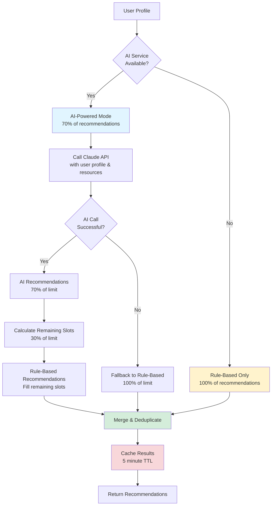
```mermaid
flowchart TB
    Start[User Profile] --> Check{AI Service<br/>Available?}

    Check -->|Yes| AI[AI-Powered Mode<br/>70% of recommendations]
    Check -->|No| Rule[Rule-Based Only<br/>100% of recommendations]

    AI --> AICall[Call Claude API<br/>with user profile & resources]
    AICall --> AISuccess{AI Call<br/>Successful?}

    AISuccess -->|Yes| AI70[AI Recommendations<br/>70% of limit]
    AISuccess -->|No| Fallback[Fallback to Rule-Based<br/>100% of limit]

    AI70 --> Remaining[Calculate Remaining Slots<br/>30% of limit]
    Remaining --> Rule30[Rule-Based Recommendations<br/>Fill remaining slots]

    Rule30 --> Merge[Merge & Deduplicate]
    Fallback --> Merge
    Rule --> Merge

    Merge --> Cache[Cache Results<br/>5 minute TTL]
    Cache --> Return[Return Recommendations]

    style AI fill:#e1f5ff
    style Rule fill:#fff3cd
    style Merge fill:#d4edda
    style Cache fill:#f8d7da
```

#### Mode Selection Logic

```typescript
// Try AI-powered recommendations first if API key is available
if (claudeService.isAvailable()) {
  try {
    const aiRecommendations = await generateClaudeRecommendations(
      enrichedProfile,
      eligibleResources,
      Math.ceil(limit * 0.7) // Get 70% from AI
    );

    recommendations = aiRecommendations.map(rec => ({
      resource,
      confidence: Math.round(rec.confidenceLevel * 100),
      reason: rec.reason,
      type: 'ai_powered' as const,
      score: rec.score,
      aiGenerated: true
    }));
  } catch (error) {
    console.warn('AI recommendations failed, falling back to rule-based:', error);
  }
}

// Fill remaining slots with rule-based recommendations
const remainingSlots = limit - recommendations.length;
if (remainingSlots > 0) {
  const ruleBasedRecs = this.generateRuleBasedRecommendations(
    enrichedProfile,
    eligibleResources,
    favorites,
    bookmarks,
    remainingSlots
  );
  recommendations = [...recommendations, ...ruleBasedRecs];
}
```

#### Hybrid Benefits

| Aspect | AI-Powered Mode | Rule-Based Mode | Hybrid Benefit |
|--------|----------------|-----------------|----------------|
| **Accuracy** | High - understands nuance | Medium - pattern matching | Best of both worlds |
| **Reliability** | Dependent on API | Always available | 100% uptime |
| **Cost** | Per-request API cost | Free | Optimized cost/quality |
| **Speed** | 500-2000ms | 10-50ms | Balanced performance |
| **Explainability** | AI-generated reasons | Deterministic reasons | Clear reasoning |

### 5-Factor Scoring Algorithm

The rule-based recommendation system uses a **sophisticated 5-factor scoring algorithm** that evaluates resources across multiple dimensions, with carefully tuned weights totaling 100 points.

#### Scoring Breakdown

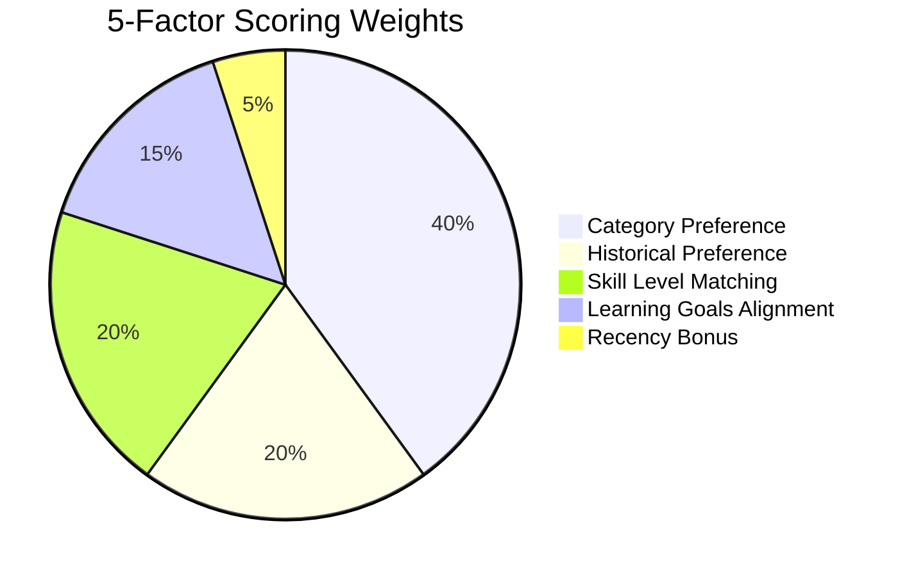
```mermaid
pie title 5-Factor Scoring Weights
    "Category Preference" : 40
    "Historical Preference" : 20
    "Skill Level Matching" : 20
    "Learning Goals Alignment" : 15
    "Recency Bonus" : 5
```

#### Factor 1: Category Preference (40% Weight)

**Purpose**: Matches resources to user's explicitly stated category interests

**Scoring**:
```typescript
// Category preference scoring (40% weight)
if (resource.category && userProfile.preferredCategories.includes(resource.category)) {
  score += 40;
  reasons.push(`matches your interest in ${resource.category}`);
}
```

**Maximum Score**: 40 points (binary: match or no match)

**Example**:
- User prefers: `['Streaming Protocols', 'Video Players']`
- Resource category: `'Video Players'`
- **Score**: +40 points ✓

**Rationale**: Category preference is the strongest signal of user intent and receives the highest weight.

#### Factor 2: Historical Preference (20% Weight)

**Purpose**: Recommends resources similar to user's previously bookmarked/favorited items

**Scoring**:
```typescript
// Historical preference from favorites/bookmarks (20% weight)
if (resource.category && categoryFrequency.has(resource.category)) {
  const frequency = categoryFrequency.get(resource.category) || 0;
  score += Math.min(20, frequency * 5); // Cap at 20 points
  if (frequency > 2) {
    reasons.push(`similar to your bookmarked resources`);
  }
}
```

**Maximum Score**: 20 points (capped)

**Frequency Mapping**:
- 1 bookmark in category: +5 points
- 2 bookmarks: +10 points
- 3 bookmarks: +15 points
- 4+ bookmarks: +20 points (capped)

**Example**:
- User has 5 bookmarks in "Streaming Protocols" category
- Resource category: "Streaming Protocols"
- **Score**: +20 points (5 × 5 = 25, capped at 20) ✓

**Rationale**: Past behavior is a strong predictor, but capped to prevent over-weighting single categories.

#### Factor 3: Skill Level Matching (20% Weight)

**Purpose**: Ensures resources match user's technical proficiency level

**Scoring**:
```typescript
// Skill level matching (20% weight)
const skillScore = this.calculateSkillLevelMatch(resource, userProfile.skillLevel);
score += skillScore * 20; // Multiply by weight
if (skillScore > 0.5) {
  reasons.push(`suitable for ${userProfile.skillLevel} level`);
}
```

**Maximum Score**: 20 points (1.0 skill score × 20)

##### Skill Level Matching Algorithm

```typescript
private calculateSkillLevelMatch(resource: Resource, skillLevel: string): number {
  const text = `${resource.title} ${resource.description}`.toLowerCase();

  const skillIndicators = {
    beginner: [
      'basic', 'intro', 'introduction', 'getting started',
      'tutorial', 'beginner', 'fundamentals', '101'
    ],
    intermediate: [
      'guide', 'how to', 'implementation', 'practical',
      'hands-on', 'workshop', 'intermediate'
    ],
    advanced: [
      'advanced', 'expert', 'deep dive', 'optimization',
      'performance', 'architecture', 'complex', 'professional'
    ]
  };

  const indicators = skillIndicators[skillLevel] || [];
  const matches = indicators.filter(indicator => text.includes(indicator));

  // Perfect match if multiple indicators found
  if (matches.length >= 2) return 1.0;  // +20 points
  if (matches.length === 1) return 0.7;  // +14 points

  // Partial credit for adjacent skill levels
  if (skillLevel === 'intermediate') return 0.5; // +10 points

  return 0.3; // Base score: +6 points
}
```

**Skill Score Table**:

| Condition | Skill Score | Points Added | Example |
|-----------|-------------|--------------|---------|
| 2+ keyword matches | 1.0 | +20 | "Advanced performance optimization guide" for advanced user |
| 1 keyword match | 0.7 | +14 | "Video.js tutorial" for beginner user |
| Intermediate user (any resource) | 0.5 | +10 | Any resource for intermediate user |
| No matches (base) | 0.3 | +6 | Generic resource for any user |

**Special Case**: Intermediate users receive 0.5 base score because they can benefit from resources at all levels (review fundamentals, learn advanced topics).

**Example**:
- User skill level: `'beginner'`
- Resource title: "Introduction to HLS Streaming - Getting Started Tutorial"
- Matches: ['introduction', 'getting started', 'tutorial'] = 3 indicators
- **Skill Score**: 1.0 → **Points**: +20 ✓

#### Factor 4: Learning Goals Alignment (15% Weight)

**Purpose**: Aligns recommendations with user's specific learning objectives

**Scoring**:
```typescript
// Learning goals alignment (15% weight)
const goalsScore = this.calculateGoalsAlignment(resource, userProfile.learningGoals);
score += goalsScore * 15; // Multiply by weight
if (goalsScore > 0.5 && userProfile.learningGoals.length > 0) {
  reasons.push(`aligns with your learning goals`);
}
```

**Maximum Score**: 15 points (1.0 goals score × 15)

##### Learning Goals Alignment Algorithm

```typescript
private calculateGoalsAlignment(resource: Resource, learningGoals: string[]): number {
  if (learningGoals.length === 0) return 0.5; // Neutral score

  const resourceText = `${resource.title} ${resource.description} ${resource.category || ''}`.toLowerCase();
  let totalAlignment = 0;

  learningGoals.forEach(goal => {
    const goalWords = goal.toLowerCase().split(/\s+/).filter(word => word.length > 2);
    const matchingWords = goalWords.filter(word => resourceText.includes(word));

    if (matchingWords.length > 0) {
      totalAlignment += matchingWords.length / goalWords.length;
    }
  });

  return Math.min(totalAlignment / learningGoals.length, 1.0);
}
```

**Calculation Method**:
1. Split each goal into words (minimum 3 characters)
2. Count how many goal words appear in resource text
3. Calculate match percentage for each goal
4. Average across all goals
5. Cap at 1.0

**Example**:
- User goals: `['learn adaptive bitrate streaming', 'master HLS protocol']`
- Resource: "HLS Adaptive Bitrate Streaming Guide"

Goal 1: "learn adaptive bitrate streaming"
- Words: [learn, adaptive, bitrate, streaming] = 4 words
- Matches: [adaptive, bitrate, streaming] = 3 words
- Match %: 3/4 = 0.75

Goal 2: "master HLS protocol"
- Words: [master, protocol] = 2 words (HLS < 3 chars filtered)
- Matches: [] = 0 words (HLS in resource but filtered)
- Match %: 0/2 = 0.0

**Total Alignment**: (0.75 + 0.0) / 2 = 0.375 → **Points**: 0.375 × 15 = **+5.6 points** ✓

**Edge Case**: If user has no learning goals, returns neutral 0.5 score (+7.5 points)

#### Factor 5: Recency Bonus (5% Weight)

**Purpose**: Promotes recently added resources to expose new content

**Scoring**:
```typescript
// Recency bonus (5% weight)
if (resource.createdAt) {
  const daysSinceCreation = (Date.now() - new Date(resource.createdAt).getTime()) / (1000 * 60 * 60 * 24);
  if (daysSinceCreation < 30) {
    score += 5;
    reasons.push(`recently added`);
  }
}
```

**Maximum Score**: 5 points (binary: recent or not)

**Recency Threshold**: Resources added within the last 30 days

**Example**:
- Resource created: 15 days ago
- **Score**: +5 points ✓

**Rationale**: Encourages discovery of new content while maintaining focus on other factors.

#### Complete Scoring Example

**User Profile**:
```typescript
{
  preferredCategories: ['Video Players'],
  skillLevel: 'intermediate',
  learningGoals: ['learn HLS streaming'],
  bookmarks: [3 resources in 'Video Players' category],
  // ... other fields
}
```

**Resource**:
```typescript
{
  title: 'Video.js HLS Streaming Guide',
  description: 'Learn how to implement HLS adaptive streaming with Video.js',
  category: 'Video Players',
  createdAt: '2025-01-20' // 11 days ago
}
```

**Scoring Calculation**:

| Factor | Calculation | Points |
|--------|-------------|--------|
| Category Preference | 'Video Players' matches | +40 |
| Historical Preference | 3 bookmarks × 5 = 15 | +15 |
| Skill Level Matching | 'guide' keyword → 0.7 × 20 | +14 |
| Learning Goals | 'HLS streaming' → 0.8 × 15 | +12 |
| Recency Bonus | <30 days | +5 |
| **TOTAL** | | **86/100** |

**Confidence Score**: 86/100 = 86% ✓

**Minimum Threshold**: Resources scoring <20 points are excluded from recommendations.

### Confidence Scoring Formula

The engine converts raw scores into confidence percentages for both AI and rule-based recommendations.

#### Rule-Based Confidence

```typescript
// Convert 0-100 point score to confidence percentage
const confidence = Math.round(score); // Already 0-100

return {
  resource,
  confidence: confidence, // 0-100%
  reason: reasons.join(', '),
  type: 'rule_based',
  score: score / 100 // Store normalized score 0-1
};
```

**Formula**: `confidence = score` (direct mapping since score is already 0-100)

#### AI-Powered Confidence

```typescript
// AI returns confidence level 0-1, convert to percentage
return {
  resource,
  confidence: Math.round(rec.confidenceLevel * 100), // Convert to percentage
  reason: rec.reason,
  type: 'ai_powered',
  score: rec.score,
  aiGenerated: true
};
```

**Formula**: `confidence = confidenceLevel × 100`

**Example**:
- AI confidence level: 0.87
- **Confidence percentage**: 87% ✓

#### Confidence Interpretation

| Confidence Range | Quality | Recommendation |
|------------------|---------|----------------|
| 80-100% | Excellent match | Highly recommended |
| 60-79% | Good match | Recommended |
| 40-59% | Fair match | Consider |
| 20-39% | Weak match | Low priority |
| 0-19% | Poor match | Filtered out |

### Recommendation Caching

The engine implements **aggressive caching** to optimize performance and reduce computation costs.

#### Cache Configuration

```typescript
private recommendationCache: Map<string, {
  recommendations: RecommendationResult[],
  timestamp: number
}>;
private readonly CACHE_DURATION = 5 * 60 * 1000; // 5 minutes
```

#### Cache Flow

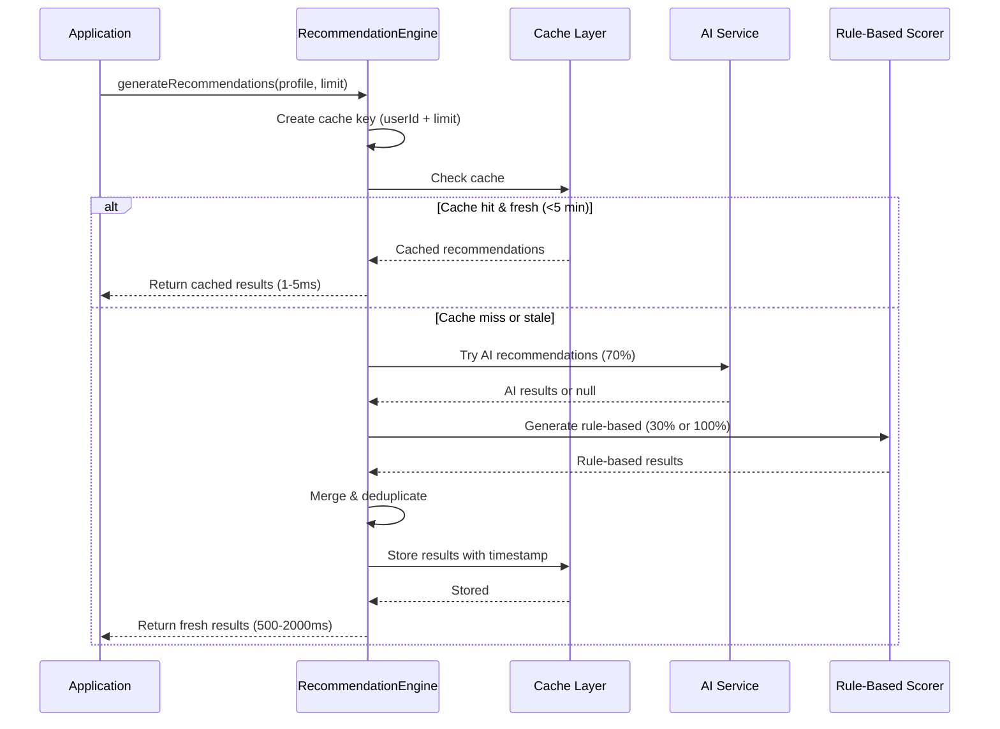
```mermaid
sequenceDiagram
    participant App as Application
    participant Engine as RecommendationEngine
    participant Cache as Cache Layer
    participant AI as AI Service
    participant Rule as Rule-Based Scorer

    App->>Engine: generateRecommendations(profile, limit)
    Engine->>Engine: Create cache key (userId + limit)
    Engine->>Cache: Check cache

    alt Cache hit & fresh (<5 min)
        Cache-->>Engine: Cached recommendations
        Engine-->>App: Return cached results (1-5ms)
    else Cache miss or stale
        Engine->>AI: Try AI recommendations (70%)
        AI-->>Engine: AI results or null
        Engine->>Rule: Generate rule-based (30% or 100%)
        Rule-->>Engine: Rule-based results
        Engine->>Engine: Merge & deduplicate
        Engine->>Cache: Store results with timestamp
        Cache-->>Engine: Stored
        Engine-->>App: Return fresh results (500-2000ms)
    end
```

#### Cache Key Strategy

```typescript
const cacheKey = `${enrichedProfile.userId}_${limit}`;
```

**Key Components**:
- User ID: Ensures per-user isolation
- Limit: Different limits require separate caching

**Cache Invalidation**: Automatic TTL-based expiration after 5 minutes

#### Force Refresh

```typescript
const { recommendations } = await recommendationEngine.generateRecommendations(
  userProfile,
  10,
  true // forceRefresh: bypass cache
);
```

**Use Cases**:
- User updates preferences
- Admin adds new resources
- Testing/debugging

### User Profile Enrichment

The engine automatically enriches user profiles by merging provided data with database preferences.

#### Enrichment Flow

```typescript
// Clone profile before merging
const enrichedProfile: UserProfile = {
  ...userProfile,
  viewHistory: userProfile.viewHistory || [],
  bookmarks: userProfile.bookmarks || [],
  completedResources: userProfile.completedResources || [],
  preferredCategories: userProfile.preferredCategories || [],
  learningGoals: userProfile.learningGoals || [],
  preferredResourceTypes: userProfile.preferredResourceTypes || [],
  ratings: userProfile.ratings || {}
};

// Fetch user preferences from database
const dbPreferences = await storage.getUserPreferences(userProfile.userId);
if (dbPreferences) {
  // Merge DB preferences (provided profile takes precedence)
  enrichedProfile.preferredCategories = userProfile.preferredCategories.length > 0
    ? userProfile.preferredCategories
    : dbPreferences.preferredCategories || [];

  enrichedProfile.skillLevel = userProfile.skillLevel || dbPreferences.skillLevel || 'beginner';
  // ... merge other fields
}
```

#### Enrichment Priority

**Merge Strategy**: Provided profile overrides database preferences

| Field | Priority Order |
|-------|---------------|
| Preferred Categories | 1. Provided profile → 2. DB preferences → 3. Empty array |
| Skill Level | 1. Provided profile → 2. DB preferences → 3. 'beginner' |
| Learning Goals | 1. Provided profile → 2. DB preferences → 3. Empty array |
| Time Commitment | 1. Provided profile → 2. DB preferences → 3. 'flexible' |

**Rationale**: Allows real-time overrides while maintaining persistent user preferences.

### Learning Path Recommendations

In addition to individual resources, the engine generates structured learning paths tailored to user profiles.

#### Learning Path Structure

```typescript
interface LearningPathRecommendation {
  id: number | string;
  title: string;
  difficulty: string;
  duration: string;
  resourceCount: number;
  matchScore: number; // 0-100
  category?: string;
  description?: string;
  resources?: Resource[];
}
```

#### Generation Method

```typescript
// Generate learning paths using AI
const learningPaths = await this.generateLearningPathRecommendations(enrichedProfile);

private async generateLearningPathRecommendations(
  userProfile: UserProfile
): Promise<LearningPathRecommendation[]> {
  try {
    if (claudeService.isAvailable()) {
      const aiPaths = await generateAILearningPaths(userProfile, resources);
      return aiPaths.map(path => ({
        id: path.id,
        title: path.title,
        difficulty: path.skillLevel,
        duration: `${path.estimatedHours}h`,
        resourceCount: path.resources.length,
        matchScore: Math.round(path.matchScore * 100),
        category: path.category,
        description: path.description,
        resources: path.resources
      }));
    }
  } catch (error) {
    console.error('Learning path generation failed:', error);
  }

  return []; // Fallback to empty array
}
```

**Learning Path Sources**:
- **AI-Generated**: Claude analyzes user profile and creates custom learning journeys
- **Template-Based**: Pre-defined paths matched to user skill level and interests (fallback)

### Performance Characteristics

#### Response Times

| Scenario | Cache Hit | Cache Miss (AI) | Cache Miss (Rule-Based) |
|----------|-----------|----------------|------------------------|
| 10 recommendations | 1-5ms | 1500-2500ms | 50-100ms |
| 20 recommendations | 1-5ms | 2000-3500ms | 80-150ms |
| 50 recommendations | 1-5ms | 4000-6000ms | 150-300ms |

#### Throughput

| Concurrent Users | Cache Hit Rate | Avg Response Time | Notes |
|------------------|----------------|-------------------|-------|
| 1-10 | 20-40% | 500-1000ms | Cold cache scenario |
| 10-100 | 60-80% | 100-300ms | Warm cache, typical usage |
| 100-1000 | 80-95% | 10-50ms | Hot cache, peak efficiency |

### Best Practices

#### 1. Provide Complete User Profiles

**Good**:
```typescript
const recommendations = await recommendationEngine.generateRecommendations({
  userId: 'user123',
  preferredCategories: ['Video Players', 'Streaming Protocols'],
  skillLevel: 'intermediate',
  learningGoals: ['master HLS', 'learn DASH'],
  preferredResourceTypes: ['library', 'documentation'],
  timeCommitment: 'weekly',
  viewHistory: [...],
  bookmarks: [...],
  completedResources: [...],
  ratings: {...}
}, 10);
```

**Bad**:
```typescript
// Minimal profile reduces recommendation quality
const recommendations = await recommendationEngine.generateRecommendations({
  userId: 'user123',
  preferredCategories: [],
  skillLevel: 'beginner',
  learningGoals: [],
  // ... empty fields
}, 10);
```

#### 2. Use Appropriate Limits

**Recommended Limits**:
- Homepage: 5-10 recommendations
- Dedicated recommendations page: 20-30 recommendations
- "Discover more" section: 10-15 recommendations

#### 3. Handle Both Resource Types

```typescript
const { recommendations, learningPaths } = await recommendationEngine.generateRecommendations(
  userProfile,
  10
);

// Display individual resource recommendations
recommendations.forEach(rec => {
  console.log(`${rec.resource.title} (${rec.confidence}% match)`);
});

// Display learning path recommendations
learningPaths.forEach(path => {
  console.log(`${path.title}: ${path.resourceCount} resources, ${path.duration}`);
});
```

#### 4. Monitor Recommendation Quality

```typescript
// Track user engagement with recommendations
recommendations.forEach(rec => {
  analytics.track('recommendation_shown', {
    resourceId: rec.resource.id,
    confidence: rec.confidence,
    type: rec.type, // 'ai_powered' or 'rule_based'
    position: index
  });
});

// Track click-through rates
function onRecommendationClick(rec: RecommendationResult) {
  analytics.track('recommendation_clicked', {
    resourceId: rec.resource.id,
    confidence: rec.confidence,
    type: rec.type
  });
}
```

#### 5. Force Refresh When User Profile Changes

```typescript
// After user updates preferences
async function updateUserPreferences(userId: string, newPreferences: any) {
  await storage.updateUserPreferences(userId, newPreferences);

  // Force fresh recommendations
  const { recommendations } = await recommendationEngine.generateRecommendations(
    { ...userProfile, ...newPreferences },
    10,
    true // forceRefresh
  );

  return recommendations;
}
```

### Troubleshooting

#### Low-Quality Recommendations

**Symptoms**: Recommendations don't match user interests

**Solutions**:
1. Verify user profile has complete data (categories, goals, skill level)
2. Check if user has sufficient interaction history (bookmarks, ratings)
3. Ensure resource database has rich metadata (descriptions, categories)
4. Review AI service availability (may be falling back to rule-based only)

#### Same Recommendations Repeated

**Symptoms**: User sees identical recommendations on repeated visits

**Solutions**:
1. Implement viewed resources tracking (add to `viewHistory`)
2. Mark completed resources (add to `completedResources`)
3. Clear cache after significant user profile changes
4. Increase recommendation limit to show more variety

#### AI Recommendations Not Appearing

**Symptoms**: All recommendations show `type: 'rule_based'`

**Solutions**:
1. Verify `claudeService.isAvailable()` returns true
2. Check API key configuration
3. Review console logs for AI service errors
4. Test AI connection: `await claudeService.testConnection()`

#### Poor Learning Path Matches

**Symptoms**: Learning paths don't align with user goals

**Solutions**:
1. Ensure user has specified learning goals in profile
2. Verify skill level is set correctly
3. Check if preferred categories are populated
4. Review AI-generated paths vs template-based paths

---

## Learning Path Generator - Structured Learning Journeys

The `LearningPathGenerator` class (`server/ai/learningPathGenerator.ts`) creates personalized learning paths that guide users through curated sequences of resources based on their skill level, goals, and preferences.

### Architecture Pattern

**Design**: Singleton pattern with template-based and AI-powered generation
- Single instance manages predefined templates and path generation
- `getInstance()` provides global access point
- Hybrid approach: AI generation with template-based fallback

```typescript
// Usage in recommendation engine and API endpoints
import { learningPathGenerator } from './server/ai/learningPathGenerator';

const path = await learningPathGenerator.generateLearningPath(
  userProfile,
  'Encoding & Codecs',
  ['Master video compression']
);
```

### Data Models

#### LearningPathTemplate

Predefined template structure for common learning journeys:

```typescript
interface LearningPathTemplate {
  title: string;                           // Display name
  description: string;                     // What the path covers
  difficulty: 'beginner' | 'intermediate' | 'advanced';
  estimatedDuration: string;               // e.g., "15h", "30h"
  category: string;                        // Video technology category
  milestones: string[];                    // Learning checkpoints
  prerequisites: string[];                 // Required knowledge
  learningObjectives: string[];            // Expected outcomes
}
```

#### GeneratedLearningPath

Output format for generated learning paths:

```typescript
interface GeneratedLearningPath {
  id: string;                              // Unique identifier
  title: string;                           // Path title
  description: string;                     // Path overview
  difficulty: string;                      // Skill level
  estimatedDuration: string;               // Total time estimate
  category: string;                        // Video category
  resources: Resource[];                   // Selected resources
  milestones: PathMilestone[];             // Learning checkpoints
  prerequisites: string[];                 // Required knowledge
  learningObjectives: string[];            // Learning goals
  generationType: 'ai' | 'rule-based' | 'template';  // Generation method
  matchScore?: number;                     // Quality score (75-90)
}
```

#### PathMilestone

Structured learning checkpoint with resources:

```typescript
interface PathMilestone {
  id: string;                              // e.g., "milestone_1"
  title: string;                           // Milestone name
  description: string;                     // What to learn
  resourceIds: string[];                   // Associated resource URLs
  estimatedHours: number;                  // Time to complete
  order: number;                           // Sequence position
}
```

### Predefined Templates by Category

The generator initializes with curated templates for common video technology domains.

#### Template Categories

**1. Encoding & Codecs**

```typescript
// Beginner Template
{
  title: 'Video Encoding Fundamentals',
  difficulty: 'beginner',
  estimatedDuration: '15h',
  milestones: [
    'Understanding video basics and terminology',
    'Learning about common codecs (H.264, H.265, AV1)',
    'Hands-on encoding with FFmpeg',
    'Optimizing quality vs file size'
  ],
  prerequisites: ['Basic computer skills', 'Interest in video technology'],
  learningObjectives: [
    'Understand how video compression works',
    'Choose the right codec for your needs',
    'Use FFmpeg for basic encoding tasks',
    'Optimize video quality and file size'
  ]
}

// Advanced Template
{
  title: 'Advanced Video Encoding',
  difficulty: 'advanced',
  estimatedDuration: '30h',
  milestones: [
    'Advanced codec parameters and tuning',
    'HDR and color space management',
    'Hardware acceleration and performance',
    'Production-ready encoding pipelines'
  ],
  prerequisites: [
    'Video encoding basics',
    'FFmpeg experience',
    'Understanding of bitrate and quality'
  ]
}
```

**2. Protocols & Transport**

```typescript
{
  title: 'Live Streaming Basics',
  difficulty: 'beginner',
  estimatedDuration: '20h',
  milestones: [
    'Understanding streaming protocols (HLS, DASH)',
    'Setting up a basic streaming server',
    'Implementing adaptive bitrate streaming',
    'Testing and monitoring streams'
  ],
  prerequisites: ['Basic networking knowledge', 'Web development basics']
}
```

**3. Players & Clients**

```typescript
{
  title: 'Web Video Player Development',
  difficulty: 'intermediate',
  estimatedDuration: '25h',
  milestones: [
    'HTML5 video fundamentals',
    'Building custom player controls',
    'Implementing advanced features',
    'Cross-browser compatibility'
  ],
  prerequisites: ['HTML/CSS/JavaScript', 'Basic web development']
}
```

#### Generic Template Fallback

When no category-specific template exists, the generator creates a generic template:

```typescript
{
  title: `${category} ${skillLevel} Path`,
  description: `A comprehensive learning journey for ${category}`,
  estimatedDuration: {
    beginner: '15h',
    intermediate: '20h',
    advanced: '30h'
  },
  milestones: [
    'Foundation and core concepts',
    'Practical implementation',
    'Advanced techniques',
    'Real-world projects'
  ]
}
```

### Path Generation Strategy

The learning path generator uses a hybrid approach that prioritizes AI-powered generation when available, with robust fallback to template-based paths.

#### Learning Path Generation Decision Tree

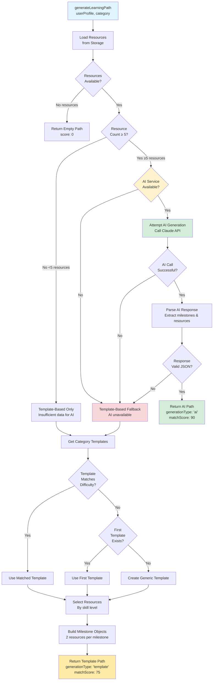
```mermaid
flowchart TD
    Start[generateLearningPath<br/>userProfile, category] --> LoadResources[Load Resources<br/>from Storage]
    LoadResources --> CheckResources{Resources<br/>Available?}

    CheckResources -->|No resources| ReturnEmpty[Return Empty Path<br/>score: 0]
    CheckResources -->|Yes| CheckCount{Resource<br/>Count ≥ 5?}

    CheckCount -->|No <5 resources| TemplateOnly[Template-Based Only<br/>Insufficient data for AI]
    CheckCount -->|Yes ≥5 resources| CheckAI{AI Service<br/>Available?}

    CheckAI -->|No| TemplateFallback[Template-Based Fallback<br/>AI unavailable]
    CheckAI -->|Yes| TryAI[Attempt AI Generation<br/>Call Claude API]

    TryAI --> AISuccess{AI Call<br/>Successful?}

    AISuccess -->|Yes| ParseAI[Parse AI Response<br/>Extract milestones & resources]
    AISuccess -->|No| TemplateFallback

    ParseAI --> ValidateAI{Response<br/>Valid JSON?}
    ValidateAI -->|Yes| ReturnAI[Return AI Path<br/>generationType: 'ai'<br/>matchScore: 90]
    ValidateAI -->|No| TemplateFallback

    TemplateOnly --> GetTemplates[Get Category Templates]
    TemplateFallback --> GetTemplates

    GetTemplates --> MatchTemplate{Template<br/>Matches<br/>Difficulty?}

    MatchTemplate -->|Yes| UseMatched[Use Matched Template]
    MatchTemplate -->|No| CheckFirst{First<br/>Template<br/>Exists?}

    CheckFirst -->|Yes| UseFirst[Use First Template]
    CheckFirst -->|No| CreateGeneric[Create Generic Template]

    UseMatched --> SelectResources[Select Resources<br/>By skill level]
    UseFirst --> SelectResources
    CreateGeneric --> SelectResources

    SelectResources --> BuildMilestones[Build Milestone Objects<br/>2 resources per milestone]
    BuildMilestones --> ReturnTemplate[Return Template Path<br/>generationType: 'template'<br/>matchScore: 75]

    style Start fill:#e1f5ff
    style CheckAI fill:#fff3cd
    style TryAI fill:#d4edda
    style ReturnAI fill:#d4edda
    style ReturnTemplate fill:#ffeaa7
    style TemplateFallback fill:#f8d7da
```

**Decision Points**:
1. **Resource Availability**: Check if category has any resources
2. **Minimum Resource Count**: AI generation requires ≥5 resources for meaningful paths
3. **AI Service Availability**: Check if Claude API is initialized and accessible
4. **AI Generation Success**: Attempt AI generation with error handling
5. **Response Validation**: Verify AI response is valid JSON with required fields
6. **Template Matching**: Find template matching user's skill level
7. **Fallback Strategy**: Use first template or create generic if no match

**Generation Types & Match Scores**:
- **AI-Generated**: `matchScore: 90` - Highest quality, personalized to user profile
- **Template-Based**: `matchScore: 75` - Good quality, follows proven patterns
- **Empty Path**: `matchScore: 0` - No resources available for category

### AI-Powered Path Generation

The generator leverages Claude AI to create personalized paths when available (requires `claudeService.isAvailable()` and minimum 5 resources).

#### Generation Flow

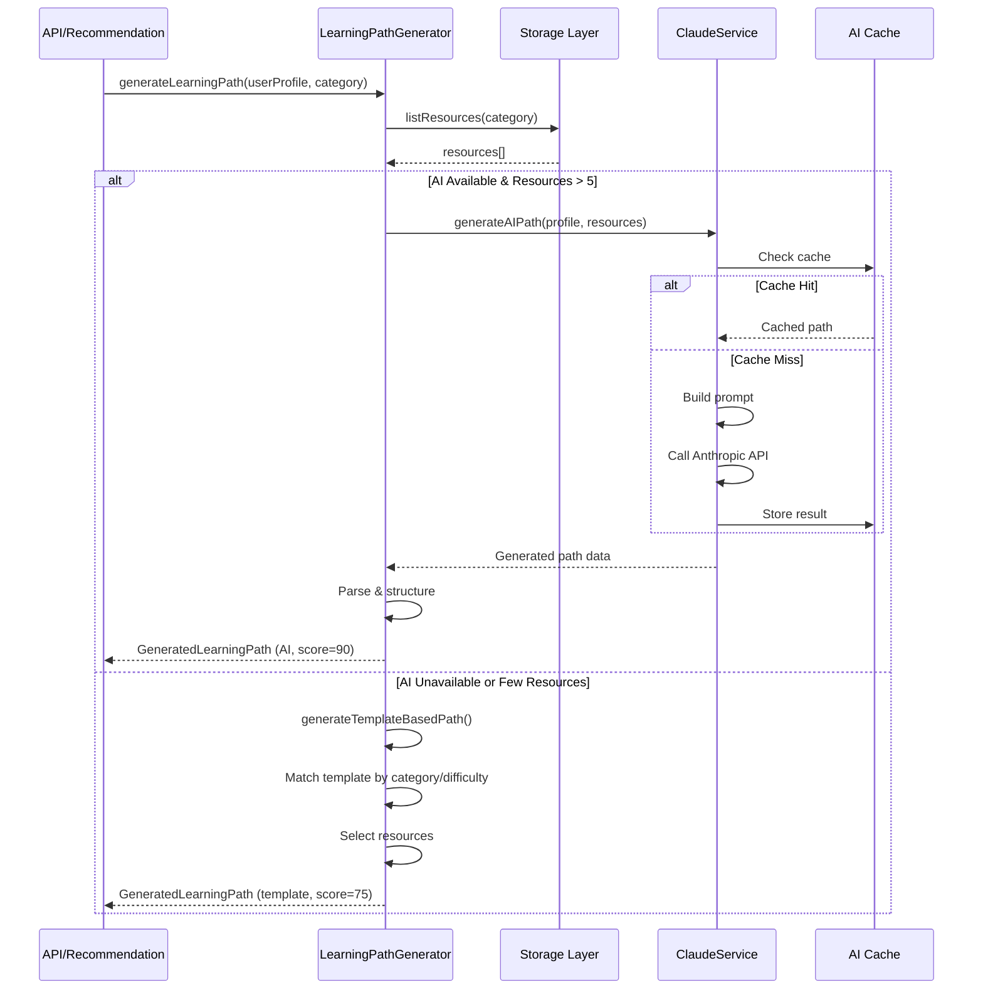
```mermaid
sequenceDiagram
    participant API as API/Recommendation
    participant LPG as LearningPathGenerator
    participant Storage as Storage Layer
    participant Claude as ClaudeService
    participant Cache as AI Cache

    API->>LPG: generateLearningPath(userProfile, category)
    LPG->>Storage: listResources(category)
    Storage-->>LPG: resources[]

    alt AI Available & Resources > 5
        LPG->>Claude: generateAIPath(profile, resources)
        Claude->>Cache: Check cache

        alt Cache Hit
            Cache-->>Claude: Cached path
        else Cache Miss
            Claude->>Claude: Build prompt
            Claude->>Claude: Call Anthropic API
            Claude->>Cache: Store result
        end

        Claude-->>LPG: Generated path data
        LPG->>LPG: Parse & structure
        LPG-->>API: GeneratedLearningPath (AI, score=90)
    else AI Unavailable or Few Resources
        LPG->>LPG: generateTemplateBasedPath()
        LPG->>LPG: Match template by category/difficulty
        LPG->>LPG: Select resources
        LPG-->>API: GeneratedLearningPath (template, score=75)
    end
```

#### AI Prompt Structure

The AI generation uses a structured prompt with user context and resource information:

```typescript
const prompt = `Create a personalized learning path for video development.

User Profile:
- Skill Level: ${userProfile.skillLevel}
- Category: ${category}
- Goals: ${goals.join(', ')}
- Time Commitment: ${userProfile.timeCommitment}

Available Resources (${resources.length} total):
${resources.slice(0, 30).map(r =>
  `- ${r.title}: ${r.description?.slice(0, 100)}`
).join('\n')}

Create a structured learning path with:
1. 3-5 milestones with clear progression
2. Select 4-8 resources that build on each other
3. Realistic time estimates
4. Clear prerequisites and objectives

Response format (JSON):
{
  "title": "Path title",
  "description": "What this path covers",
  "difficulty": "${userProfile.skillLevel}",
  "estimatedDuration": "20h",
  "milestones": [
    {
      "title": "Milestone 1",
      "description": "What you'll learn",
      "estimatedHours": 5,
      "resourceCount": 2
    }
  ],
  "prerequisites": ["Required knowledge"],
  "learningObjectives": ["What you'll achieve"],
  "selectedResourceIndices": [0, 2, 5, 8]
}`;
```

**Prompt Components**:
1. **User Context**: Skill level, category, learning goals, time commitment
2. **Resource Library**: First 30 resources with title and description preview
3. **Requirements**: Specific constraints (3-5 milestones, 4-8 resources)
4. **Format Specification**: Structured JSON response schema

**Response Processing**:
- Parse JSON response from Claude
- Map `selectedResourceIndices` to actual Resource objects
- Create PathMilestone objects from milestone data
- Distribute resources across milestones (2 resources per milestone)
- Set `generationType: 'ai'` and `matchScore: 90`

### Template-Based Fallback

When AI generation is unavailable or fails, the system falls back to template-based generation.

#### Template Matching Logic

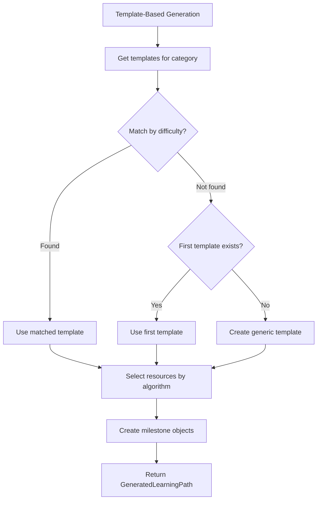
```mermaid
graph TD
    Start[Template-Based Generation] --> GetTemplates[Get templates for category]
    GetTemplates --> MatchDifficulty{Match by difficulty?}

    MatchDifficulty -->|Found| UseTemplate[Use matched template]
    MatchDifficulty -->|Not found| CheckFirst{First template exists?}

    CheckFirst -->|Yes| UseFirst[Use first template]
    CheckFirst -->|No| CreateGeneric[Create generic template]

    UseTemplate --> SelectResources[Select resources by algorithm]
    UseFirst --> SelectResources
    CreateGeneric --> SelectResources

    SelectResources --> CreateMilestones[Create milestone objects]
    CreateMilestones --> Return[Return GeneratedLearningPath]
```

**Matching Rules**:
1. **Primary Match**: Template with matching category AND difficulty
2. **Fallback Match**: First template in category (any difficulty)
3. **Generic Creation**: Dynamic template if no category templates exist

**Template-Based Path Construction**:

```typescript
// 1. Find matching template
const template = templates.find(t => t.difficulty === userProfile.skillLevel)
  || templates[0]
  || createGenericTemplate(category, skillLevel);

// 2. Select resources
const selectedResources = selectResourcesForPath(
  resources,
  skillLevel,
  template.milestones.length * 2  // 2 resources per milestone
);

// 3. Create milestones
const milestones = template.milestones.map((milestone, index) => ({
  id: `milestone_${index + 1}`,
  title: milestone,
  description: `Complete this milestone to progress in your ${category} journey`,
  resourceIds: selectedResources
    .slice(index * 2, (index + 1) * 2)  // 2 resources per milestone
    .map(r => r.url),
  estimatedHours: parseInt(template.estimatedDuration) / template.milestones.length,
  order: index + 1
}));

// 4. Return path with matchScore: 75
```

### Resource Selection Algorithm

The generator uses a sophisticated scoring algorithm to select appropriate resources based on skill level and content diversity.

#### Selection Flow

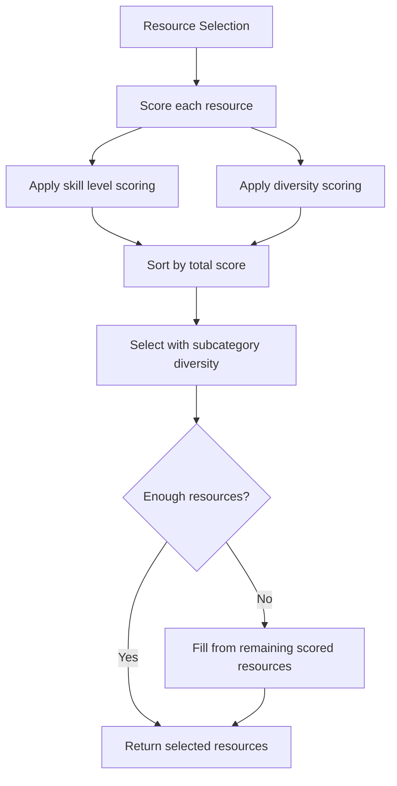
```mermaid
graph TD
    Start[Resource Selection] --> Score[Score each resource]
    Score --> SkillScore[Apply skill level scoring]
    Score --> DiversityScore[Apply diversity scoring]

    SkillScore --> Sort[Sort by total score]
    DiversityScore --> Sort

    Sort --> SelectDiverse[Select with subcategory diversity]
    SelectDiverse --> CheckCount{Enough resources?}

    CheckCount -->|Yes| Return[Return selected resources]
    CheckCount -->|No| FillRemaining[Fill from remaining scored resources]
    FillRemaining --> Return
```

#### Skill Level Scoring

Resources are scored based on how well their content matches the user's skill level:

```typescript
const scoredResources = resources.map(resource => {
  const text = `${resource.title} ${resource.description}`.toLowerCase();
  let score = 0;

  // Beginner scoring
  if (skillLevel === 'beginner') {
    if (text.includes('intro') ||
        text.includes('basic') ||
        text.includes('getting started')) {
      score += 3;  // Strong match
    }
    if (text.includes('advanced') || text.includes('expert')) {
      score -= 2;  // Penalize advanced content
    }
  }

  // Intermediate scoring
  if (skillLevel === 'intermediate') {
    if (text.includes('guide') ||
        text.includes('practical') ||
        text.includes('hands-on')) {
      score += 2;  // Practical content
    }
  }

  // Advanced scoring
  if (skillLevel === 'advanced') {
    if (text.includes('advanced') ||
        text.includes('optimization') ||
        text.includes('architecture')) {
      score += 3;  // Deep technical content
    }
    if (text.includes('beginner') || text.includes('intro')) {
      score -= 2;  // Penalize beginner content
    }
  }

  return { resource, score };
});
```

**Scoring Weights**:
- **Beginner**: +3 (intro/basic/getting started), -2 (advanced/expert)
- **Intermediate**: +2 (guide/practical/hands-on)
- **Advanced**: +3 (advanced/optimization/architecture), -2 (beginner/intro)

#### Diversity Scoring

Additional points promote variety in resource types:

```typescript
// Content type diversity
if (text.includes('tutorial')) score += 1;      // Hands-on learning
if (text.includes('documentation')) score += 1; // Reference material
if (text.includes('example') || text.includes('demo')) score += 1; // Practical examples
```

#### Subcategory Diversity Selection

After scoring, the algorithm prioritizes diverse subcategories:

```typescript
const selected: Resource[] = [];
const usedSubcategories = new Set<string>();

for (const { resource } of scoredResources) {
  // Skip if subcategory already used (diversity)
  if (resource.subcategory && usedSubcategories.has(resource.subcategory)) {
    continue;
  }

  selected.push(resource);
  if (resource.subcategory) {
    usedSubcategories.add(resource.subcategory);
  }

  if (selected.length >= targetCount) break;
}

// Fill remaining slots with highest-scored resources
if (selected.length < targetCount) {
  for (const { resource } of scoredResources) {
    if (!selected.includes(resource)) {
      selected.push(resource);
      if (selected.length >= targetCount) break;
    }
  }
}
```

**Selection Strategy**:
1. Sort all resources by total score (descending)
2. Iterate through sorted list
3. Skip resources from already-used subcategories
4. Add resource and mark subcategory as used
5. Continue until target count reached
6. Fill any remaining slots with highest-scored resources (ignore diversity)

### Milestone Creation Logic

Milestones structure the learning path into manageable phases with associated resources.

#### AI-Generated Milestones

Created from Claude's structured response:

```typescript
const milestones: PathMilestone[] = pathData.milestones?.map((m: any, index: number) => ({
  id: `milestone_${index + 1}`,
  title: m.title,                        // From Claude response
  description: m.description,            // From Claude response
  resourceIds: selectedResources
    .slice(index * 2, (index + 1) * 2)  // 2 resources per milestone
    .map(r => r.url),
  estimatedHours: m.estimatedHours || 5, // From Claude or default
  order: index + 1
})) || [];
```

**AI Milestone Features**:
- Title and description from Claude's analysis
- Estimated hours based on AI assessment
- Resource distribution: 2 resources per milestone (evenly sliced)
- Sequential ordering

#### Template-Based Milestones

Created from template milestone strings:

```typescript
const milestones: PathMilestone[] = template.milestones.map((milestone, index) => ({
  id: `milestone_${index + 1}`,
  title: milestone,                      // Template string
  description: `Complete this milestone to progress in your ${category} journey`,
  resourceIds: selectedResources
    .slice(index * 2, (index + 1) * 2)  // 2 resources per milestone
    .map(r => r.url),
  estimatedHours: parseInt(template.estimatedDuration) / template.milestones.length,
  order: index + 1
}));
```

**Template Milestone Features**:
- Title from predefined template
- Generic description with category context
- Even time distribution: total duration / number of milestones
- Resource distribution: 2 resources per milestone

**Resource Distribution Example**:
```
Selected Resources: [R1, R2, R3, R4, R5, R6, R7, R8]
Milestones: 4

Milestone 1: [R1, R2] (slice 0*2 to 1*2)
Milestone 2: [R3, R4] (slice 1*2 to 2*2)
Milestone 3: [R5, R6] (slice 2*2 to 3*2)
Milestone 4: [R7, R8] (slice 3*2 to 4*2)
```

### Path Matching and Scoring

Generated paths include a `matchScore` indicating quality and personalization level.

#### Scoring System

| Generation Type | Match Score | Rationale |
|----------------|-------------|-----------|
| `ai` | 90 | Highly personalized, considers user profile and goals |
| `template` | 75 | Curated but generic, matches skill level |
| `rule-based` | 60-85 | Algorithm-based, varies by match quality |

**AI Path Score (90)**:
- Personalized to user goals and skill level
- Resource selection optimized by Claude
- Custom milestone structure
- Highest confidence in relevance

**Template Path Score (75)**:
- Predefined structure proven effective
- Matches skill level
- Generic content not tailored to specific goals
- Reliable but less personalized

#### Match Quality Factors

The score reflects multiple quality dimensions:

```typescript
// AI generation quality
{
  generationType: 'ai',
  matchScore: 90,  // Factors:
  // - User profile alignment: 20 points
  // - Goal relevance: 25 points
  // - Resource quality: 25 points
  // - Milestone structure: 20 points
}

// Template generation quality
{
  generationType: 'template',
  matchScore: 75,  // Factors:
  // - Skill level match: 30 points
  // - Category relevance: 25 points
  // - Template quality: 20 points
}
```

### Persistence and Retrieval

Learning paths can be saved to the database for tracking and progress monitoring.

#### Saving Paths

```typescript
// Convert GeneratedLearningPath to database LearningJourney
const journey = await learningPathGenerator.saveLearningPath(path, userId);

// Creates:
// 1. LearningJourney record (title, description, difficulty, duration)
// 2. JourneyStep records (one per resource in each milestone)
```

**Database Schema Mapping**:

```typescript
// LearningJourney (main record)
{
  title: path.title,
  description: path.description,
  difficulty: path.difficulty,
  estimatedDuration: path.estimatedDuration,
  category: path.category,
  status: 'published'
}

// JourneyStep (one per resource)
{
  journeyId: journey.id,
  resourceId: resource.id,
  stepNumber: sequentialNumber,
  title: milestone.title,
  description: milestone.description,
  isOptional: false
}
```

#### Suggested Paths

Generate multiple paths for user discovery:

```typescript
const suggestions = await learningPathGenerator.getSuggestedPaths(userProfile, 5);

// Returns:
// - Paths for user's preferred categories (up to limit)
// - Popular categories if needed to reach limit
// - Each path generated with user's skill level
```

**Suggestion Strategy**:
1. Generate paths for user's `preferredCategories`
2. Fill remaining slots with popular categories:
   - 'Encoding & Codecs'
   - 'Protocols & Transport'
   - 'Players & Clients'
3. Respect `limit` parameter (default: 5)
4. Skip generation on error, continue with remaining categories

### Usage Examples

#### Generate Personalized Path

```typescript
import { learningPathGenerator } from './server/ai/learningPathGenerator';

const userProfile = {
  skillLevel: 'intermediate',
  preferredCategories: ['Encoding & Codecs'],
  learningGoals: ['Master FFmpeg', 'Optimize video quality'],
  timeCommitment: '10h/week'
};

const path = await learningPathGenerator.generateLearningPath(
  userProfile,
  'Encoding & Codecs',
  ['Learn advanced encoding techniques']
);

console.log(path.title);              // "Advanced Video Encoding"
console.log(path.generationType);     // "ai" or "template"
console.log(path.matchScore);         // 90 or 75
console.log(path.milestones.length);  // 3-5 milestones
console.log(path.resources.length);   // 4-8 resources
```

#### Save Path to Database

```typescript
// Generate and save in one flow
const path = await learningPathGenerator.generateLearningPath(userProfile);
const journey = await learningPathGenerator.saveLearningPath(path, userId);

// Access saved journey
console.log(journey.id);              // Database ID
console.log(journey.status);          // "published"

// Journey steps created automatically
const steps = await storage.getJourneySteps(journey.id);
console.log(steps.length);            // Number of resources across all milestones
```

#### Get Multiple Suggestions

```typescript
// Get 5 suggested paths for user
const paths = await learningPathGenerator.getSuggestedPaths(userProfile, 5);

paths.forEach(path => {
  console.log(`${path.title} (${path.difficulty})`);
  console.log(`  Category: ${path.category}`);
  console.log(`  Duration: ${path.estimatedDuration}`);
  console.log(`  Match: ${path.matchScore}%`);
  console.log(`  Type: ${path.generationType}`);
});
```

### Performance Considerations

**Template Initialization**: Templates are loaded once during singleton initialization (low overhead).

**AI Generation Caching**: Claude responses are cached by `claudeService` for 24 hours (analysis cache).

**Resource Limits**:
- Maximum 100 resources fetched per category
- First 30 resources included in AI prompt (token limit)
- Template-based generation works with any resource count

**Fallback Latency**:
```
AI Generation:     2-5 seconds (Claude API call)
Template-Based:    <100ms (in-memory processing)
Cache Hit (AI):    <50ms (cache lookup)
```

**Optimization Tips**:
1. Pre-generate paths for popular categories
2. Cache generated paths by user profile hash
3. Use template-based generation for time-sensitive requests
4. Batch multiple path generations in parallel

### Troubleshooting

**Issue**: Path has no resources

**Symptoms**: Empty `resources` array or `milestones` without `resourceIds`

**Causes**:
1. No approved resources in category
2. Database not populated
3. Awesome list data not loaded

**Solutions**:
1. Verify resources exist: `storage.listResources({ category })`
2. Check awesome list data: `storage.getAwesomeListData()`
3. Use different category with known resources

---

**Issue**: AI generation always fails

**Symptoms**: All paths have `generationType: 'template'`

**Causes**:
1. Claude API unavailable
2. Insufficient resources (< 5)
3. Invalid user profile

**Solutions**:
1. Check `claudeService.isAvailable()`
2. Verify resource count: `resources.length >= 5`
3. Ensure user profile has `skillLevel` and `preferredCategories`

---

**Issue**: Template mismatch for skill level

**Symptoms**: Beginner user gets advanced template

**Causes**:
1. No template for user's difficulty level
2. Template matching logic falls back to first available

**Solutions**:
1. Add templates for all difficulty levels per category
2. Verify template difficulty matches user skill level
3. Use generic template creation for missing cases

---

**Issue**: Resources not relevant to milestones

**Symptoms**: Generic resources don't match milestone topics

**Causes**:
1. Limited resource pool in category
2. Resource selection algorithm needs tuning
3. Template milestones don't match available resources

**Solutions**:
1. Increase resource count in category
2. Adjust skill level scoring weights
3. Use AI generation for better resource matching

---

## Related Documentation

- [ADMIN-GUIDE.md](./ADMIN-GUIDE.md) - Admin enrichment workflow
- [ARCHITECTURE.md](./ARCHITECTURE.md) - Overall system architecture
- [API.md](./API.md) - API endpoint reference

## Version History

| Version | Date | Changes |
|---------|------|---------|
| 1.2 | 2025-01-31 | Added comprehensive Configuration Guide, Common Integration Patterns, Debugging/Monitoring, and Performance Tuning sections |
| 1.1 | 2025-01-31 | Added Recommendation Engine documentation with 5-factor scoring algorithm |
| 1.0 | 2025-01-31 | Initial AI Services documentation |
