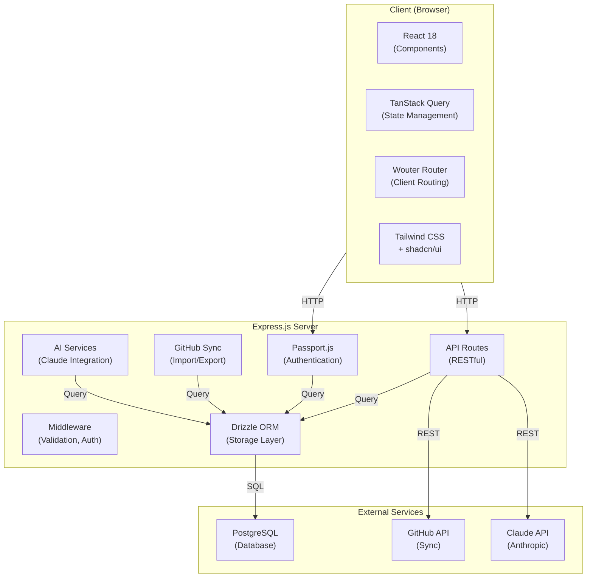
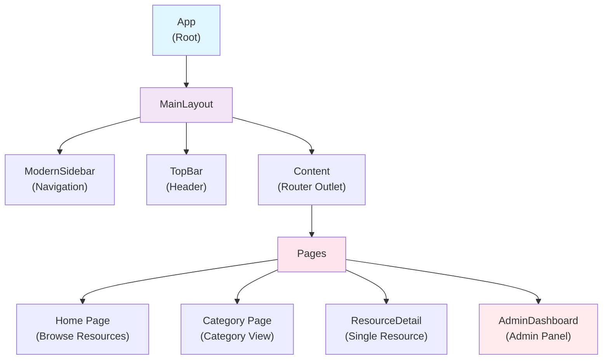
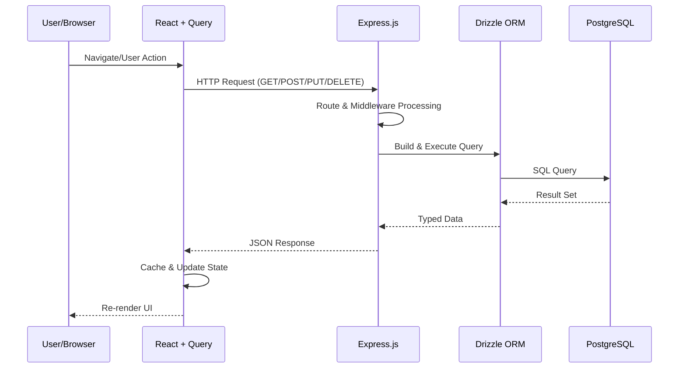
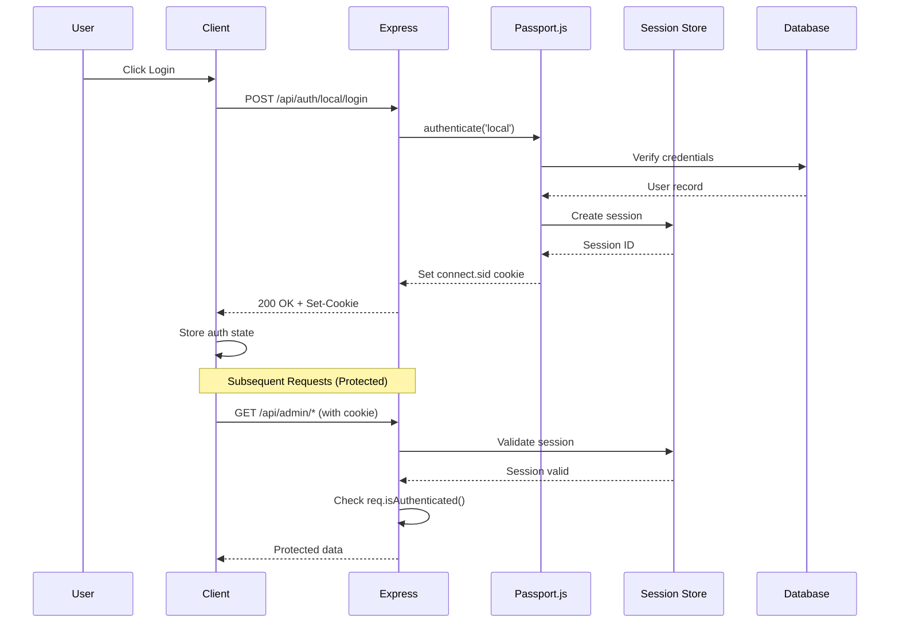
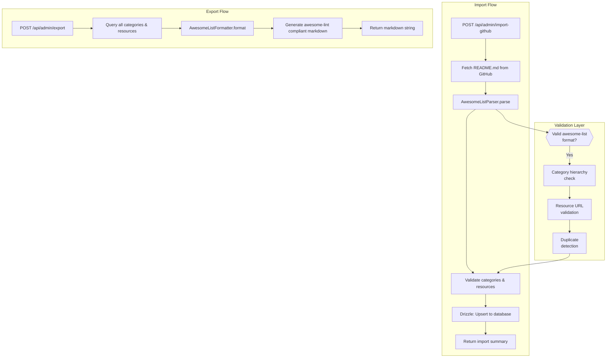
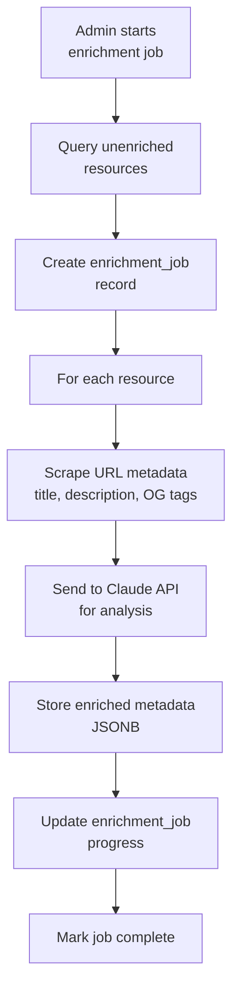

# System Architecture

Technical architecture documentation for the Awesome Video Resource Viewer application.

## Overview

The Awesome Video Resource Viewer is a full-stack application built with modern web technologies. It serves as a curated platform for discovering video development resources, featuring AI-powered recommendations, GitHub integration, and admin curation tools.

### System Architecture Diagram



## Technology Stack

### Frontend
| Technology | Purpose |
|------------|---------|
| React 18+ | UI framework |
| TypeScript | Type safety |
| Vite | Build tool & dev server |
| TanStack Query v5 | Server state management |
| Wouter | Client-side routing |
| Tailwind CSS | Utility-first styling |
| shadcn/ui | Component library |
| Lucide React | Icons |
| Fuse.js | Fuzzy search |

### Backend
| Technology | Purpose |
|------------|---------|
| Express.js | HTTP server |
| TypeScript | Type safety |
| Drizzle ORM | Database ORM |
| Passport.js | Authentication |
| Zod | Schema validation |
| Remark | Markdown parsing |

### Database
| Technology | Purpose |
|------------|---------|
| PostgreSQL (Neon) | Primary database |
| Drizzle Kit | Migrations |

### External Services
| Service | Purpose |
|---------|---------|
| Anthropic Claude | AI analysis & enrichment |
| GitHub API | Repository sync |
| Replit Auth | OAuth authentication |
| Google Analytics | Usage analytics |

## Directory Structure

```
├── client/                 # Frontend application
│   ├── src/
│   │   ├── components/     # Reusable UI components
│   │   │   ├── ui/         # shadcn/ui primitives
│   │   │   ├── layout/     # Layout components
│   │   │   └── ...
│   │   ├── pages/          # Route pages
│   │   ├── hooks/          # Custom React hooks
│   │   ├── lib/            # Utilities & helpers
│   │   └── App.tsx         # Root component & routing
│   └── index.html
├── server/                 # Backend application
│   ├── ai/                 # AI services
│   │   ├── claudeService.ts
│   │   ├── enrichmentService.ts
│   │   ├── recommendationEngine.ts
│   │   └── urlScraper.ts
│   ├── github/             # GitHub integration
│   │   ├── syncService.ts
│   │   ├── formatter.ts
│   │   └── parser.ts
│   ├── validation/         # Validation services
│   │   ├── awesomeLint.ts
│   │   └── linkChecker.ts
│   ├── routes.ts           # API route definitions
│   ├── storage.ts          # Database access layer
│   ├── replitAuth.ts       # OAuth configuration
│   ├── localAuth.ts        # Local auth for dev
│   └── index.ts            # Server entry point
├── shared/                 # Shared code
│   └── schema.ts           # Database schema & types
├── scripts/                # Utility scripts
└── docs/                   # Documentation
```

## Component Hierarchy



## Data Flow

### Request/Response Cycle Sequence Diagram



### Authentication Flow (Detailed)



### GitHub Sync Flow (Import & Export)



### AI Enrichment Flow



## Database Schema

### Core Tables

**users**
- Primary user accounts (Replit OAuth or local)
- Roles: user, admin, moderator

**resources**
- Core resource entries
- Status: pending, approved, rejected
- Metadata stored as JSONB

**categories / subcategories / sub_subcategories**
- 3-level hierarchy for navigation
- Slugs for URL routing

**resource_edits**
- User-submitted edit suggestions
- Conflict detection via originalResourceUpdatedAt

**resource_audit_log**
- Complete audit trail of all changes

### Support Tables

**learning_journeys / journey_steps / user_journey_progress**
- Learning path functionality

**favorites / bookmarks**
- User engagement tracking

**github_sync_queue / sync_history**
- GitHub sync state management

**enrichment_jobs**
- AI batch processing tracking

**tags / resource_tags**
- Tag management (many-to-many)

## Security Measures

### Authentication
- Passport.js session management
- bcrypt password hashing (local auth)
- Session stored in PostgreSQL
- HTTPS enforced in production

### Authorization
- Role-based access control (RBAC)
- isAuthenticated middleware
- isAdmin middleware for admin routes

### Input Validation
- Zod schemas for all inputs
- Whitelisted editable fields for edit suggestions
- Field size limits enforced
- SQL injection prevented via Drizzle ORM

### API Security
- CORS configured for production
- Rate limiting on external APIs
- Secrets stored in environment variables

## Performance Considerations

### Caching
- TanStack Query client-side caching
- Database query optimization with indexes
- Static asset caching via Vite

### Database
- Connection pooling via Neon
- Indexes on frequently queried columns
- JSONB for flexible metadata storage

### Frontend
- Code splitting via dynamic imports
- Lazy loading of heavy components
- Optimized bundle size

## Environment Variables

```bash
# Database
DATABASE_URL=postgresql://...

# Authentication
REPLIT_DOMAINS=...
REPLIT_IDENTITY_TOKEN=...
SESSION_SECRET=...

# External Services
AI_INTEGRATIONS_ANTHROPIC_API_KEY=...
GITHUB_TOKEN=...
GITHUB_REPO_URL=...

# Optional
NODE_ENV=development|production
GA_TRACKING_ID=...
```

## Deployment

The application is designed for Replit deployment:

1. **Development**: `npm run dev` starts Vite + Express
2. **Production**: `npm run build` → `npm run start`
3. **Database**: Replit PostgreSQL (Neon-backed)
4. **Secrets**: Managed via Replit Secrets tab
5. **Deploy**: Replit's built-in deployment system

## Monitoring & Logging

- Console logging for debugging
- Audit log for resource changes
- Google Analytics for frontend tracking
- Health endpoint: `GET /api/health`
