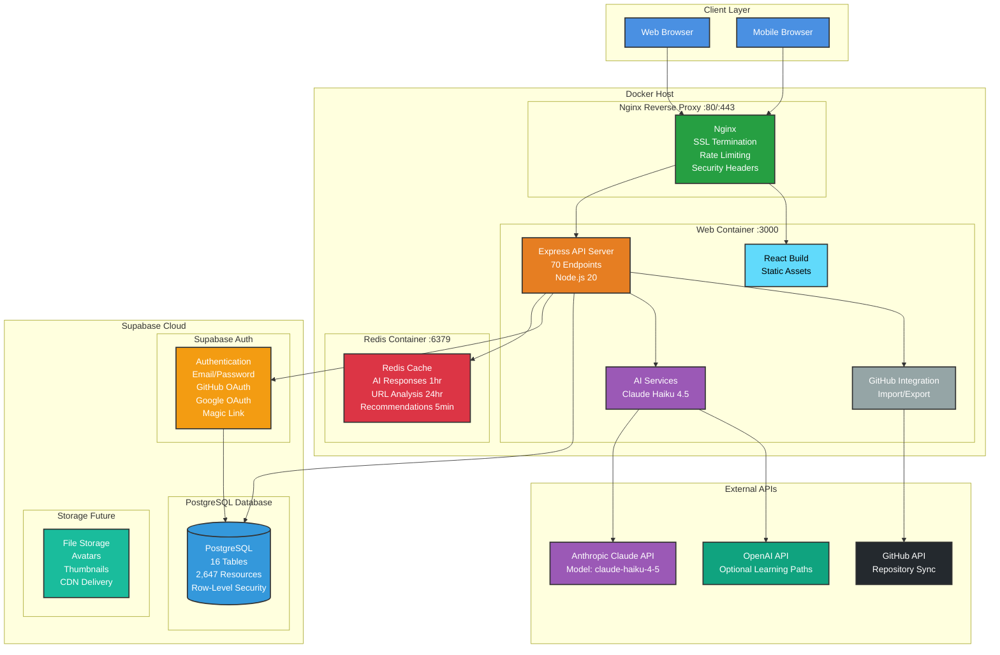
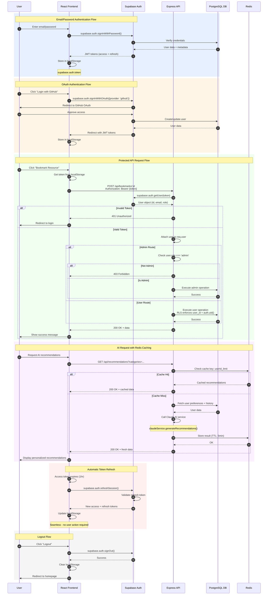

# Awesome List Site - Architecture Documentation

**Version**: 2.0.0
**Last Updated**: 2025-11-30
**Status**: Production Ready

This document provides comprehensive architectural diagrams and explanations for the Awesome Video Resources platform. All diagrams are created using Mermaid syntax for easy rendering in GitHub, IDEs, and documentation tools.

---

## Table of Contents

1. [System Architecture](#system-architecture)
2. [Database Schema (ERD)](#database-schema-erd)
3. [Authentication Flow](#authentication-flow)
4. [Key Architectural Decisions](#key-architectural-decisions)
5. [Performance Considerations](#performance-considerations)
6. [Security Architecture](#security-architecture)

---

## System Architecture

### Diagram



### Component Overview

#### Client Layer

**Web Browser / Mobile Browser**
- Modern browsers supporting ES2020+
- Progressive Web App (PWA) capabilities
- Responsive design: Mobile-first approach
- Supported browsers: Chrome 90+, Firefox 88+, Safari 14+, Edge 90+

#### Docker Host

**Nginx Reverse Proxy (Ports 80/443)**
- **SSL/TLS Termination**: Handles HTTPS encryption
- **Rate Limiting**:
  - API endpoints: 60 requests/minute per IP
  - Auth endpoints: 10 requests/minute per IP
  - Burst allowance: 20 (API), 5 (auth)
- **Security Headers**:
  - `X-Frame-Options: SAMEORIGIN`
  - `X-Content-Type-Options: nosniff`
  - `X-XSS-Protection: 1; mode=block`
  - `Referrer-Policy: strict-origin-when-cross-origin`
  - `Permissions-Policy: geolocation=(), microphone=(), camera=()`
- **Gzip Compression**: Reduces payload size by ~70%
- **Static Asset Caching**: 1 year for hashed assets, 1 hour for HTML

**Web Container (Port 3000)**

*Express API Server*
- 70 REST API endpoints
- Node.js 20 LTS runtime
- Drizzle ORM for database operations
- JWT-based authentication middleware
- Request validation via Zod schemas
- Error handling with graceful degradation

*React Build*
- Server-side rendering (SSR) for initial load
- Code-split bundles for optimal loading
- Progressive enhancement strategy
- Service worker for offline support (future)

*AI Services*
- Claude Haiku 4.5 integration (Anthropic)
- Response caching for cost optimization
- SSRF protection with domain allowlist
- Rate limiting: 1 request/second
- Graceful fallback to rule-based algorithms

*GitHub Integration*
- Bidirectional sync with awesome-list repositories
- Markdown parsing and generation
- Conflict resolution for concurrent edits
- Octokit client for GitHub API v3

**Redis Container (Port 6379)**
- **AI Response Cache**: 1-hour TTL, ~100 entries
- **URL Analysis Cache**: 24-hour TTL, unlimited
- **User Recommendations**: 5-minute TTL per user
- **Memory Policy**: allkeys-lru (evict least recently used)
- **Persistence**: RDB snapshots every 5 minutes (optional)

#### Supabase Cloud

**Supabase Auth**
- Multi-provider authentication:
  - Email/Password (with email verification)
  - GitHub OAuth
  - Google OAuth
  - Magic Link (passwordless)
- JWT token management (access + refresh)
- User metadata storage (role, avatar_url, preferences)
- Session management with automatic refresh
- Rate limiting: 50 requests/minute per IP

**PostgreSQL Database**
- **Version**: PostgreSQL 15
- **Tables**: 16 (see ERD below)
- **Total Resources**: 2,647+ video development resources
- **Row-Level Security (RLS)**: Enabled on all user-facing tables
- **Full-Text Search**: `pg_trgm` + `TSVECTOR` indexes
- **Connection Pooling**: Supavisor (max 100 concurrent connections)
- **Backups**: Automatic daily backups (7-day retention)

**Storage (Future)**
- Avatar uploads (user profile images)
- Thumbnail caching (video preview images)
- CDN delivery via Supabase CDN
- Bucket-level access policies

#### External APIs

**Anthropic Claude API**
- Model: `claude-haiku-4-5` (4-5x faster, 1/3 cost vs Sonnet)
- Use Cases:
  - Resource auto-tagging and categorization
  - URL metadata analysis
  - Personalized recommendations
  - Learning path generation
- Rate Limits: Tier 1 (50 req/min), Tier 2+ (higher)
- Cost: ~$0.25 per 1M input tokens, ~$1.25 per 1M output tokens

**GitHub API**
- Authenticated: 5,000 requests/hour
- Endpoints Used:
  - Repository contents (raw.githubusercontent.com)
  - Commits (create, list)
  - Trees (create, read)
  - User profile
- Scopes Required: `repo`, `read:user`

**OpenAI API (Optional)**
- Model: `gpt-4-turbo-preview`
- Use Case: Learning path generation (fallback/alternative)
- Not required for core functionality

---

## Database Schema (ERD)

### Diagram

```mermaid
erDiagram
    %% CORE CONTENT TABLES
    categories ||--o{ subcategories : "has"
    subcategories ||--o{ sub_subcategories : "has"
    categories ||--o{ resources : "categorized by"

    resources ||--o{ resource_tags : "tagged with"
    tags ||--o{ resource_tags : "applied to"

    %% USER DATA RELATIONSHIPS
    auth_users ||--o| user_preferences : "has"
    auth_users ||--o{ user_favorites : "favorites"
    auth_users ||--o{ user_bookmarks : "bookmarks"
    auth_users ||--o{ user_interactions : "interacts"
    auth_users ||--o{ user_journey_progress : "enrolled in"

    resources ||--o{ user_favorites : "favorited by"
    resources ||--o{ user_bookmarks : "bookmarked by"
    resources ||--o{ user_interactions : "interacted with"

    %% LEARNING JOURNEY RELATIONSHIPS
    learning_journeys ||--o{ journey_steps : "contains"
    journey_steps }o--|| resources : "references"
    learning_journeys ||--o{ user_journey_progress : "tracked by"
    journey_steps ||--o{ user_journey_progress : "current step"

    %% AI PROCESSING RELATIONSHIPS
    enrichment_jobs ||--o{ enrichment_queue : "processes"
    resources ||--o{ enrichment_queue : "enriched by"
    auth_users ||--o{ enrichment_jobs : "started by"

    %% RESOURCE EDIT RELATIONSHIPS
    resources ||--o{ resource_edits : "has edits"
    auth_users ||--o{ resource_edits : "submitted by"
    auth_users ||--o{ resource_edits : "handled by"

    %% GITHUB SYNC RELATIONSHIPS
    github_sync_queue }o--o{ resources : "syncs"
    auth_users ||--o{ github_sync_history : "performed by"

    %% AUDIT RELATIONSHIPS
    resources ||--o{ resource_audit_log : "logged"
    auth_users ||--o{ resource_audit_log : "performed by"

    %% TABLE DEFINITIONS
    categories {
        uuid id PK
        text name UK
        text slug UK
        text description
        timestamp created_at
        timestamp updated_at
    }

    subcategories {
        uuid id PK
        uuid category_id FK
        text name
        text slug
        timestamp created_at
        timestamp updated_at
    }

    sub_subcategories {
        uuid id PK
        uuid subcategory_id FK
        text name
        text slug
        timestamp created_at
        timestamp updated_at
    }

    resources {
        uuid id PK
        text title "NOT NULL"
        text url "NOT NULL"
        text description
        text category
        text subcategory
        text sub_subcategory
        text status "pending|approved|rejected|archived"
        uuid submitted_by FK
        uuid approved_by FK
        timestamp approved_at
        boolean github_synced
        timestamp last_synced_at
        jsonb metadata
        tsvector search_vector
        timestamp created_at
        timestamp updated_at
    }

    tags {
        uuid id PK
        text name UK
        text slug UK
        timestamp created_at
    }

    resource_tags {
        uuid resource_id FK
        uuid tag_id FK
    }

    auth_users {
        uuid id PK
        text email UK
        jsonb user_metadata "role, avatar_url"
        timestamp created_at
    }

    user_preferences {
        uuid id PK
        uuid user_id FK_UK
        jsonb preferred_categories
        text skill_level "beginner|intermediate|advanced"
        jsonb learning_goals
        jsonb preferred_resource_types
        text time_commitment "daily|weekly|flexible"
        timestamp created_at
        timestamp updated_at
    }

    user_favorites {
        uuid user_id FK
        uuid resource_id FK
        timestamp created_at
    }

    user_bookmarks {
        uuid user_id FK
        uuid resource_id FK
        text notes
        timestamp created_at
    }

    user_interactions {
        uuid id PK
        uuid user_id FK
        uuid resource_id FK
        text interaction_type "view|click|bookmark|rate|complete"
        integer interaction_value
        jsonb metadata
        timestamp timestamp
    }

    learning_journeys {
        uuid id PK
        text title "NOT NULL"
        text description "NOT NULL"
        text difficulty "beginner|intermediate|advanced"
        text estimated_duration
        text icon
        integer order_index
        text category "NOT NULL"
        text status "draft|published|archived"
        timestamp created_at
        timestamp updated_at
    }

    journey_steps {
        uuid id PK
        uuid journey_id FK
        uuid resource_id FK
        integer step_number "NOT NULL"
        text title "NOT NULL"
        text description
        boolean is_optional
        timestamp created_at
    }

    user_journey_progress {
        uuid id PK
        uuid user_id FK
        uuid journey_id FK
        uuid current_step_id FK
        jsonb completed_steps "array of step IDs"
        timestamp started_at
        timestamp last_accessed_at
        timestamp completed_at
    }

    enrichment_jobs {
        uuid id PK
        text status "pending|processing|completed|failed|cancelled"
        text filter "all|unenriched"
        integer batch_size
        integer total_resources
        integer processed_resources
        integer successful_resources
        integer failed_resources
        integer skipped_resources
        jsonb processed_resource_ids
        jsonb failed_resource_ids
        text error_message
        jsonb metadata
        uuid started_by FK
        timestamp started_at
        timestamp completed_at
        timestamp created_at
        timestamp updated_at
    }

    enrichment_queue {
        uuid id PK
        uuid job_id FK
        uuid resource_id FK
        text status "pending|processing|completed|failed|skipped"
        integer retry_count
        integer max_retries
        text error_message
        jsonb ai_metadata
        timestamp processed_at
        timestamp created_at
        timestamp updated_at
    }

    resource_edits {
        uuid id PK
        uuid resource_id FK
        uuid submitted_by FK
        text status "pending|approved|rejected"
        timestamp original_resource_updated_at
        jsonb proposed_changes
        jsonb proposed_data
        jsonb claude_metadata
        timestamp claude_analyzed_at
        uuid handled_by FK
        timestamp handled_at
        text rejection_reason
        timestamp created_at
        timestamp updated_at
    }

    github_sync_queue {
        uuid id PK
        text repository_url
        text branch
        jsonb resource_ids
        text action "import|export"
        text status "pending|processing|completed|failed"
        text error_message
        jsonb metadata
        timestamp created_at
        timestamp processed_at
    }

    github_sync_history {
        uuid id PK
        text repository_url
        text direction "export|import"
        text commit_sha
        text commit_message
        text commit_url
        integer resources_added
        integer resources_updated
        integer resources_removed
        integer total_resources
        uuid performed_by FK
        jsonb snapshot
        jsonb metadata
        timestamp created_at
    }

    resource_audit_log {
        uuid id PK
        uuid resource_id FK
        text action "created|updated|approved|synced"
        uuid performed_by FK
        jsonb changes
        text notes
        timestamp created_at
    }
```

### Schema Design Principles

#### 1. **Hierarchical Content Organization**
- **3-Level Taxonomy**: Category → Subcategory → Sub-Subcategory
- **Denormalized Fields**: Resources store category names for faster queries
- **Normalized Relationships**: Maintain referential integrity via foreign keys

**Example Hierarchy**:
```
Encoding & Codecs (category)
  └─ Codecs (subcategory)
      ├─ AV1 (sub-subcategory)
      ├─ HEVC (sub-subcategory)
      └─ VP9 (sub-subcategory)
```

#### 2. **User Data Isolation**
- **Row-Level Security (RLS)**: Users can only access their own data
- **Composite Primary Keys**: `(user_id, resource_id)` for bookmarks/favorites
- **Soft Deletes**: No cascading deletes on user data (ON DELETE SET NULL)

#### 3. **Audit Trail**
- **Timestamping**: All tables have `created_at`, most have `updated_at`
- **Audit Log**: Immutable record of all resource changes
- **Snapshot Storage**: GitHub sync history stores full state for diffing

#### 4. **JSONB for Flexibility**
- **Metadata Fields**: Store AI analysis, user preferences, custom data
- **Search Optimization**: JSONB indexing for fast queries
- **Schema Evolution**: Add new fields without migrations

#### 5. **Performance Indexes**

**Critical Indexes**:
```sql
-- Full-text search
CREATE INDEX idx_resources_search USING GIN(search_vector);

-- Compound index for common query pattern
CREATE INDEX idx_resources_status_category ON resources(status, category);

-- Foreign key indexes (automatic in PostgreSQL)
CREATE INDEX idx_enrichment_queue_job_id ON enrichment_queue(job_id);
CREATE INDEX idx_user_interactions_user_id ON user_interactions(user_id);
CREATE INDEX idx_github_sync_history_repository_url ON github_sync_history(repository_url);
```

---

## Authentication Flow

### Diagram



### Authentication Flow Details

#### 1. **Email/Password Authentication** (Steps 1-7)

**Client-Side** (`client/src/hooks/useAuth.ts`):
```typescript
const { data, error } = await supabase.auth.signInWithPassword({
  email: 'user@example.com',
  password: 'secure-password'
});

if (error) {
  // Handle error (invalid credentials, rate limit, etc.)
  console.error('Login failed:', error.message);
} else {
  // Success - tokens automatically stored
  console.log('User:', data.user);
  console.log('Session:', data.session);
}
```

**Token Structure**:
```json
{
  "access_token": "eyJhbGci...JWT",
  "refresh_token": "v2.xyz123...",
  "expires_in": 3600,
  "token_type": "bearer",
  "user": {
    "id": "uuid-here",
    "email": "user@example.com",
    "user_metadata": {
      "role": "user",
      "avatar_url": "https://..."
    }
  }
}
```

#### 2. **OAuth Authentication** (Steps 8-14)

**GitHub OAuth Flow**:
```typescript
// 1. Initiate OAuth
await supabase.auth.signInWithOAuth({
  provider: 'github',
  options: {
    redirectTo: 'http://localhost:3000/auth/callback',
    scopes: 'read:user user:email'
  }
});

// 2. User approves on GitHub → redirect back

// 3. Handle callback (automatic in Supabase)
// Tokens stored in localStorage automatically
```

**Google OAuth Flow**:
```typescript
await supabase.auth.signInWithOAuth({
  provider: 'google',
  options: {
    redirectTo: 'http://localhost:3000/auth/callback',
    queryParams: {
      access_type: 'offline',
      prompt: 'consent'
    }
  }
});
```

#### 3. **Protected API Requests** (Steps 15-28)

**Backend Middleware** (`server/supabaseAuth.ts`):
```typescript
export async function extractUser(req, res, next) {
  const authHeader = req.headers.authorization;

  if (!authHeader || !authHeader.startsWith('Bearer ')) {
    req.user = null;
    return next();
  }

  const token = authHeader.substring(7);

  try {
    const { data: { user }, error } = await supabase.auth.getUser(token);

    if (error || !user) {
      req.user = null;
    } else {
      req.user = {
        id: user.id,
        email: user.email,
        role: user.user_metadata?.role || 'user',
        metadata: user.user_metadata
      };
    }
  } catch (err) {
    console.error('Auth error:', err);
    req.user = null;
  }

  next();
}

export function isAuthenticated(req, res, next) {
  if (!req.user) {
    return res.status(401).json({ message: 'Unauthorized' });
  }
  next();
}

export function isAdmin(req, res, next) {
  if (!req.user || req.user.role !== 'admin') {
    return res.status(403).json({ message: 'Forbidden' });
  }
  next();
}
```

**Usage in Routes**:
```typescript
// Public route (no auth required)
app.get('/api/resources', async (req, res) => {
  const resources = await storage.getApprovedResources();
  res.json(resources);
});

// Authenticated route
app.post('/api/bookmarks/:id', isAuthenticated, async (req, res) => {
  // req.user is guaranteed to exist here
  await storage.createBookmark(req.user.id, req.params.id);
  res.json({ success: true });
});

// Admin-only route
app.delete('/api/resources/:id', isAdmin, async (req, res) => {
  // req.user.role === 'admin' guaranteed
  await storage.deleteResource(req.params.id);
  res.json({ success: true });
});
```

#### 4. **Row-Level Security (RLS)**

**Database Policies**:
```sql
-- Public can view approved resources
CREATE POLICY "Public approved resources"
  ON resources FOR SELECT
  TO anon, authenticated
  USING (status = 'approved');

-- Users can only read their own bookmarks
CREATE POLICY "User bookmarks read"
  ON user_bookmarks FOR SELECT
  TO authenticated
  USING (user_id = auth.uid());

-- Users can only create their own bookmarks
CREATE POLICY "User bookmarks create"
  ON user_bookmarks FOR INSERT
  TO authenticated
  WITH CHECK (user_id = auth.uid());

-- Admins can do anything
CREATE POLICY "Admin full access"
  ON resources FOR ALL
  TO authenticated
  USING (
    EXISTS (
      SELECT 1 FROM auth.users
      WHERE id = auth.uid()
      AND raw_user_meta_data->>'role' = 'admin'
    )
  );
```

**How RLS Works**:
1. API sends JWT token to database via `Authorization` header
2. Supabase automatically sets `auth.uid()` based on JWT
3. PostgreSQL policies enforce access control
4. Queries automatically filtered by policy conditions

#### 5. **Token Refresh** (Steps 43-48)

**Automatic Refresh**:
```typescript
// Supabase client handles this automatically
// But you can also manually refresh:

const { data, error } = await supabase.auth.refreshSession();

if (error) {
  // Refresh token expired (30 days) - force re-login
  console.error('Session expired:', error);
  await supabase.auth.signOut();
  window.location.href = '/login';
} else {
  // New tokens stored automatically
  console.log('Session refreshed:', data.session);
}
```

**Session Monitoring**:
```typescript
supabase.auth.onAuthStateChange((event, session) => {
  if (event === 'SIGNED_IN') {
    console.log('User signed in:', session.user);
  } else if (event === 'SIGNED_OUT') {
    console.log('User signed out');
  } else if (event === 'TOKEN_REFRESHED') {
    console.log('Token refreshed automatically');
  } else if (event === 'USER_UPDATED') {
    console.log('User metadata updated');
  }
});
```

---

## Key Architectural Decisions

### 1. **Stateless Authentication (JWT)**

**Why**:
- No session storage needed (scales horizontally)
- Reduced database load (no session queries)
- Automatic expiration (1-hour access tokens)
- Secure by default (httpOnly cookies option)

**Trade-offs**:
- Cannot revoke tokens before expiry (mitigated by short TTL)
- Slightly larger request size (JWT in Authorization header)

### 2. **Redis for AI Caching**

**Why**:
- Reduce AI API costs (Claude: $0.25-$1.25 per 1M tokens)
- Improve response time (cache hit: ~10ms vs API call: ~2000ms)
- Distributed caching (works across multiple server instances)

**Cache Strategy**:
- **AI Responses**: 1-hour TTL (balance freshness vs cost)
- **URL Analysis**: 24-hour TTL (metadata rarely changes)
- **Recommendations**: 5-minute TTL (personalized, frequently updated)

### 3. **Row-Level Security (RLS)**

**Why**:
- Defense in depth (even if API compromised, DB enforces access)
- Simplified backend logic (no manual access checks)
- Audit-friendly (policies visible in schema)

**Performance**:
- Index `auth.uid()` for fast policy evaluation
- Minimize policy complexity (simple boolean checks)
- Use `service_role` key for admin operations (bypass RLS)

### 4. **Drizzle ORM vs Prisma**

**Why Drizzle**:
- Zero-cost abstractions (compiles to SQL)
- Full SQL control (escape hatches for complex queries)
- TypeScript-first (excellent type inference)
- Lightweight (no query builder overhead)

**Trade-offs**:
- Less mature ecosystem (fewer plugins)
- Manual migration management (vs Prisma's auto-migration)

### 5. **Docker Compose vs Kubernetes**

**Why Docker Compose**:
- Simpler deployment (single YAML file)
- Lower resource overhead (no control plane)
- Faster iteration (restart services in seconds)
- Sufficient for single-server deployments

**When to Use Kubernetes**:
- Multi-region deployments
- Auto-scaling based on load
- Zero-downtime deployments
- > 10,000 concurrent users

---

## Performance Considerations

### 1. **Database Query Optimization**

**N+1 Query Prevention**:
```typescript
// BAD: Fetches journey steps in loop (N+1 queries)
const journeys = await db.select().from(learningJourneys);
for (const journey of journeys) {
  journey.steps = await db.select()
    .from(journeySteps)
    .where(eq(journeySteps.journeyId, journey.id));
}

// GOOD: Single query with JOIN
const journeys = await db.select({
  id: learningJourneys.id,
  title: learningJourneys.title,
  steps: sql`ARRAY_AGG(JSON_BUILD_OBJECT(
    'id', ${journeySteps.id},
    'title', ${journeySteps.title},
    'stepNumber', ${journeySteps.stepNumber}
  ) ORDER BY ${journeySteps.stepNumber})`
})
  .from(learningJourneys)
  .leftJoin(journeySteps, eq(journeySteps.journeyId, learningJourneys.id))
  .groupBy(learningJourneys.id);
```

**Pagination**:
```typescript
// Cursor-based pagination for large datasets
const resources = await db.select()
  .from(resources)
  .where(and(
    eq(resources.status, 'approved'),
    req.query.cursor ? gt(resources.createdAt, req.query.cursor) : sql`TRUE`
  ))
  .orderBy(resources.createdAt)
  .limit(20);
```

### 2. **Caching Strategy**

**Multi-Layer Caching**:
```
Request → Client Cache (React Query, 5min)
       → Redis Cache (1hr)
       → Database Cache (PostgreSQL query cache)
       → Disk
```

**Cache Invalidation**:
```typescript
// Invalidate cache on resource update
await storage.updateResource(id, data);
await redis.del(`resource:${id}`);
await redis.del(`resources:approved:*`);  // Wildcard delete
queryClient.invalidateQueries(['/api/resources']);
```

### 3. **Frontend Optimization**

**Code Splitting**:
```typescript
// Lazy load admin panel (reduces initial bundle by ~300KB)
const AdminDashboard = React.lazy(() => import('./pages/AdminDashboard'));

<Suspense fallback={<LoadingSpinner />}>
  <AdminDashboard />
</Suspense>
```

**Image Optimization**:
```html
<!-- Lazy load images below fold -->


<!-- Responsive images -->

```

### 4. **API Response Time Targets**

| Endpoint Type | Target | P95 | P99 |
|--------------|--------|-----|-----|
| Static assets | <50ms | 100ms | 200ms |
| Read queries | <100ms | 200ms | 500ms |
| Write operations | <200ms | 400ms | 1000ms |
| AI operations | <2000ms | 5000ms | 10000ms |

---

## Security Architecture

### 1. **Defense in Depth**

```
Layer 1: Nginx Rate Limiting (60 req/min)
Layer 2: Nginx Security Headers (XSS, CSRF, Clickjacking)
Layer 3: Supabase Auth (JWT validation)
Layer 4: API Middleware (isAuthenticated, isAdmin)
Layer 5: Row-Level Security (PostgreSQL policies)
Layer 6: Input Validation (Zod schemas)
```

### 2. **SSRF Protection**

**Domain Allowlist** (`server/ai/claudeService.ts`):
```typescript
const ALLOWED_DOMAINS = [
  'github.com', 'youtube.com', 'vimeo.com', 'twitch.tv',
  'npmjs.com', 'stackoverflow.com', 'medium.com', 'dev.to',
  // ... ~35 trusted video/development domains
];

function isUrlAllowed(url: string): boolean {
  const parsedUrl = new URL(url);

  if (parsedUrl.protocol !== 'https:') {
    return false;  // HTTPS only
  }

  const domain = parsedUrl.hostname.replace(/^www\./, '');
  return ALLOWED_DOMAINS.includes(domain);
}
```

### 3. **SQL Injection Prevention**

**Drizzle ORM Parameterization**:
```typescript
// SAFE: Drizzle uses parameterized queries
const user = await db.select()
  .from(users)
  .where(eq(users.email, userInput));  // Automatically escaped

// UNSAFE: Raw SQL without sanitization (NEVER DO THIS)
const user = await db.execute(
  sql`SELECT * FROM users WHERE email = '${userInput}'`
);
```

### 4. **XSS Prevention**

**React Auto-Escaping**:
```tsx
// SAFE: React escapes by default
<div>{userInput}</div>

// UNSAFE: dangerouslySetInnerHTML (only use with sanitized HTML)
<div dangerouslySetInnerHTML={{ __html: sanitizedHTML }} />
```

**DOMPurify for Rich Text**:
```typescript
import DOMPurify from 'dompurify';

const sanitized = DOMPurify.sanitize(userInput, {
  ALLOWED_TAGS: ['b', 'i', 'em', 'strong', 'a'],
  ALLOWED_ATTR: ['href', 'title']
});
```

### 5. **CSRF Protection**

**SameSite Cookies**:
```typescript
res.cookie('session', token, {
  httpOnly: true,
  secure: true,  // HTTPS only
  sameSite: 'strict',  // No cross-origin requests
  maxAge: 7 * 24 * 60 * 60 * 1000  // 7 days
});
```

**CSRF Token for State-Changing Operations** (Future):
```typescript
// Generate token on login
const csrfToken = crypto.randomBytes(32).toString('hex');
res.cookie('csrf-token', csrfToken, { httpOnly: false });

// Validate on POST/PUT/DELETE
if (req.headers['x-csrf-token'] !== req.cookies['csrf-token']) {
  return res.status(403).json({ message: 'Invalid CSRF token' });
}
```

---

## Diagram Rendering

### View Diagrams Online

**GitHub Markdown**:
- All diagrams render automatically in `ARCHITECTURE.md` on GitHub
- Example: https://github.com/your-repo/blob/main/docs/ARCHITECTURE.md

**Mermaid Live Editor**:
- Copy diagram code to https://mermaid.live/
- Export as SVG/PNG for presentations

**VS Code**:
- Install extension: "Markdown Preview Mermaid Support"
- Open `ARCHITECTURE.md` → Click "Open Preview" (Cmd+Shift+V)

**CLI Rendering** (requires `mmdc`):
```bash
# Install Mermaid CLI
npm install -g @mermaid-js/mermaid-cli

# Render to PNG
mmdc -i docs/diagrams/system-architecture.mmd -o system-architecture.png

# Render to SVG
mmdc -i docs/diagrams/database-erd.mmd -o database-erd.svg
```

---

## Additional Resources

- **Complete Architecture**: See `/CLAUDE.md`
- **Migration Guide**: See `/docs/REPLIT_TO_SUPABASE_MIGRATION_PLAN.md`
- **Admin Manual**: See `/docs/admin-manual.md`
- **API Reference**: See `/docs/api-reference.md`
- **Database Migrations**: See `/supabase/migrations/`

---

**Last Updated**: 2025-11-30
**Maintainer**: Awesome List Site Team
**License**: MIT
