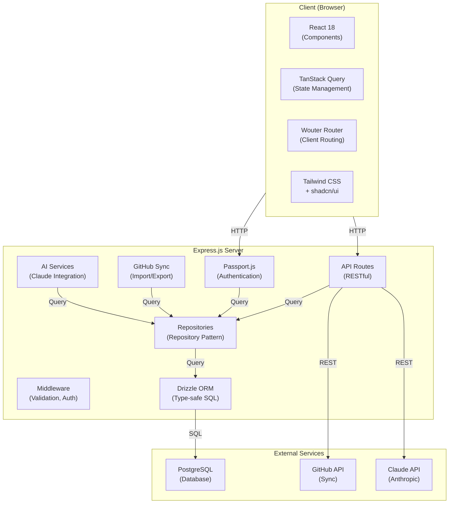
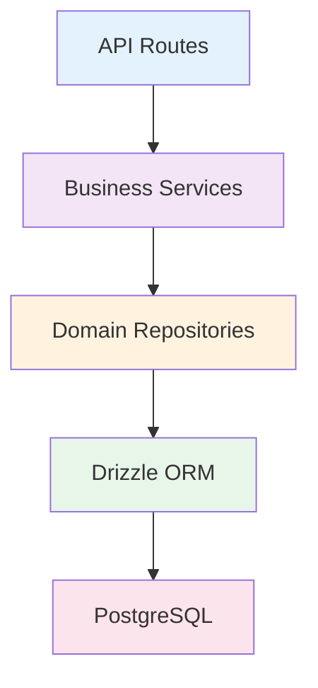
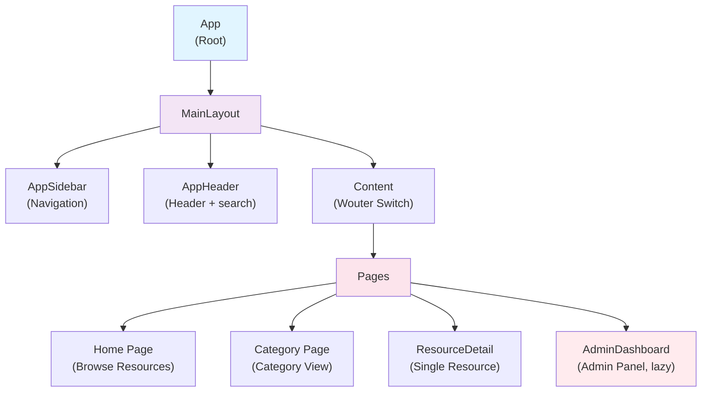
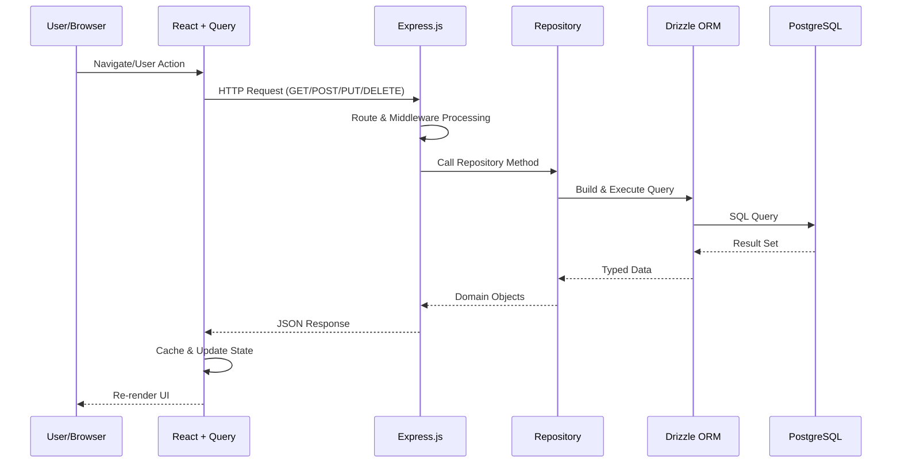
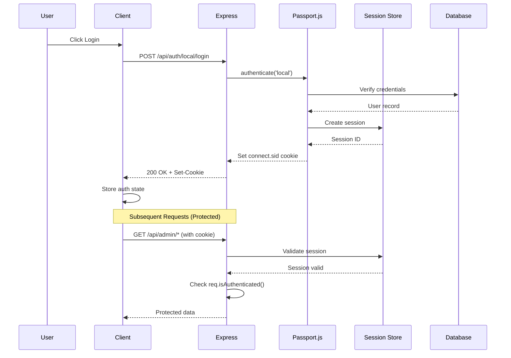
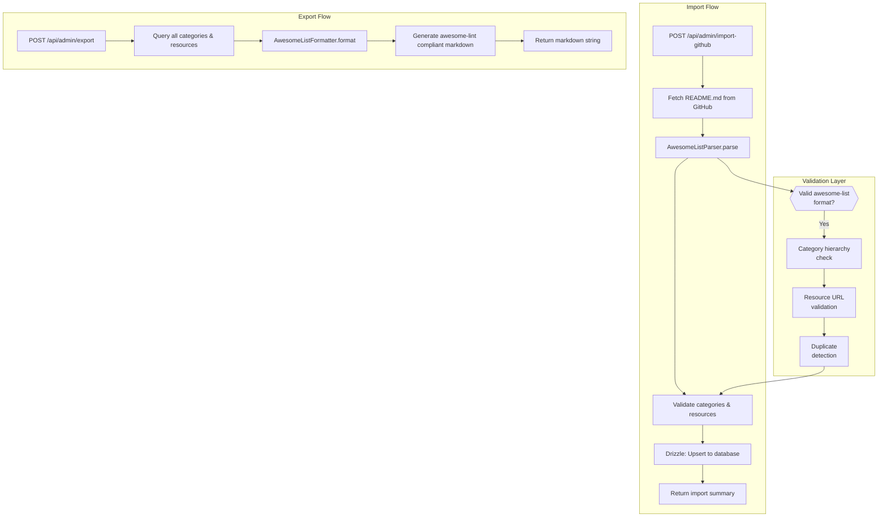
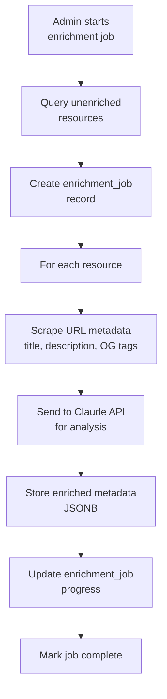

# System Architecture

Technical architecture documentation for the Awesome Video Resource Viewer application.

## Overview

The Awesome Video Resource Viewer is a full-stack application built with modern web technologies. It serves as a curated platform for discovering video development resources, featuring AI-powered recommendations, GitHub integration, and admin curation tools.

### System Architecture Diagram


```mermaid
graph TB
    subgraph Client["Client (Browser)"]
        React["React 18<br/>(Components)"]
        TQ["TanStack Query<br/>(State Management)"]
        Router["Wouter Router<br/>(Client Routing)"]
        UI["Tailwind CSS<br/>+ shadcn/ui"]
    end

    subgraph Server["Express.js Server"]
        Routes["API Routes<br/>(RESTful)"]
        Auth["Passport.js<br/>(Authentication)"]
        Middleware["Middleware<br/>(Validation, Auth)"]
        Repos["Repositories<br/>(Repository Pattern)"]
        ORM["Drizzle ORM<br/>(Type-safe SQL)"]
        GitHub["GitHub Sync<br/>(Import/Export)"]
        AI["AI Services<br/>(Claude Integration)"]
    end

    subgraph External["External Services"]
        DB["PostgreSQL<br/>(Database)"]
        GH["GitHub API<br/>(Sync)"]
        Claude["Claude API<br/>(Anthropic)"]
    end

    Client -->|HTTP| Routes
    Client -->|HTTP| Auth
    Routes -->|Query| Repos
    Auth -->|Query| Repos
    Repos -->|Query| ORM
    ORM -->|SQL| DB
    GitHub -->|Query| Repos
    AI -->|Query| Repos
    Routes -->|REST| GH
    Routes -->|REST| Claude
```

## Technology Stack

### Frontend
| Technology | Purpose |
|------------|---------|
| React 18+ | UI framework |
| TypeScript | Type safety |
| Vite | Build tool & dev server |
| TanStack Query v5 | Server state management |
| Wouter | Client-side routing |
| Tailwind CSS | Utility-first styling |
| shadcn/ui | Component library |
| Lucide React | Icons |
| Fuse.js | Fuzzy search |

### Backend
| Technology | Purpose |
|------------|---------|
| Express.js | HTTP server |
| TypeScript | Type safety |
| Drizzle ORM | Database ORM |
| Passport.js | Authentication |
| Zod | Schema validation |
| Remark | Markdown parsing |

### Database
| Technology | Purpose |
|------------|---------|
| PostgreSQL (Neon) | Primary database |
| Drizzle Kit | Migrations |

### External Services
| Service | Purpose |
|---------|---------|
| Anthropic Claude | AI analysis, enrichment & agent research |
| OpenAI | Embeddings & optional AI features |
| GitHub API | Repository sync |
| Replit Auth (OIDC) | OAuth authentication |
| Google Analytics | Usage analytics |

### Rendering & theming

- **No Next.js, no React SSR.** The app is a Vite-built React SPA served by Express.
  For crawlers, `server/og-middleware.ts` (with `server/ssr.ts`) injects a full meta/OG
  tag set at request time ("SSR-lite"); after hydration react-helmet manages the live head.
- **Runtime design-system switcher.** The UI ships multiple design systems selectable at
  runtime (Editorial is the default), plus a light/dark/auto theme, managed by
  `ThemeProvider` (`client/src/components/ui/theme-provider.tsx`) and the `use-theme` hook,
  persisted to `localStorage`.

## Directory Structure

```
├── client/                 # Frontend application
│   ├── src/
│   │   ├── components/     # Reusable UI components
│   │   │   ├── ui/         # shadcn/ui primitives
│   │   │   ├── layout/     # Layout components
│   │   │   └── ...
│   │   ├── pages/          # Route pages
│   │   ├── hooks/          # Custom React hooks
│   │   ├── lib/            # Utilities & helpers
│   │   └── App.tsx         # Root component & routing
│   └── index.html
├── server/                 # Backend application
│   ├── repositories/       # Data access layer (Repository Pattern)
│   │   ├── ResourceRepository.ts
│   │   ├── CategoryRepository.ts
│   │   ├── UserRepository.ts
│   │   ├── TagRepository.ts
│   │   ├── LearningJourneyRepository.ts
│   │   ├── UserFeatureRepository.ts
│   │   ├── AuditRepository.ts
│   │   ├── GithubSyncRepository.ts
│   │   ├── EnrichmentRepository.ts
│   │   ├── AdminRepository.ts
│   │   ├── LegacyRepository.ts
│   │   └── index.ts        # Barrel export
│   ├── ai/                 # AI services (Claude / OpenAI, agents)
│   │   ├── claudeService.ts
│   │   ├── enrichmentService.ts
│   │   ├── researchService.ts
│   │   ├── agentRuntime.ts
│   │   ├── recommendationEngine.ts
│   │   ├── embeddingService.ts
│   │   ├── configCrypto.ts
│   │   └── urlScraper.ts
│   ├── github/             # GitHub integration
│   │   ├── syncService.ts
│   │   ├── formatter.ts
│   │   ├── parser.ts
│   │   └── client.ts
│   ├── validation/         # Validation services
│   │   ├── awesomeLint.ts
│   │   ├── linkChecker.ts
│   │   └── inputs.ts
│   ├── db/                 # Drizzle connection (pg pool)
│   ├── routes.ts           # API route definitions
│   ├── storage.ts          # IStorage facade over repositories
│   ├── migrate.ts          # Boot-time migration runner
│   ├── replitAuth.ts       # OAuth configuration
│   ├── localAuth.ts        # Local auth for dev
│   ├── og-middleware.ts    # Crawler SSR-lite (meta injection)
│   └── index.ts            # Server entry point
├── shared/                 # Shared code
│   ├── schema.ts           # Database schema & types
│   └── validation.ts       # Shared content validation rules
├── migrations/             # Journaled SQL migrations
├── scripts/                # Utility scripts
└── docs/                   # Documentation
```

## Backend Architecture Patterns

### Repository Pattern

The backend implements the **Repository Pattern** to separate data access logic from business logic, providing a clean abstraction layer over database operations.

#### Structure

The repository layer is organized by domain (classes, PascalCase files):

```
server/
├── repositories/
│   ├── ResourceRepository.ts         # Resource CRUD & approval workflow
│   ├── CategoryRepository.ts         # 3-level category hierarchy
│   ├── UserRepository.ts             # User accounts, roles, auth
│   ├── TagRepository.ts              # Tags & resource tagging
│   ├── LearningJourneyRepository.ts  # Journeys & progress
│   ├── UserFeatureRepository.ts      # Favorites, bookmarks, preferences
│   ├── AuditRepository.ts            # Audit log & edit suggestions
│   ├── GithubSyncRepository.ts       # GitHub sync queue & history
│   ├── EnrichmentRepository.ts       # AI enrichment jobs & queue
│   ├── AdminRepository.ts            # Admin statistics
│   ├── LegacyRepository.ts           # Hierarchical corpus builders
│   └── index.ts                      # Barrel export
```

#### Benefits

1. **Separation of Concerns**: Database queries are isolated from business logic
2. **Testability**: Repositories can be mocked for unit testing
3. **Maintainability**: Centralized data access patterns
4. **Type Safety**: Drizzle ORM provides full TypeScript type inference
5. **Reusability**: Common queries are defined once and reused across services

#### Usage Example

```typescript
// Option A — instantiate a domain repository directly (preferred for new code)
import { ResourceRepository } from './repositories';

const resourceRepo = new ResourceRepository();
const resources = await resourceRepo.getResources();
const resource = await resourceRepo.getResourceById(id);

// Option B — use the unified storage facade (backward compatible)
import { storage } from './storage';

const resource = await storage.getResourceById(id);
```

#### Architecture Diagram


```mermaid
graph TD
    Routes["API Routes"] --> Services["Business Services"]
    Services --> Repos["Domain Repositories"]
    Repos --> Drizzle["Drizzle ORM"]
    Drizzle --> DB["PostgreSQL"]

    style Routes fill:#e3f2fd
    style Services fill:#f3e5f5
    style Repos fill:#fff3e0
    style Drizzle fill:#e8f5e9
    style DB fill:#fce4ec
```

#### storage.ts and the repository layer

`server/storage.ts` still exists, but it is now a thin **facade** implementing the
`IStorage` interface by delegating each method to the appropriate domain repository. This
preserves the existing `storage.*` call sites while new code can import repositories
directly for better modularity.

| Legacy pattern | Current pattern |
|----------------|-----------------|
| `import { storage } from './storage'` | `import { ResourceRepository } from './repositories'` |
| `storage.getResourceById(id)` (still works) | `new ResourceRepository().getResourceById(id)` |
| One monolithic data-access file | One focused repository per domain + facade |
| Mixed concerns | Single responsibility per repository |

This structure improves organization and testability while keeping backward compatibility
through the facade.

## Component Hierarchy


```mermaid
graph TD
    App["App<br/>(Root)"]
    MainLayout["MainLayout"]
    AppSidebar["AppSidebar<br/>(Navigation)"]
    AppHeader["AppHeader<br/>(Header + search)"]
    Content["Content<br/>(Wouter Switch)"]
    Pages["Pages"]

    Home["Home Page<br/>(Browse Resources)"]
    Category["Category Page<br/>(Category View)"]
    ResourceDetail["ResourceDetail<br/>(Single Resource)"]
    AdminDash["AdminDashboard<br/>(Admin Panel, lazy)"]

    App --> MainLayout
    MainLayout --> AppSidebar
    MainLayout --> AppHeader
    MainLayout --> Content
    Content --> Pages
    Pages --> Home
    Pages --> Category
    Pages --> ResourceDetail
    Pages --> AdminDash

    style App fill:#e1f5ff
    style MainLayout fill:#f3e5f5
    style Pages fill:#fce4ec
    style AdminDash fill:#ffebee
```

## Data Flow

### Request/Response Cycle Sequence Diagram


```mermaid
sequenceDiagram
    participant U as User/Browser
    participant R as React + Query
    participant E as Express.js
    participant Repo as Repository
    participant D as Drizzle ORM
    participant DB as PostgreSQL

    U->>R: Navigate/User Action
    R->>E: HTTP Request (GET/POST/PUT/DELETE)
    E->>E: Route & Middleware Processing
    E->>Repo: Call Repository Method
    Repo->>D: Build & Execute Query
    D->>DB: SQL Query
    DB-->>D: Result Set
    D-->>Repo: Typed Data
    Repo-->>E: Domain Objects
    E-->>R: JSON Response
    R->>R: Cache & Update State
    R-->>U: Re-render UI
```

### Authentication Flow (Detailed)


```mermaid
sequenceDiagram
    participant U as User
    participant C as Client
    participant E as Express
    participant P as Passport.js
    participant S as Session Store
    participant DB as Database

    U->>C: Click Login
    C->>E: POST /api/auth/local/login
    E->>P: authenticate('local')
    P->>DB: Verify credentials
    DB-->>P: User record
    P->>S: Create session
    S-->>P: Session ID
    P-->>E: Set connect.sid cookie
    E-->>C: 200 OK + Set-Cookie
    C->>C: Store auth state

    Note over C,E: Subsequent Requests (Protected)
    C->>E: GET /api/admin/* (with cookie)
    E->>S: Validate session
    S-->>E: Session valid
    E->>E: Check req.isAuthenticated()
    E-->>C: Protected data
```

### GitHub Sync Flow (Import & Export)


```mermaid
flowchart TD
    subgraph Import["Import Flow"]
        I1["POST /api/admin/import-github"]
        I2["Fetch README.md from GitHub"]
        I3["AwesomeListParser.parse"]
        I4["Validate categories & resources"]
        I5["Drizzle: Upsert to database"]
        I6["Return import summary"]

        I1 --> I2 --> I3 --> I4 --> I5 --> I6
    end

    subgraph Export["Export Flow"]
        E1["POST /api/admin/export"]
        E2["Query all categories & resources"]
        E3["AwesomeListFormatter.format"]
        E4["Generate awesome-lint compliant markdown"]
        E5["Return markdown string"]

        E1 --> E2 --> E3 --> E4 --> E5
    end

    subgraph Validation["Validation Layer"]
        V1{{"Valid awesome-list<br/>format?"}}
        V2["Category hierarchy<br/>check"]
        V3["Resource URL<br/>validation"]
        V4["Duplicate<br/>detection"]
    end

    I3 --> V1
    V1 -->|Yes| V2
    V2 --> V3
    V3 --> V4
    V4 --> I4
```

### AI Enrichment Flow


```mermaid
flowchart TD
    A1["Admin starts<br/>enrichment job"]
    A2["Query unenriched<br/>resources"]
    A3["Create enrichment_job<br/>record"]
    A4["For each resource"]
    A5["Scrape URL metadata<br/>title, description, OG tags"]
    A6["Send to Claude API<br/>for analysis"]
    A7["Store enriched metadata<br/>JSONB"]
    A8["Update enrichment_job<br/>progress"]
    A9["Mark job complete"]

    A1 --> A2 --> A3 --> A4 --> A5 --> A6 --> A7 --> A8 --> A9
```

## Database Schema

> **📖 For detailed database schema documentation, see [DATABASE.md](./DATABASE.md)**

### Core Tables

**users**
- Primary user accounts (Replit OAuth or local)
- Roles: user, admin, moderator

**resources**
- Core resource entries
- Status: pending, approved, rejected
- Metadata stored as JSONB

**categories / subcategories / sub_subcategories**
- 3-level hierarchy for navigation
- Slugs for URL routing

**resource_edits**
- User-submitted edit suggestions
- Conflict detection via originalResourceUpdatedAt

**resource_audit_log**
- Complete audit trail of all changes

### Support Tables

**learning_journeys / journey_steps / user_journey_progress**
- Learning path functionality

**user_favorites / user_bookmarks / user_preferences / user_interactions**
- User engagement, personalization, and behavioral analytics

**github_sync_queue / github_sync_history**
- GitHub sync state management

**enrichment_jobs / enrichment_queue**
- AI batch enrichment tracking (with per-run agent config)

**research_jobs / research_discoveries / agent_events**
- Claude Agent SDK research runs and structured agent event log

**link_health_jobs / link_health_checks**
- Link-health scanning results

**api_keys / password_reset_tokens**
- Programmatic API access and self-service password reset

**tags / resource_tags**
- Tag management (many-to-many)

> The full 29-table schema is documented in [DATABASE.md](./DATABASE.md).

## Security Measures

### Authentication
- Passport.js session management
- bcrypt password hashing (local auth)
- Session stored in PostgreSQL
- HTTPS enforced in production

### Authorization
- Role-based access control (RBAC)
- isAuthenticated middleware
- isAdmin middleware for admin routes

### Input Validation
- Zod schemas for all inputs
- Whitelisted editable fields for edit suggestions
- Field size limits enforced
- SQL injection prevented via Drizzle ORM

### API Security
- CORS configured for production
- Rate limiting on external APIs
- Secrets stored in environment variables

## Performance Considerations

### Caching
- TanStack Query client-side caching
- Database query optimization with indexes
- Static asset caching via Vite

### Database
- Connection pooling via Neon
- Indexes on frequently queried columns
- JSONB for flexible metadata storage

### Frontend
- Code splitting via dynamic imports
- Lazy loading of heavy components
- Optimized bundle size

## Environment Variables

See [ENVIRONMENT.md](./ENVIRONMENT.md) for the canonical, complete list. A representative
subset:

```bash
# Database
DATABASE_URL=postgresql://...

# Authentication (Replit OIDC + sessions)
REPL_ID=...
ISSUER_URL=https://replit.com/oidc   # default
SESSION_SECRET=...

# AI (managed Anthropic key preferred; ANTHROPIC_API_KEY as fallback)
AI_INTEGRATIONS_ANTHROPIC_API_KEY=...
CONFIG_ENCRYPTION_KEY=...            # encrypts per-run agent auth tokens

# GitHub sync
GITHUB_TOKEN=...
GITHUB_REPO_URL=...

# Frontend / optional
VITE_GA_MEASUREMENT_ID=...
NODE_ENV=development|production
```

## Deployment

The application is designed for Replit deployment:

1. **Development**: `npm run dev` starts Vite + Express
2. **Production**: `npm run build` → `npm run start`
3. **Database**: Replit PostgreSQL (Neon-backed)
4. **Secrets**: Managed via Replit Secrets tab
5. **Deploy**: Replit's built-in deployment system

## Monitoring & Logging

- Console logging for debugging
- Audit log for resource changes
- Google Analytics for frontend tracking
- Health endpoint: `GET /api/health`
