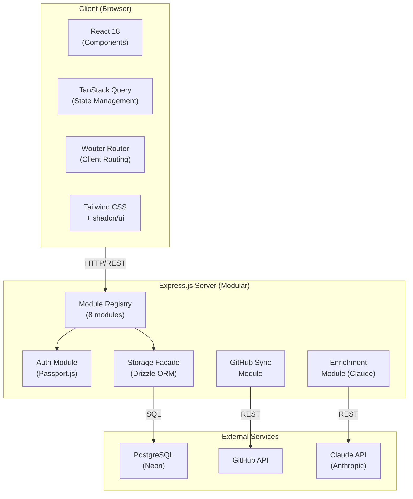
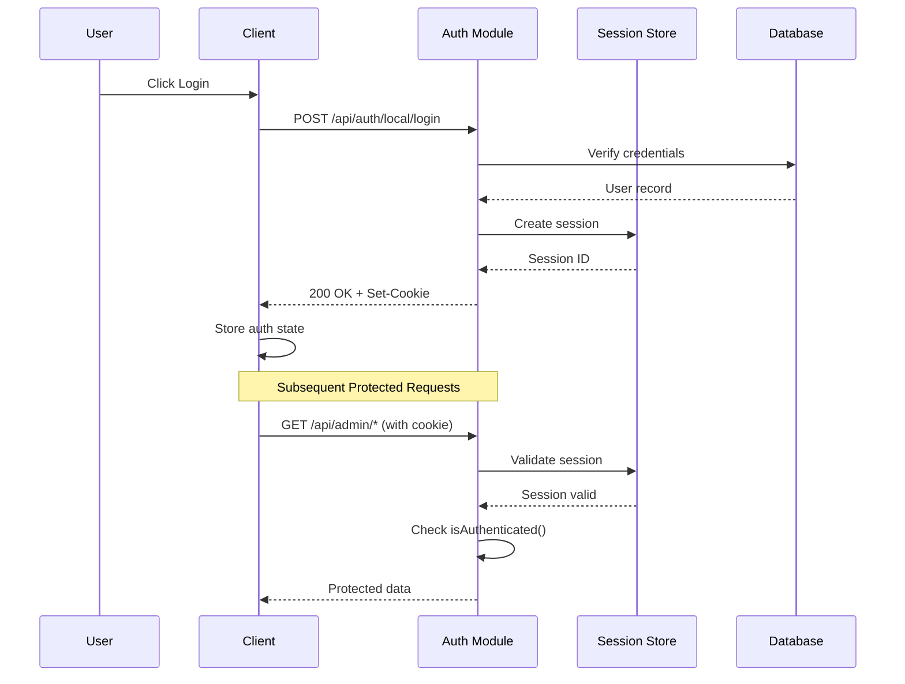

# System Architecture

This document describes the architecture of the Awesome Video Resource Viewer, including the modular backend structure, system design, data flow, and development guidelines.

## Table of Contents

- [Overview](#overview)
- [Modular Backend Architecture](#modular-backend-architecture)
- [Technology Stack](#technology-stack)
- [Module Structure](#module-structure)
- [Core Modules](#core-modules)
- [Data Flow](#data-flow)
- [Adding New Modules](#adding-new-modules)
- [System Architecture Diagrams](#system-architecture-diagrams)
- [Database Schema](#database-schema)
- [Security & Performance](#security--performance)

## Overview

The Awesome Video Resource Viewer is a full-stack application built with modern web technologies. It serves as a curated platform for discovering 2,600+ video development resources, featuring AI-powered recommendations, GitHub integration, and admin curation tools.

### Modular Architecture Highlights

The backend has been refactored from a monolithic architecture into a **modular architecture** with 8 self-contained feature modules:

| Metric | Before | After | Improvement |
|--------|--------|-------|-------------|
| `routes.ts` | 2,980 lines | 122 lines | **95% reduction** |
| `storage.ts` | 2,040 lines | 1,263 lines | **38% reduction** |
| Module Count | 1 monolith | 8 modules | **Clear boundaries** |
| Circular Dependencies | Present | **0** | **Eliminated** |
| Total Routes | 84 routes | 46 endpoints | **Organized** |

## Modular Backend Architecture

### Design Principles

1. **Single Responsibility**: Each module handles one feature domain
2. **Explicit Dependencies**: Modules declare their dependencies clearly
3. **Consistent Structure**: All modules follow the same 3-file pattern
4. **Separation of Concerns**: Routes, storage, and business logic are separated
5. **Type Safety**: TypeScript interfaces ensure contract compliance
6. **No Circular Dependencies**: Strict dependency hierarchy

### Module Registry

All modules are registered in `server/modules/index.ts`:

```typescript
export { authModule } from './auth';
export { resourcesModule } from './resources';
export { categoriesModule } from './categories';
export { userModule } from './user';
export { journeysModule } from './journeys';
export { adminModule } from './admin';
export { githubSyncModule } from './github-sync';
export { enrichmentModule } from './enrichment';
```

Modules are initialized in `server/routes.ts`:

```typescript
export async function registerRoutes(app: Express): Promise<Server> {
  // Setup authentication
  setupAuth(app);

  // Register all feature modules (order matters for dependencies)
  authModule.registerRoutes(app);
  resourcesModule.registerRoutes(app);
  categoriesModule.registerRoutes(app);
  userModule.registerRoutes(app);
  journeysModule.registerRoutes(app);
  adminModule.registerRoutes(app);
  githubSyncModule.registerRoutes(app);
  enrichmentModule.registerRoutes(app);

  return createServer(app);
}
```

## Technology Stack

### Frontend
| Technology | Purpose |
|------------|---------|
| React 18+ | UI framework |
| TypeScript | Type safety |
| Vite | Build tool & dev server |
| TanStack Query v5 | Server state management |
| Wouter | Client-side routing |
| Tailwind CSS | Utility-first styling |
| shadcn/ui | Component library |
| Lucide React | Icons |
| Fuse.js | Fuzzy search |

### Backend
| Technology | Purpose |
|------------|---------|
| Express.js | HTTP server |
| TypeScript | Type safety |
| Drizzle ORM | Database ORM |
| Passport.js | Authentication |
| Zod | Schema validation |
| Remark | Markdown parsing |

### Database
| Technology | Purpose |
|------------|---------|
| PostgreSQL (Neon) | Primary database |
| Drizzle Kit | Migrations |

### External Services
| Service | Purpose |
|---------|---------|
| Anthropic Claude | AI analysis & enrichment |
| GitHub API | Repository sync |
| Replit Auth | OAuth authentication |

## Module Structure

Every module follows a consistent **3-file structure**:

```
server/modules/<module-name>/
├── index.ts      # Module entry point and documentation
├── routes.ts     # Express route handlers (implements Module interface)
└── storage.ts    # Data access layer (implements storage interface)
```

### File Responsibilities

#### `index.ts` - Module Entry Point

Exports the module and provides comprehensive documentation:

```typescript
/**
 * ============================================================================
 * MODULE NAME - Brief Description
 * ============================================================================
 *
 * FEATURES:
 * - Feature 1
 * - Feature 2
 *
 * SECURITY:
 * - Security consideration 1
 * - Security consideration 2
 *
 * See /docs/API.md for endpoint documentation.
 * ============================================================================
 */

export { moduleNameModule } from './routes';
```

#### `routes.ts` - Route Handlers

Defines HTTP endpoints and implements the `Module` interface:

```typescript
import type { Express } from 'express';
import type { Module } from '../types';
import { isAuthenticated, isAdmin } from '../middleware';

export const moduleNameModule: Module = {
  name: 'module-name',
  description: 'Module description',

  registerRoutes: (app: Express) => {
    // Public routes
    app.get('/api/module-name', handler);

    // Authenticated routes
    app.post('/api/module-name', isAuthenticated, handler);

    // Admin routes
    app.delete('/api/module-name/:id', isAuthenticated, isAdmin, handler);
  }
};
```

#### `storage.ts` - Data Access Layer

Defines storage interface and implementation:

```typescript
export interface IModuleNameStorage {
  getItem(id: number): Promise<Item | null>;
  listItems(): Promise<Item[]>;
  createItem(data: NewItem): Promise<Item>;
  updateItem(id: number, data: Partial<Item>): Promise<Item>;
  deleteItem(id: number): Promise<void>;
}

// Implementation delegates to main storage
class ModuleNameStorage implements IModuleNameStorage {
  // Methods delegate to storage.ts
}

export const moduleNameStorage: IModuleNameStorage = new ModuleNameStorage();
```

## Core Modules

### 1. Auth Module (`server/modules/auth/`)

**Responsibility**: Authentication and authorization

**Routes** (3 endpoints):
- `GET /api/auth/user` - Get current user
- `POST /api/auth/logout` - Logout user
- `POST /api/auth/local/login` - Local authentication

**Storage Interface**: `IAuthStorage` (user management, role updates)

**Dependencies**: None (base module)

**Security**: bcrypt password hashing, session management, RBAC

---

### 2. Resources Module (`server/modules/resources/`)

**Responsibility**: Resource CRUD and lifecycle management

**Routes** (8 endpoints):
- `GET /api/resources` - List resources (with filters)
- `GET /api/resources/:id` - Get single resource
- `POST /api/resources` - Create resource (authenticated)
- `PUT /api/resources/:id` - Update resource (authenticated)
- `DELETE /api/resources/:id` - Delete resource (admin)
- `POST /api/resources/:id/tags` - Add tags (admin)
- `DELETE /api/resources/:id/tags/:tag` - Remove tag (admin)
- `GET /api/resources/:id/audit-log` - Get audit history (admin)

**Storage Interface**: `IResourceStorage` (CRUD, pending workflow, tags, audit)

**Dependencies**: Categories module

**Resource Lifecycle**:
1. Submit → pending
2. Review → approved/rejected
3. Publish → public
4. Update → audit trail
5. Archive → soft delete

---

### 3. Categories Module (`server/modules/categories/`)

**Responsibility**: 3-level category hierarchy management

**Routes** (3 endpoints):
- `GET /api/categories` - List all categories
- `GET /api/categories/:id/subcategories` - List subcategories
- `GET /api/subcategories/:id/sub-subcategories` - List sub-subcategories

**Storage Interface**: `ICategoryStorage` (22 methods across 3 hierarchy levels)

**Dependencies**: None

**Hierarchy**: Category → Subcategory → Sub-subcategory → Resources

---

### 4. User Module (`server/modules/user/`)

**Responsibility**: User preferences and progress tracking

**Routes** (8 endpoints):
- `GET/POST/DELETE /api/favorites` - Manage favorites
- `GET/POST/DELETE /api/bookmarks` - Manage bookmarks
- `GET /api/user/progress` - Get user progress
- `GET /api/user/submissions` - List user submissions

**Storage Interface**: `IUserStorage` (favorites, bookmarks, progress, preferences)

**Dependencies**: Resources, Journeys modules

---

### 5. Journeys Module (`server/modules/journeys/`)

**Responsibility**: Learning journey management and tracking

**Routes** (5 endpoints):
- `GET /api/journeys` - List all journeys
- `GET /api/journeys/:id` - Get journey details
- `POST /api/journeys/:id/start` - Start a journey (authenticated)
- `POST /api/journeys/:id/progress` - Update progress (authenticated)
- `GET /api/journeys/:id/progress` - Get user progress (authenticated)

**Storage Interface**: `IJourneysStorage` (15 methods: journeys, steps, progress)

**Dependencies**: Resources module

**Journey Structure**: Journey → Steps → Resources → User Progress

---

### 6. Admin Module (`server/modules/admin/`)

**Responsibility**: Administrative operations and moderation

**Routes** (6 endpoints):
- `GET /api/admin/stats` - Dashboard statistics
- `GET /api/admin/users` - List all users
- `PUT /api/admin/users/:id/role` - Update user role
- `GET /api/admin/pending` - Get pending resources
- `POST /api/admin/approve/:id` - Approve resource
- `POST /api/admin/reject/:id` - Reject resource

**Storage Interface**: `IAdminStorage` (stats, user management, moderation, audit)

**Dependencies**: Auth, Resources modules

**Security**: All routes require `isAuthenticated` + `isAdmin`

---

### 7. GitHub Sync Module (`server/modules/github-sync/`)

**Responsibility**: GitHub repository synchronization

**Routes** (9 endpoints):
- `GET /api/github/awesome-lists` - List awesome lists (public)
- `POST /api/admin/import-github` - Import from GitHub (admin)
- `GET /api/admin/github/sync-queue` - Get sync queue (admin)
- `POST /api/admin/github/sync/:id` - Sync specific item (admin)
- `DELETE /api/admin/github/sync/:id` - Remove from queue (admin)
- `POST /api/admin/export` - Export to markdown (admin)
- `GET /api/admin/export/preview` - Preview export (admin)
- `POST /api/admin/validate` - Validate awesome-lint (admin)
- `GET /api/admin/sync-history` - Get sync history (admin)

**Storage Interface**: `IGithubSyncStorage` (sync queue, sync history)

**Dependencies**: Resources, Categories modules

**Features**: awesome-lint compliance, markdown parsing, link validation

---

### 8. Enrichment Module (`server/modules/enrichment/`)

**Responsibility**: AI-powered resource enrichment

**Routes** (4 endpoints):
- `POST /api/admin/enrichment/start` - Start enrichment job (admin)
- `GET /api/admin/enrichment/jobs` - List enrichment jobs (admin)
- `GET /api/admin/enrichment/jobs/:id` - Get job status (admin)
- `POST /api/admin/enrichment/jobs/:id/cancel` - Cancel job (admin)

**Storage Interface**: `IEnrichmentStorage` (jobs, queue management)

**Dependencies**: Resources module, Claude API

**Features**: Batch metadata extraction, AI-generated tags, OG image detection

## Data Flow

### Module Dependency Graph

```
┌─────────────────────────────────────────────────────────┐
│                     Main Application                     │
│                   (server/routes.ts)                     │
└──────────────────────┬──────────────────────────────────┘
                       │
       ┌───────────────┼───────────────┐
       │               │               │
       ▼               ▼               ▼
┌──────────┐    ┌──────────┐    ┌──────────┐
│   Auth   │    │Categories│    │ Resources│ (Base Modules)
│  Module  │    │  Module  │    │  Module  │
└──────────┘    └──────────┘    └────┬─────┘
                                     │
              ┌──────────────────────┼─────────────┐
              │                      │             │
              ▼                      ▼             ▼
       ┌──────────┐           ┌──────────┐  ┌──────────┐
       │   User   │           │ Journeys │  │  Admin   │ (Feature Modules)
       │  Module  │           │  Module  │  │  Module  │
       └──────────┘           └──────────┘  └──────────┘
              │
              └──────────────┬───────────────┐
                             │               │
                             ▼               ▼
                      ┌──────────┐    ┌──────────┐
                      │GitHub    │    │Enrichment│ (Integration Modules)
                      │Sync      │    │  Module  │
                      └──────────┘    └──────────┘
```

### Request Flow

```
1. HTTP Request from Client
   ↓
2. Express Middleware (auth, logging, parsing)
   ↓
3. Module Router (routes.ts)
   ↓
4. Authentication Middleware (if required)
   ↓
5. Authorization Middleware (if admin required)
   ↓
6. Route Handler
   ↓
7. Business Logic
   ↓
8. Storage Facade (storage.ts)
   ↓
9. Module Storage (module/storage.ts)
   ↓
10. Database (PostgreSQL via Drizzle ORM)
   ↓
11. Response sent to client
```

### Storage Facade Pattern

The main `storage.ts` acts as a **facade** that delegates to module storage:

```typescript
// storage.ts delegates to module storage
export const storage: IStorage = {
  // Resources → resourceStorage
  listResources: () => resourceStorage.listResources(),
  getResource: (id) => resourceStorage.getResource(id),

  // Categories → categoryStorage
  listCategories: () => categoryStorage.listCategories(),

  // GitHub Sync → githubSyncStorage
  addToGithubSyncQueue: (data) => githubSyncStorage.addToGithubSyncQueue(data),

  // Enrichment → enrichmentStorage
  createEnrichmentJob: (data) => enrichmentStorage.createEnrichmentJob(data),

  // Direct implementations for backward compatibility
  getUserFavorites: (userId) => { /* implementation */ },
};
```

**Benefits**:
- **Backward Compatibility**: Existing code still works
- **Gradual Migration**: Modules can be refactored independently
- **Clear Ownership**: Each module owns its data operations
- **Performance**: No indirection overhead

## Adding New Modules

### Quick Start Guide

1. **Create Module Directory**:
```bash
mkdir -p server/modules/my-module
touch server/modules/my-module/{index,routes,storage}.ts
```

2. **Define Module Interface** (`index.ts`):
```typescript
/**
 * ============================================================================
 * MY MODULE - Brief Description
 * ============================================================================
 */
export { myModule } from './routes';
```

3. **Implement Routes** (`routes.ts`):
```typescript
import type { Express } from 'express';
import type { Module } from '../types';
import { isAuthenticated, isAdmin } from '../middleware';

export const myModule: Module = {
  name: 'my-module',
  description: 'My module description',

  registerRoutes: (app: Express) => {
    app.get('/api/my-module', handler);
    app.post('/api/my-module', isAuthenticated, handler);
  }
};
```

4. **Create Storage Interface** (`storage.ts`):
```typescript
export interface IMyModuleStorage {
  listItems(): Promise<Item[]>;
  getItem(id: number): Promise<Item | null>;
}

class MyModuleStorage implements IMyModuleStorage {
  // Implementation
}

export const myModuleStorage: IMyModuleStorage = new MyModuleStorage();
```

5. **Register Module**:
- Add to `server/modules/index.ts`: `export { myModule } from './my-module';`
- Add to `server/routes.ts`: `myModule.registerRoutes(app);`

6. **Update Storage Facade** (if needed):
```typescript
// server/storage.ts
class DatabaseStorage implements IStorage {
  async listMyItems(): Promise<Item[]> {
    return myModuleStorage.listMyItems();
  }
}
```

### Best Practices

1. **Keep Modules Focused**: Single responsibility per module
2. **Minimize Dependencies**: Avoid tight coupling
3. **Use Interfaces**: Define storage interfaces for testability
4. **Document Thoroughly**: Include comprehensive JSDoc comments
5. **Follow Patterns**: Match the structure of existing modules
6. **Error Handling**: Always use try-catch blocks
7. **Type Safety**: Define TypeScript types for all inputs/outputs

### Naming Conventions

- **Module Names**: kebab-case (e.g., `github-sync`, `my-module`)
- **File Names**: kebab-case (e.g., `routes.ts`, `storage.ts`)
- **Export Names**: camelCase (e.g., `githubSyncModule`, `myModule`)
- **Interface Names**: PascalCase with `I` prefix (e.g., `IMyModuleStorage`)

## System Architecture Diagrams

### High-Level System Architecture


```mermaid
graph TB
    subgraph Client["Client (Browser)"]
        React["React 18<br/>(Components)"]
        TQ["TanStack Query<br/>(State Management)"]
        Router["Wouter Router<br/>(Client Routing)"]
        UI["Tailwind CSS<br/>+ shadcn/ui"]
    end

    subgraph Server["Express.js Server (Modular)"]
        Routes["Module Registry<br/>(8 modules)"]
        Auth["Auth Module<br/>(Passport.js)"]
        Storage["Storage Facade<br/>(Drizzle ORM)"]
        GitHub["GitHub Sync<br/>Module"]
        AI["Enrichment<br/>Module (Claude)"]
    end

    subgraph External["External Services"]
        DB["PostgreSQL<br/>(Neon)"]
        GH["GitHub API"]
        Claude["Claude API<br/>(Anthropic)"]
    end

    Client -->|HTTP/REST| Routes
    Routes --> Auth
    Routes --> Storage
    Storage -->|SQL| DB
    GitHub -->|REST| GH
    AI -->|REST| Claude
```

### Authentication Flow


```mermaid
sequenceDiagram
    participant U as User
    participant C as Client
    participant A as Auth Module
    participant S as Session Store
    participant DB as Database

    U->>C: Click Login
    C->>A: POST /api/auth/local/login
    A->>DB: Verify credentials
    DB-->>A: User record
    A->>S: Create session
    S-->>A: Session ID
    A-->>C: 200 OK + Set-Cookie
    C->>C: Store auth state

    Note over C,A: Subsequent Protected Requests
    C->>A: GET /api/admin/* (with cookie)
    A->>S: Validate session
    S-->>A: Session valid
    A->>A: Check isAuthenticated()
    A-->>C: Protected data
```

## Database Schema

> **📖 For detailed database schema documentation, see [DATABASE.md](./DATABASE.md)**

### Core Tables

**users** - User accounts (Replit OAuth or local)
- Roles: user, admin, moderator

**resources** - Core resource entries
- Status: pending, approved, rejected
- Metadata stored as JSONB

**categories / subcategories / sub_subcategories**
- 3-level hierarchy for navigation

**resource_edits** - User-submitted edit suggestions
- Conflict detection via originalResourceUpdatedAt

**resource_audit_log** - Complete audit trail

### Support Tables

**learning_journeys / journey_steps / user_journey_progress** - Learning paths

**favorites / bookmarks** - User engagement

**github_sync_queue / sync_history** - GitHub sync state

**enrichment_jobs / enrichment_queue** - AI batch processing

**tags / resource_tags** - Tag management (many-to-many)

## Security & Performance

### Security Measures

**Authentication**:
- Passport.js session management
- bcrypt password hashing (10 rounds)
- HTTP-only secure cookies
- HTTPS enforced in production

**Authorization**:
- Role-based access control (RBAC)
- `isAuthenticated` middleware for protected routes
- `isAdmin` middleware for admin routes

**Input Validation**:
- Zod schemas for all inputs
- Whitelisted editable fields
- SQL injection prevented via Drizzle ORM
- Field size limits enforced

**API Security**:
- CORS configured for production
- Rate limiting on external APIs
- Secrets in environment variables

### Performance Optimizations

**Caching**:
- TanStack Query client-side caching (5 min default)
- Database query optimization with indexes
- Static asset caching via Vite

**Database**:
- Connection pooling via Neon
- Indexes on frequently queried columns
- JSONB for flexible metadata storage

**Frontend**:
- Code splitting via dynamic imports
- Lazy loading of heavy components
- Optimized bundle size

## Directory Structure

```
├── client/                 # Frontend application
│   ├── src/
│   │   ├── components/     # Reusable UI components
│   │   │   ├── ui/         # shadcn/ui primitives
│   │   │   └── ...
│   │   ├── pages/          # Route pages (17 pages)
│   │   ├── hooks/          # Custom React hooks
│   │   ├── lib/            # Utilities & helpers
│   │   └── App.tsx         # Root component & routing
├── server/                 # Backend application
│   ├── modules/            # Feature modules (NEW)
│   │   ├── auth/           # Authentication module
│   │   ├── resources/      # Resources module
│   │   ├── categories/     # Categories module
│   │   ├── user/           # User module
│   │   ├── journeys/       # Journeys module
│   │   ├── admin/          # Admin module
│   │   ├── github-sync/    # GitHub sync module
│   │   ├── enrichment/     # Enrichment module
│   │   ├── index.ts        # Module registry
│   │   ├── types.ts        # Module types
│   │   └── middleware.ts   # Shared middleware
│   ├── ai/                 # AI services
│   ├── github/             # GitHub integration
│   ├── validation/         # Validation services
│   ├── routes.ts           # Module orchestration (122 lines)
│   ├── storage.ts          # Storage facade (1,263 lines)
│   └── index.ts            # Server entry point
├── shared/                 # Shared code
│   └── schema.ts           # Database schema & types
├── scripts/                # Utility scripts
└── docs/                   # Documentation
    ├── ARCHITECTURE.md     # This file
    ├── API.md              # API reference
    ├── CODE-MAP.md         # Codebase navigation
    └── DATABASE.md         # Database schema
```

## Migration History

### Before Modularization

**Monolithic Architecture** (51,000+ lines):
- `server/routes.ts`: 2,980 lines with 84 routes
- `server/storage.ts`: 2,040 lines with 100+ methods
- All routes in single file
- All storage operations in single class

**Problems**:
- High cognitive load for developers
- Difficult to test features in isolation
- Risk of merge conflicts
- Unclear module boundaries

### After Modularization

**Modular Architecture** (8 modules):
- `server/routes.ts`: **122 lines** (95% reduction) - module registration only
- `server/storage.ts`: **1,263 lines** (38% reduction) - facade pattern
- 8 self-contained modules with clear boundaries
- 46 organized endpoints across modules

**Benefits**:
- ✅ **95% reduction** in main routes file
- ✅ **38% reduction** in main storage file
- ✅ **Zero circular dependencies**
- ✅ Clear module boundaries
- ✅ Independent testing capability
- ✅ Parallel development support

## Related Documentation

- [API Reference](./API.md) - Complete API endpoint documentation
- [Code Map](./CODE-MAP.md) - Codebase navigation guide
- [Database Schema](./DATABASE.md) - Database documentation
- [Admin Guide](./ADMIN-GUIDE.md) - Administrator documentation
- [Setup Guide](./SETUP.md) - Development environment setup
- [Contributing](../CONTRIBUTING.md) - Contribution guidelines

---

**Last Updated**: 2026-02-01
**Architecture Version**: 2.0 (Modular)
