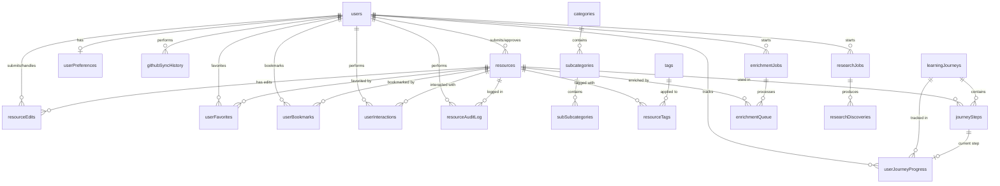

# Database Reference

Schema and migration reference for the Awesome Video resource platform.

> **Source of truth:** [`shared/schema.ts`](../shared/schema.ts). Every table, column,
> index, and Zod insert schema is defined there and this document mirrors it. When the
> two disagree, `shared/schema.ts` wins — update this file to match.

## Overview

- **Engine:** PostgreSQL (Neon-hosted in production/Replit).
- **Driver:** `pg` (node-postgres) connection pool wired to **Drizzle ORM**
  (`drizzle-orm/node-postgres`) in [`server/db/index.ts`](../server/db/index.ts).
- **Schema management:** `drizzle-kit push` in development; journaled SQL migrations in
  `migrations/` applied by a boot-time migrator in production (see
  [Migrations & schema changes](#migrations--schema-changes)).
- **Tables:** 29 `pgTable` definitions in `shared/schema.ts`.

The schema supports: user authentication (Replit OAuth + local password), a 3-level
category taxonomy, a resource approval workflow, crowdsourced edit suggestions, a full
audit trail, learning journeys, AI enrichment/research jobs, GitHub import/export, link
health scanning, and API keys for programmatic access.

---

## Table catalog

All 29 tables, grouped by domain. Drizzle export name → SQL table name.

**Auth & users**
| Export | SQL table | Purpose |
|--------|-----------|---------|
| `sessions` | `sessions` | Express session store (connect-pg-simple) |
| `users` | `users` | User accounts (OAuth + local auth), roles |
| `apiKeys` | `api_keys` | Hashed API keys for programmatic access |
| `passwordResetTokens` | `password_reset_tokens` | Single-use hashed reset tokens |

**Content & taxonomy**
| Export | SQL table | Purpose |
|--------|-----------|---------|
| `resources` | `resources` | Core curated resources (+ generated FTS column) |
| `categories` | `categories` | Top-level taxonomy |
| `subcategories` | `subcategories` | Second-level taxonomy |
| `subSubcategories` | `sub_subcategories` | Third-level taxonomy |
| `tags` | `tags` | Cross-cutting tags |
| `resourceTags` | `resource_tags` | Resource↔tag junction |
| `awesomeLists` | `awesome_lists` | External awesome-list sources |

**Workflow & audit**
| Export | SQL table | Purpose |
|--------|-----------|---------|
| `resourceEdits` | `resource_edits` | Crowdsourced edit suggestions (+ Claude analysis) |
| `resourceAuditLog` | `resource_audit_log` | Complete change history |

**Learning journeys**
| Export | SQL table | Purpose |
|--------|-----------|---------|
| `learningJourneys` | `learning_journeys` | Curated learning paths |
| `journeySteps` | `journey_steps` | Ordered steps within a journey |
| `userJourneyProgress` | `user_journey_progress` | Per-user journey progress |

**User engagement & personalization**
| Export | SQL table | Purpose |
|--------|-----------|---------|
| `userFavorites` | `user_favorites` | Favorited resources |
| `userBookmarks` | `user_bookmarks` | Bookmarked resources (with notes) |
| `userPreferences` | `user_preferences` | Recommendation preferences |
| `userInteractions` | `user_interactions` | Behavioral analytics events |

**GitHub sync**
| Export | SQL table | Purpose |
|--------|-----------|---------|
| `githubSyncQueue` | `github_sync_queue` | Queued import/export operations |
| `githubSyncHistory` | `github_sync_history` | Completed sync operations + stats |

**AI enrichment, research & agents**
| Export | SQL table | Purpose |
|--------|-----------|---------|
| `enrichmentJobs` | `enrichment_jobs` | Batch AI enrichment jobs |
| `enrichmentQueue` | `enrichment_queue` | Per-resource enrichment tasks |
| `researchJobs` | `research_jobs` | Claude Agent SDK research runs |
| `researchDiscoveries` | `research_discoveries` | Candidate resources found by research |
| `agentEvents` | `agent_events` | Structured agent run event log |

**Link health**
| Export | SQL table | Purpose |
|--------|-----------|---------|
| `linkHealthJobs` | `link_health_jobs` | Link-scan job runs |
| `linkHealthChecks` | `link_health_checks` | Per-URL scan results |

---

## Entity relationship diagram (core domain)

The core content/user relationships. Auxiliary tables (`api_keys`,
`password_reset_tokens`, `link_health_*`, `research_*`, `agent_events`, `sessions`,
`awesome_lists`) are documented in the table catalog above but omitted here for clarity.



---

## Auth & users

### sessions
Express session storage for Passport.js (`connect-pg-simple`).

| Column | Type | Constraints | Notes |
|--------|------|-------------|-------|
| sid | varchar | PK | Session ID |
| sess | jsonb | NOT NULL | Session payload |
| expire | timestamp | NOT NULL | Expiry (indexed: `IDX_session_expire`) |

### users
Supports Replit OAuth (email, no password) and local auth (bcrypt password).

| Column | Type | Constraints | Notes |
|--------|------|-------------|-------|
| id | varchar | PK, default `gen_random_uuid()` | UUID |
| email | varchar | UNIQUE | Login email |
| password | varchar | nullable | bcrypt hash (local auth only) |
| first_name | varchar | | |
| last_name | varchar | | |
| profile_image_url | varchar | | |
| role | text | default `'user'` | `user`, `admin`, `moderator` |
| deletion_requested_at | timestamp | nullable | Set when a user requests account/data deletion from their profile; admins action it privately. NULL = no pending request |
| created_at | timestamp | default now | |
| updated_at | timestamp | default now | |

### api_keys
Hashed API keys for the public/programmatic API. Only the SHA-256 hash is stored; the
plaintext key is shown once at creation.

| Column | Type | Constraints | Notes |
|--------|------|-------------|-------|
| id | varchar | PK, default uuid | |
| user_id | varchar | FK → users.id, CASCADE, NOT NULL | Owner |
| key | varchar | NOT NULL, UNIQUE | SHA-256 hash |
| name | varchar | NOT NULL | User label |
| scopes | jsonb (`string[]`) | default `[]`, NOT NULL | Permission scopes |
| created_at | timestamp | default now, NOT NULL | |
| last_used_at | timestamp | nullable | |
| expires_at | timestamp | nullable | Null = non-expiring |
| revoked_at | timestamp | nullable | Non-null = revoked |

Indexes: `idx_api_keys_user_id`, `idx_api_keys_key`, `idx_api_keys_expires_at`.

### password_reset_tokens
Single-use, hashed tokens for the self-service "forgot password" flow. A token is valid
only while `used_at IS NULL AND expires_at > now()`, and is atomically claimed at
redemption. Cascade-deletes with the owning user.

| Column | Type | Constraints | Notes |
|--------|------|-------------|-------|
| id | varchar | PK, default uuid | |
| user_id | varchar | FK → users.id, CASCADE, NOT NULL | |
| token_hash | varchar | NOT NULL, UNIQUE | SHA-256 hash |
| expires_at | timestamp | NOT NULL | |
| used_at | timestamp | nullable | |
| created_at | timestamp | default now, NOT NULL | |

Indexes: `idx_password_reset_tokens_user_id`, `idx_password_reset_tokens_expires_at`.

---

## Content & taxonomy

### resources
Core content entity. Supports the 3-level taxonomy and an approval workflow.

| Column | Type | Constraints | Notes |
|--------|------|-------------|-------|
| id | serial | PK | |
| title | text | NOT NULL | |
| url | text | NOT NULL, UNIQUE | Prevents duplicates |
| description | text | NOT NULL, default `''` | |
| category | text | NOT NULL | Matches `categories.name` (text, not FK) |
| subcategory | text | nullable | |
| sub_subcategory | text | nullable | |
| status | text | default `'approved'` | `pending`, `approved`, `rejected`, `archived` |
| submitted_by | varchar | FK → users.id, CASCADE | |
| approved_by | varchar | FK → users.id | |
| approved_at | timestamp | nullable | |
| github_synced | boolean | default false | |
| last_synced_at | timestamp | nullable | |
| metadata | jsonb | default `{}` | AI enrichment data, etc. |
| created_at | timestamp | default now | |
| updated_at | timestamp | default now | |
| search_tsv | tsvector | GENERATED ALWAYS | Full-text index over title+description+url (BUG-018, `migrations/0029_search_fts.sql`) |

Indexes: `idx_resources_status`, `idx_resources_status_category`, `idx_resources_category`,
and a GIN index `idx_resources_search_tsv` on the generated `search_tsv` column.

**Categories are referenced by text**, not foreign keys — `resources.category`/`subcategory`/`sub_subcategory`
match the corresponding taxonomy row's `name`. This keeps imports and taxonomy evolution flexible.

**Approval workflow:** submissions start `pending` (public submissions) or `approved`
(admin/import); admins move them to `approved`/`rejected`; archived rows are hidden but
retained. Public read endpoints serve `status = 'approved'`.

### categories
| Column | Type | Constraints |
|--------|------|-------------|
| id | serial | PK |
| name | text | NOT NULL, UNIQUE |
| slug | text | NOT NULL, UNIQUE |

### subcategories
| Column | Type | Constraints |
|--------|------|-------------|
| id | serial | PK |
| name | text | NOT NULL |
| slug | text | NOT NULL |
| category_id | integer | FK → categories.id, CASCADE |

Unique constraint `subcategories_slug_category_unique` on `(slug, category_id)`.

### sub_subcategories
| Column | Type | Constraints |
|--------|------|-------------|
| id | serial | PK |
| name | text | NOT NULL |
| slug | text | NOT NULL |
| subcategory_id | integer | FK → subcategories.id, CASCADE |

Unique constraint `sub_subcategories_slug_subcategory_unique` on `(slug, subcategory_id)`.

> Taxonomy writes are additionally validated by the shared content rules in
> [`shared/validation.ts`](../shared/validation.ts) (`taxonomyNameSchema`, `slugSchema`) —
> Drizzle/Zod only enforce column types, so these guard against HTML/control chars,
> over-long names, and path-like slugs.

### tags / resource_tags
`tags`: `id` serial PK, `name` text NOT NULL UNIQUE, `slug` text NOT NULL UNIQUE, `created_at`.

`resource_tags` (junction): `resource_id` (FK resources, CASCADE) + `tag_id` (FK tags,
CASCADE), composite primary key `(resource_id, tag_id)`.

### awesome_lists
External awesome-list sources for import.

| Column | Type | Constraints |
|--------|------|-------------|
| id | serial | PK |
| title | text | NOT NULL |
| description | text | NOT NULL, default `''` |
| repo_url | text | NOT NULL |
| source_url | text | NOT NULL |

---

## Workflow & audit

### resource_edits
Crowdsourced edit suggestions, optionally analyzed by Claude before an admin approves/rejects.

| Column | Type | Constraints | Notes |
|--------|------|-------------|-------|
| id | serial | PK | |
| resource_id | integer | FK → resources.id, NOT NULL | |
| submitted_by | varchar | FK → users.id, NOT NULL | |
| status | text | default `'pending'`, NOT NULL | `pending`, `approved`, `rejected` |
| original_resource_updated_at | timestamp | NOT NULL | Conflict detection |
| proposed_changes | jsonb | NOT NULL | Field-by-field `{ old, new }` |
| proposed_data | jsonb | NOT NULL | Full proposed resource |
| claude_metadata | jsonb | nullable | AI suggestions |
| claude_analyzed_at | timestamp | nullable | |
| handled_by | varchar | FK → users.id | |
| handled_at | timestamp | nullable | |
| rejection_reason | text | nullable | |
| created_at | timestamp | default now, NOT NULL | |
| updated_at | timestamp | default now, NOT NULL | |

Indexes: `idx_resource_edits_resource_id`, `idx_resource_edits_status`, `idx_resource_edits_submitted_by`.

The set of fields a user may edit is whitelisted by `EDITABLE_RESOURCE_FIELDS` in
`shared/schema.ts` (title, description, url, tags, category, subcategory, subSubcategory).

### resource_audit_log
Complete change history. Survives resource and user deletion.

| Column | Type | Constraints | Notes |
|--------|------|-------------|-------|
| id | serial | PK | |
| resource_id | integer | FK → resources.id, **SET NULL** | Current reference |
| original_resource_id | integer | nullable, never nullified | Preserves history after delete |
| action | text | NOT NULL | `created`, `updated`, `approved`, `rejected`, `synced`, `deleted` |
| performed_by | varchar | FK → users.id, **SET NULL** | |
| changes | jsonb | nullable | `{ field: { old, new } }` |
| notes | text | nullable | |
| created_at | timestamp | default now | |

Design: `resource_id`/`performed_by` use `SET NULL` on delete so the log persists;
`original_resource_id` is denormalized and never cleared, so history stays queryable even
after a resource is removed. (See `scripts/migrate-audit-log-original-resource-id.ts` for
the one-off backfill.)

---

## Learning journeys

### learning_journeys
| Column | Type | Constraints | Notes |
|--------|------|-------------|-------|
| id | serial | PK | |
| title | text | NOT NULL | |
| description | text | NOT NULL | |
| difficulty | text | default `'beginner'` | `beginner`, `intermediate`, `advanced` |
| estimated_duration | text | nullable | e.g. "20 hours" |
| icon | text | nullable | |
| order_index | integer | nullable | Sort order |
| category | text | NOT NULL | |
| status | text | default `'published'` | `draft`, `published`, `archived` |
| created_at / updated_at | timestamp | default now | |

### journey_steps
| Column | Type | Constraints |
|--------|------|-------------|
| id | serial | PK |
| journey_id | integer | FK → learning_journeys.id, CASCADE, NOT NULL |
| resource_id | integer | FK → resources.id, CASCADE (optional) |
| step_number | integer | NOT NULL |
| title | text | NOT NULL |
| description | text | nullable |
| is_optional | boolean | default false |
| created_at | timestamp | default now |

Indexes: `idx_journey_steps_journey_id`, `idx_journey_steps_resource_id`.

### user_journey_progress
| Column | Type | Constraints |
|--------|------|-------------|
| id | serial | PK |
| user_id | varchar | FK → users.id, CASCADE, NOT NULL |
| journey_id | integer | FK → learning_journeys.id, CASCADE, NOT NULL |
| current_step_id | integer | FK → journey_steps.id |
| completed_steps | jsonb (`number[]`) | default `[]` |
| started_at | timestamp | default now |
| last_accessed_at | timestamp | default now |
| completed_at | timestamp | nullable |

Unique constraint `user_journey_unique` on `(user_id, journey_id)`.
Indexes: `idx_user_journey_progress_user_id`, `idx_user_journey_progress_journey_id`.

---

## User engagement & personalization

### user_favorites
`user_id` (FK users, CASCADE) + `resource_id` (FK resources, CASCADE) + `created_at`.
Composite PK `(user_id, resource_id)`.

### user_bookmarks
Same shape as `user_favorites` plus a `notes` text column. Composite PK `(user_id, resource_id)`.

### user_preferences
| Column | Type | Constraints | Notes |
|--------|------|-------------|-------|
| id | serial | PK | |
| user_id | varchar | FK → users.id, CASCADE, NOT NULL | Unique (`user_preferences_user_id_unique`) |
| preferred_categories | jsonb (`string[]`) | default `[]` | |
| skill_level | text | default `'beginner'`, NOT NULL | `beginner`, `intermediate`, `advanced` |
| learning_goals | jsonb (`string[]`) | default `[]` | |
| preferred_resource_types | jsonb (`string[]`) | default `[]` | |
| time_commitment | text | default `'flexible'` | `daily`, `weekly`, `flexible` |
| created_at / updated_at | timestamp | default now | |

Index: `idx_user_preferences_user_id`.

### user_interactions
Behavioral events for analytics and recommendations.

| Column | Type | Constraints | Notes |
|--------|------|-------------|-------|
| id | serial | PK | |
| user_id | varchar | FK → users.id, CASCADE, NOT NULL | |
| resource_id | integer | FK → resources.id, CASCADE, NOT NULL | |
| interaction_type | text | NOT NULL | `view`, `click`, `bookmark`, `rate`, `complete` |
| interaction_value | integer | nullable | Rating (1–5) or time spent |
| metadata | jsonb | default `{}` | |
| timestamp | timestamp | default now | |

Indexes: `idx_user_interactions_user_id`, `idx_user_interactions_resource_id`, `idx_user_interactions_type`.

---

## GitHub sync

### github_sync_queue
| Column | Type | Constraints | Notes |
|--------|------|-------------|-------|
| id | serial | PK | |
| repository_url | text | NOT NULL | |
| branch | text | default `'main'` | |
| resource_ids | jsonb (`number[]`) | default `[]` | |
| action | text | NOT NULL | `import`, `export` |
| status | text | default `'pending'` | `pending`, `processing`, `completed`, `failed` |
| error_message | text | nullable | |
| metadata | jsonb | default `{}` | |
| created_at / processed_at | timestamp | | |

Index: `idx_github_sync_queue_status`.

### github_sync_history
| Column | Type | Constraints | Notes |
|--------|------|-------------|-------|
| id | serial | PK | |
| repository_url | text | NOT NULL | |
| direction | text | NOT NULL | `export`, `import` |
| commit_sha / commit_message / commit_url | text | nullable | |
| resources_added / resources_updated / resources_removed / total_resources | integer | default 0 | |
| performed_by | varchar | FK → users.id | |
| snapshot | jsonb | default `{}` | Resource snapshot at sync time |
| metadata | jsonb | default `{}` | |
| created_at | timestamp | default now | |

Indexes: `idx_github_sync_history_repo`, `idx_github_sync_history_direction`.

---

## AI enrichment, research & agents

### enrichment_jobs
Batch AI enrichment tracking. Supports a per-run Claude Agent SDK config (custom model,
endpoint, and encrypted auth token).

| Column | Type | Constraints | Notes |
|--------|------|-------------|-------|
| id | serial | PK | |
| status | text | default `'pending'`, NOT NULL | `pending`, `processing`, `completed`, `failed`, `cancelled` |
| filter | text | default `'all'` | `all`, `unenriched` |
| batch_size | integer | default 10 | |
| total_resources / processed_resources / successful_resources / failed_resources / skipped_resources | integer | default 0 | |
| processed_resource_ids / failed_resource_ids | jsonb (`number[]`) | default `[]` | |
| error_message | text | nullable | |
| metadata | jsonb | default `{}` | |
| model | text | nullable | Per-run model override |
| base_url | text | nullable | Custom endpoint |
| auth_token_encrypted | text | nullable | AES-256-GCM `ivHex:tagHex:cipherHex`; null = platform default |
| auth_token_last4 | text | nullable | Display hint |
| started_by | varchar | FK → users.id | |
| started_at / completed_at / created_at / updated_at | timestamp | | |

Indexes: `idx_enrichment_jobs_status`, `idx_enrichment_jobs_started_by`.

### enrichment_queue
Per-resource enrichment tasks with retry logic.

| Column | Type | Constraints | Notes |
|--------|------|-------------|-------|
| id | serial | PK | |
| job_id | integer | FK → enrichment_jobs.id, CASCADE, NOT NULL | |
| resource_id | integer | FK → resources.id, CASCADE, NOT NULL | |
| status | text | default `'pending'`, NOT NULL | `pending`, `processing`, `completed`, `failed`, `skipped` |
| retry_count | integer | default 0 | |
| max_retries | integer | default 3 | |
| error_message | text | nullable | |
| ai_metadata | jsonb | nullable | Claude results (suggested title/description/tags/category, confidence, keyTopics) |
| processed_at / created_at / updated_at | timestamp | | |

Indexes: `idx_enrichment_queue_job_id`, `idx_enrichment_queue_resource_id`, `idx_enrichment_queue_status`.

### research_jobs
Claude Agent SDK research runs that discover new candidate resources. Shares the same
per-run agent config (model/base_url/encrypted token) as enrichment jobs and tracks token
usage and cost.

Key columns: `status`, `prompt` (NOT NULL), `category_focus`, `max_budget_usd`
(default `'1.00'`), `max_turns` (default 30), agent config (`model`, `base_url`,
`auth_token_encrypted`, `auth_token_last4`), discovery counters
(`total_discoveries`, `approved_discoveries`, `rejected_discoveries`, `duplicates_skipped`),
token/cost accounting (`total_input_tokens`, `total_output_tokens`, `estimated_cost_usd`,
`turns_used`), `agent_log` jsonb, `started_by` (FK users), and timestamps.
Indexes: `idx_research_jobs_status`, `idx_research_jobs_started_by`.

### research_discoveries
Candidate resources produced by a research job, pending admin review.

Key columns: `job_id` (FK research_jobs, CASCADE), `title`/`url` (NOT NULL), `description`,
`suggested_category`/`suggested_subcategory`/`suggested_sub_subcategory`, `confidence`,
`reasoning`, `status` (default `'pending_review'`), `approved_at`/`rejected_at`/`rejection_reason`,
`created_resource_id` (FK resources — set when a discovery is promoted), `created_at`.
Indexes: `idx_research_discoveries_job_id`, `idx_research_discoveries_status`,
`idx_research_discoveries_url`, plus a **unique index** `research_discoveries_job_url_uq`
on `(job_id, url)` (closes a save-retry double-insert race).

### agent_events
Structured, persisted log of Claude Agent SDK multi-agent runs. Polymorphic across both
flows: `(job_type, job_id)` points at `research_jobs` or `enrichment_jobs`. Rows are
appended in stream order (`seq`) and feed the admin log viewer and the agent communication graph.

Key columns: `job_type` (`research`|`enrichment`), `job_id`, `seq`, `actor`, `actor_type`
(`orchestrator`|`subagent`|`tool`|`system`), `event_type`
(`lifecycle`|`message`|`thinking`|`tool_call`|`tool_result`|`delegation`|`delegation_result`|`result`|`error`),
`model`, `target_actor`, `summary`, `detail` jsonb, token/cost/duration metrics, `ts`.
Indexes: `idx_agent_events_job` on `(job_type, job_id)` and `idx_agent_events_job_seq` on `(job_type, job_id, seq)`.

---

## Link health

### link_health_jobs
Scan-run tracking. Columns: `status` (default `'pending'`), counters `total_links`,
`checked_links`, `healthy_links`, `broken_links`, `redirect_links`, `timeout_links`,
`suspect_links` (all NOT NULL default 0), `error_message`, `started_at`, `completed_at`,
`created_at` (NOT NULL default now). Index: `idx_link_health_jobs_status`.

### link_health_checks
Per-URL results. Columns: `job_id` (FK link_health_jobs, CASCADE), `resource_id`
(default 0), `url` (NOT NULL), `status` (`healthy`|`broken`|`timeout`|`redirect`|`dns_failure`|`suspect`),
`http_status`, `response_time`, `redirect_url`, `final_url`, `error_message`,
`consecutive_failures` (default 0), `flagged_for_review` (default false), `last_checked_at`
(default now). Indexes: `idx_link_health_checks_job_id`, `idx_link_health_checks_status`.

> The API wire shapes `LinkHealthJob`/`LinkHealthCheck` (ISO-string dates) are TypeScript
> interfaces in `shared/schema.ts`; the persisted rows above map to them in the link-health
> service.

---

## Data integrity summary

**Unique constraints**
- `users.email`
- `resources.url`
- `categories.name`, `categories.slug`, `tags.name`, `tags.slug`
- `subcategories (slug, category_id)`, `sub_subcategories (slug, subcategory_id)`
- `user_journey_progress (user_id, journey_id)`, `user_preferences.user_id`
- `api_keys.key`, `password_reset_tokens.token_hash`
- `research_discoveries (job_id, url)`

**Cascade vs. SET NULL**
- Most child rows `CASCADE` on parent delete (favorites, bookmarks, tags, journey steps,
  enrichment/research children, API keys, reset tokens).
- `resource_audit_log.resource_id` and `.performed_by` use **SET NULL** to preserve history.
- `resources.submitted_by` cascades on user delete; `approved_by` does not (nullable ref).

---

## Migrations & schema changes

Two mechanisms cooperate: **`drizzle-kit push` for development** and **journaled SQL
migrations for production**. Both derive from the same `shared/schema.ts`.

### Files
| File | Role |
|------|------|
| `shared/schema.ts` | Single source of truth (tables, columns, indexes, Zod schemas) |
| `drizzle.config.ts` | Drizzle Kit config (`schema: ./shared/schema.ts`, `out: ./migrations`, dialect `postgresql`) |
| `migrations/*.sql` | Journaled, version-controlled migrations |
| `migrations/meta/_journal.json` | Journal that pairs each `.sql` with a timestamp; the migrator only runs journaled files |
| `server/migrate.ts` | Boot-time migrator run by `server/index.ts` in production |
| `scripts/migrate.ts` | Standalone Drizzle migration runner (`npx tsx scripts/migrate.ts`) |
| `scripts/check-migration-drift.ts` | Fails if `migrations/` can no longer reproduce `shared/schema.ts` |
| `scripts/migrate-*.ts` | One-off data-migration/backfill scripts |

### Available npm scripts
Only these DB scripts exist in `package.json` (there is **no** `db:generate` or `db:migrate`):

```bash
npm run db:push     # drizzle-kit push  — sync shared/schema.ts into the dev database
npm run db:studio   # drizzle-kit studio — browse/edit the database in a GUI
```

Migration files are generated directly with Drizzle Kit:

```bash
npx drizzle-kit generate    # create a new migrations/*.sql from schema changes
npx tsx scripts/migrate.ts  # apply migrations/ to $DATABASE_URL
```

### Development workflow
1. Edit `shared/schema.ts`.
2. Run `npm run db:push` and confirm the diff. Drizzle syncs the dev database directly —
   no migration file is created.
3. Restart `npm run dev`; types flow automatically from `shared/schema.ts`.

Use `db:push` for fast local iteration. When your change needs to ship to production,
also generate a migration (below) so a fresh deploy can reproduce the schema.

### Production workflow (journaled migrations + boot migrator)
1. `npx drizzle-kit generate` — writes a new `migrations/NNNN_*.sql` and updates
   `migrations/meta/_journal.json`. Commit both.
2. **Make the SQL idempotent** (`IF NOT EXISTS`, `DO $$ ... duplicate_object ...` guards).
   This is mandatory: a fresh production database has an empty journal table, so the whole
   chain re-runs at boot.
3. On boot, `server/index.ts` calls `runMigrations()` (`server/migrate.ts`), which:
   - locates the `migrations/` folder (it must be shipped with the build),
   - runs the Drizzle migrator against all journaled files,
   - then `verifyMigrationJournal()` asserts `drizzle.__drizzle_migrations` recorded every
     journal entry, failing the boot loudly if anything was skipped.
   There is deliberately **no** swallowing of Postgres `42P07` ("relation already exists") —
   a non-idempotent migration fails the boot instead of starting with a partial schema.
4. If `migrations/` is missing but the `resources` table already exists (a database
   provisioned via `db:push`), the boot migrator logs "schema already exists" and continues.

### Migration drift check
`scripts/check-migration-drift.ts` is part of the pre-publish gate
(`scripts/pre-publish-gate.sh`). It:
1. verifies every `.sql` file is journaled (and vice versa), then
2. spins up a throwaway database, runs the migrator, and runs `drizzle-kit push --force`
   against it — requiring **"no changes detected"**. Any diff means `migrations/` no longer
   reproduces `shared/schema.ts`, so a fresh deploy would drift. Fix by running
   `npx drizzle-kit generate` and committing the new migration.

Run it manually with:

```bash
npx tsx scripts/check-migration-drift.ts   # exit 0 = clean, 1 = drift
```

### One-off data migrations
For data transformations (backfills, dedupe, normalization) that aren't plain schema DDL,
add a script under `scripts/` (e.g. `scripts/migrate-audit-log-original-resource-id.ts`)
and run it once with `npx tsx scripts/<name>.ts`. Make these idempotent — check state
before writing and verify counts afterward.

---

## Related documentation

- [ARCHITECTURE.md](./ARCHITECTURE.md) — system architecture overview
- [ENVIRONMENT.md](./ENVIRONMENT.md) — environment variables (incl. `DATABASE_URL`)
- [DEPLOYMENT.md](./DEPLOYMENT.md) — production deployment & the pre-publish gate
- [`shared/schema.ts`](../shared/schema.ts) — the authoritative schema definitions
