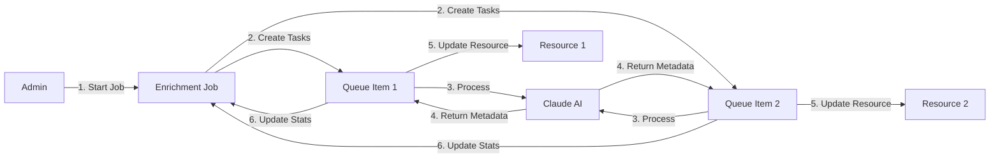

# Database Schema Documentation

Complete database schema documentation for the Awesome Video Resource Viewer application.

## Overview

The application uses **PostgreSQL** (hosted on Neon) as the primary database with **Drizzle ORM** for type-safe database operations and migrations. The schema is designed to support:

- **User authentication** with OAuth and local auth
- **3-level category hierarchy** for resource organization
- **Approval workflow** for user-submitted resources
- **AI-powered enrichment** with batch processing
- **GitHub synchronization** for import/export operations
- **Complete audit trail** of all resource changes
- **Learning journeys** with progress tracking
- **User interactions** for analytics and recommendations

---

## Entity Relationship Diagram

```mermaid
erDiagram
    users ||--o{ resources : "submits/approves"
    users ||--o{ resourceEdits : "submits/handles"
    users ||--o{ userFavorites : "favorites"
    users ||--o{ userBookmarks : "bookmarks"
    users ||--o{ userJourneyProgress : "tracks"
    users ||--o| userPreferences : "has"
    users ||--o{ userInteractions : "performs"
    users ||--o{ resourceAuditLog : "performs"
    users ||--o{ githubSyncHistory : "performs"
    users ||--o{ enrichmentJobs : "starts"

    categories ||--o{ subcategories : "contains"
    subcategories ||--o{ subSubcategories : "contains"

    resources ||--o{ resourceEdits : "has edits"
    resources ||--o{ resourceTags : "tagged with"
    resources ||--o{ journeySteps : "used in"
    resources ||--o{ userFavorites : "favorited by"
    resources ||--o{ userBookmarks : "bookmarked by"
    resources ||--o{ userInteractions : "interacted with"
    resources ||--o{ resourceAuditLog : "logged in"
    resources ||--o{ enrichmentQueue : "enriched by"

    tags ||--o{ resourceTags : "applied to"

    learningJourneys ||--o{ journeySteps : "contains"
    learningJourneys ||--o{ userJourneyProgress : "tracked in"
    journeySteps ||--o| userJourneyProgress : "current step"

    enrichmentJobs ||--o{ enrichmentQueue : "processes"

    users {
        varchar id PK "UUID"
        varchar email UK "unique"
        varchar password "hashed"
        varchar firstName
        varchar lastName
        varchar profileImageUrl
        text role "user|admin|moderator"
        timestamp createdAt
        timestamp updatedAt
    }

    resources {
        serial id PK
        text title
        text url UK "unique"
        text description
        text category
        text subcategory
        text subSubcategory
        text status "pending|approved|rejected|archived"
        varchar submittedBy FK
        varchar approvedBy FK
        timestamp approvedAt
        boolean githubSynced
        timestamp lastSyncedAt
        jsonb metadata
        timestamp createdAt
        timestamp updatedAt
    }

    categories {
        serial id PK
        text name UK
        text slug UK
    }

    subcategories {
        serial id PK
        text name
        text slug
        integer categoryId FK
    }

    subSubcategories {
        serial id PK
        text name
        text slug
        integer subcategoryId FK
    }

    resourceEdits {
        serial id PK
        integer resourceId FK
        varchar submittedBy FK
        text status "pending|approved|rejected"
        timestamp originalResourceUpdatedAt
        jsonb proposedChanges
        jsonb proposedData
        jsonb claudeMetadata
        timestamp claudeAnalyzedAt
        varchar handledBy FK
        timestamp handledAt
        text rejectionReason
        timestamp createdAt
        timestamp updatedAt
    }

    tags {
        serial id PK
        text name UK
        text slug UK
        timestamp createdAt
    }

    resourceTags {
        integer resourceId FK
        integer tagId FK
    }

    learningJourneys {
        serial id PK
        text title
        text description
        text difficulty "beginner|intermediate|advanced"
        text estimatedDuration
        text icon
        integer orderIndex
        text category
        text status "draft|published|archived"
        timestamp createdAt
        timestamp updatedAt
    }

    journeySteps {
        serial id PK
        integer journeyId FK
        integer resourceId FK
        integer stepNumber
        text title
        text description
        boolean isOptional
        timestamp createdAt
    }

    userFavorites {
        varchar userId FK
        integer resourceId FK
        timestamp createdAt
    }

    userBookmarks {
        varchar userId FK
        integer resourceId FK
        text notes
        timestamp createdAt
    }

    userJourneyProgress {
        serial id PK
        varchar userId FK
        integer journeyId FK
        integer currentStepId FK
        jsonb completedSteps "array of step IDs"
        timestamp startedAt
        timestamp lastAccessedAt
        timestamp completedAt
    }

    userPreferences {
        serial id PK
        varchar userId FK
        jsonb preferredCategories
        text skillLevel "beginner|intermediate|advanced"
        jsonb learningGoals
        jsonb preferredResourceTypes
        text timeCommitment "daily|weekly|flexible"
        timestamp createdAt
        timestamp updatedAt
    }

    userInteractions {
        serial id PK
        varchar userId FK
        integer resourceId FK
        text interactionType "view|click|bookmark|rate|complete"
        integer interactionValue "rating or duration"
        jsonb metadata
        timestamp timestamp
    }

    resourceAuditLog {
        serial id PK
        integer resourceId FK "SET NULL on delete"
        integer originalResourceId "never nullified"
        text action "created|updated|approved|rejected|synced|deleted"
        varchar performedBy FK "SET NULL on delete"
        jsonb changes
        text notes
        timestamp createdAt
    }

    githubSyncQueue {
        serial id PK
        text repositoryUrl
        text branch
        jsonb resourceIds
        text action "import|export"
        text status "pending|processing|completed|failed"
        text errorMessage
        jsonb metadata
        timestamp createdAt
        timestamp processedAt
    }

    githubSyncHistory {
        serial id PK
        text repositoryUrl
        text direction "export|import"
        text commitSha
        text commitMessage
        text commitUrl
        integer resourcesAdded
        integer resourcesUpdated
        integer resourcesRemoved
        integer totalResources
        varchar performedBy FK
        jsonb snapshot
        jsonb metadata
        timestamp createdAt
    }

    enrichmentJobs {
        serial id PK
        text status "pending|processing|completed|failed|cancelled"
        text filter "all|unenriched"
        integer batchSize
        integer totalResources
        integer processedResources
        integer successfulResources
        integer failedResources
        integer skippedResources
        jsonb processedResourceIds
        jsonb failedResourceIds
        text errorMessage
        jsonb metadata
        varchar startedBy FK
        timestamp startedAt
        timestamp completedAt
        timestamp createdAt
        timestamp updatedAt
    }

    enrichmentQueue {
        serial id PK
        integer jobId FK
        integer resourceId FK
        text status "pending|processing|completed|failed|skipped"
        integer retryCount
        integer maxRetries
        text errorMessage
        jsonb aiMetadata
        timestamp processedAt
        timestamp createdAt
        timestamp updatedAt
    }

    sessions {
        varchar sid PK
        jsonb sess
        timestamp expire
    }

    awesomeLists {
        serial id PK
        text title
        text description
        text repoUrl
        text sourceUrl
    }
```



---

## Core Tables

### Users Table
**Purpose**: Authentication, authorization, and user management

| Column | Type | Constraints | Description |
|--------|------|-------------|-------------|
| id | varchar | PK, DEFAULT gen_random_uuid() | UUID primary key |
| email | varchar | UNIQUE | User email for login |
| password | varchar | NULL allowed | Hashed password (bcrypt, local auth only) |
| firstName | varchar | | User's first name |
| lastName | varchar | | User's last name |
| profileImageUrl | varchar | | Profile picture URL |
| role | text | DEFAULT 'user' | Role: user, admin, moderator |
| createdAt | timestamp | DEFAULT NOW() | Account creation time |
| updatedAt | timestamp | DEFAULT NOW() | Last profile update |

**Authentication Methods**:
- **Replit OAuth**: email + no password
- **Local Auth**: email + hashed password (development/admin)

**Referenced By**: resources, resourceEdits, userFavorites, userBookmarks, userJourneyProgress, userPreferences, userInteractions, resourceAuditLog, githubSyncHistory, enrichmentJobs

---

### Resources Table
**Purpose**: Core content entity storing curated video resources

| Column | Type | Constraints | Description |
|--------|------|-------------|-------------|
| id | serial | PK | Auto-incrementing primary key |
| title | text | NOT NULL | Resource title |
| url | text | NOT NULL, UNIQUE | Resource URL (prevents duplicates) |
| description | text | NOT NULL, DEFAULT '' | Resource description |
| category | text | NOT NULL | Top-level category |
| subcategory | text | NULL | Second-level category |
| subSubcategory | text | NULL | Third-level category |
| status | text | DEFAULT 'approved' | pending, approved, rejected, archived |
| submittedBy | varchar | FK → users.id, CASCADE | User who submitted |
| approvedBy | varchar | FK → users.id | User who approved |
| approvedAt | timestamp | | Approval timestamp |
| githubSynced | boolean | DEFAULT false | Synced to GitHub? |
| lastSyncedAt | timestamp | | Last GitHub sync time |
| metadata | jsonb | DEFAULT {} | AI enrichment data, tags |
| createdAt | timestamp | DEFAULT NOW() | Creation time |
| updatedAt | timestamp | DEFAULT NOW() | Last modification |

**Indexes**:
- `idx_resources_status` - Fast status filtering
- `idx_resources_status_category` - Combined status + category queries
- `idx_resources_category` - Category browsing

**Approval Workflow**:
1. User submits resource → status = 'pending'
2. Admin reviews → status = 'approved' or 'rejected'
3. If approved, resource becomes visible to public
4. Resources can be archived without deletion

**Referenced By**: resourceEdits, resourceTags, journeySteps, userFavorites, userBookmarks, userInteractions, resourceAuditLog, enrichmentQueue

---

## 3-Level Category Hierarchy

The application implements a flexible 3-level taxonomy for organizing resources:

```
Category (Top-level)
  └── Subcategory (Second-level)
        └── Sub-subcategory (Third-level)
```

### Categories Table
**Purpose**: Top-level taxonomy (e.g., "Frameworks", "Languages", "Tools")

| Column | Type | Constraints | Description |
|--------|------|-------------|-------------|
| id | serial | PK | Auto-incrementing ID |
| name | text | NOT NULL, UNIQUE | Display name |
| slug | text | NOT NULL, UNIQUE | URL-friendly identifier |

### Subcategories Table
**Purpose**: Second-level taxonomy (e.g., "React" under "Frameworks")

| Column | Type | Constraints | Description |
|--------|------|-------------|-------------|
| id | serial | PK | Auto-incrementing ID |
| name | text | NOT NULL | Display name |
| slug | text | NOT NULL | URL-friendly identifier |
| categoryId | integer | FK → categories.id, CASCADE | Parent category |

**Constraints**:
- Unique constraint on `(slug, categoryId)` prevents duplicate subcategories within same category
- Cascades delete when parent category is deleted

### Sub-subcategories Table
**Purpose**: Third-level taxonomy (e.g., "Hooks" under "React" under "Frameworks")

| Column | Type | Constraints | Description |
|--------|------|-------------|-------------|
| id | serial | PK | Auto-incrementing ID |
| name | text | NOT NULL | Display name |
| slug | text | NOT NULL | URL-friendly identifier |
| subcategoryId | integer | FK → subcategories.id, CASCADE | Parent subcategory |

**Constraints**:
- Unique constraint on `(slug, subcategoryId)` prevents duplicate sub-subcategories within same subcategory
- Cascades delete when parent subcategory is deleted

### Hierarchy Example

```
Categories:
  - Frameworks (slug: frameworks)
      Subcategories:
        - React (slug: react)
            Sub-subcategories:
              - Hooks (slug: hooks)
              - State Management (slug: state-management)
        - Vue (slug: vue)
            Sub-subcategories:
              - Composition API (slug: composition-api)
  - Languages (slug: languages)
      Subcategories:
        - JavaScript (slug: javascript)
        - TypeScript (slug: typescript)
```

### Category Assignment in Resources

Resources reference categories using **text fields** (not foreign keys):
- `resources.category` → matches `categories.name`
- `resources.subcategory` → matches `subcategories.name` (optional)
- `resources.subSubcategory` → matches `subSubcategories.name` (optional)

This design allows flexible categorization without enforcing referential integrity, making it easier to:
- Import resources from external sources
- Handle category evolution over time
- Support legacy data with non-standard categories

---

## Resource Edit Suggestions

### Resource Edits Table
**Purpose**: Crowdsourced edit suggestions with AI analysis

| Column | Type | Constraints | Description |
|--------|------|-------------|-------------|
| id | serial | PK | Auto-incrementing ID |
| resourceId | integer | FK → resources.id, NOT NULL | Resource being edited |
| submittedBy | varchar | FK → users.id, NOT NULL | User who suggested edit |
| status | text | DEFAULT 'pending' | pending, approved, rejected |
| originalResourceUpdatedAt | timestamp | NOT NULL | For conflict detection |
| proposedChanges | jsonb | NOT NULL | Field-by-field changes |
| proposedData | jsonb | NOT NULL | Complete proposed data |
| claudeMetadata | jsonb | NULL | AI suggestions |
| claudeAnalyzedAt | timestamp | NULL | When Claude analyzed |
| handledBy | varchar | FK → users.id | Admin who handled edit |
| handledAt | timestamp | | When handled |
| rejectionReason | text | | Reason if rejected |
| createdAt | timestamp | DEFAULT NOW() | Creation time |
| updatedAt | timestamp | DEFAULT NOW() | Last update |

**Indexes**:
- `idx_resource_edits_resource_id` - Find edits for a resource
- `idx_resource_edits_status` - Filter by status
- `idx_resource_edits_submitted_by` - Track user contributions

**Edit Workflow**:
1. User submits edit suggestion
2. Optionally trigger Claude AI analysis for quality suggestions
3. Admin reviews edit and AI recommendations
4. Admin approves (merges changes) or rejects (with reason)

**Claude Metadata Structure**:
```json
{
  "suggestedTitle": "Improved Title",
  "suggestedDescription": "Better description...",
  "suggestedTags": ["react", "hooks", "tutorial"],
  "suggestedCategory": "Frameworks",
  "suggestedSubcategory": "React",
  "confidence": 0.95,
  "keyTopics": ["useState", "useEffect", "custom hooks"]
}
```

---

## Audit Log System

### Resource Audit Log Table
**Purpose**: Complete change history for compliance, debugging, and analytics

| Column | Type | Constraints | Description |
|--------|------|-------------|-------------|
| id | serial | PK | Auto-incrementing ID |
| resourceId | integer | FK → resources.id, SET NULL | Current resource reference |
| originalResourceId | integer | NOT NULL | Original resource ID (never nullified) |
| action | text | NOT NULL | Action type |
| performedBy | varchar | FK → users.id, SET NULL | User who performed action |
| changes | jsonb | | Changed fields and values |
| notes | text | | Optional notes |
| createdAt | timestamp | DEFAULT NOW() | When action occurred |

**Action Types**:
- `created` - Resource was created
- `updated` - Resource metadata was modified
- `approved` - Resource was approved by admin
- `rejected` - Resource was rejected by admin
- `synced` - Resource was synced to/from GitHub
- `deleted` - Resource was deleted

**Design Principles**:

1. **Preserves History After Deletion**
   - `resourceId` uses `SET NULL` on delete (maintains log after resource deletion)
   - `originalResourceId` never changes (preserves original ID for historical reference)
   - Even if a resource is deleted, the audit log remains intact

2. **User Anonymization**
   - `performedBy` uses `SET NULL` on user delete
   - Preserves action history even after user account deletion

3. **Change Tracking**
   - `changes` field stores JSON with old and new values:
   ```json
   {
     "title": { "old": "Old Title", "new": "New Title" },
     "status": { "old": "pending", "new": "approved" }
   }
   ```

**Example Query - Get Resource History**:
```sql
SELECT
  ral.action,
  ral.performedBy,
  ral.changes,
  ral.createdAt,
  u.firstName || ' ' || u.lastName AS performedByName
FROM resource_audit_log ral
LEFT JOIN users u ON ral.performedBy = u.id
WHERE ral.originalResourceId = 123
ORDER BY ral.createdAt DESC;
```

---

## AI Enrichment Queue System

The enrichment system uses a **job-queue pattern** for batch AI analysis of resources.

### Architecture Overview



### Enrichment Jobs Table
**Purpose**: Track batch enrichment operations

| Column | Type | Default | Description |
|--------|------|---------|-------------|
| id | serial | | Job ID |
| status | text | 'pending' | pending, processing, completed, failed, cancelled |
| filter | text | 'all' | all, unenriched |
| batchSize | integer | 10 | Resources per batch |
| totalResources | integer | 0 | Total to process |
| processedResources | integer | 0 | Count processed |
| successfulResources | integer | 0 | Count successful |
| failedResources | integer | 0 | Count failed |
| skippedResources | integer | 0 | Count skipped |
| processedResourceIds | jsonb | [] | Success IDs |
| failedResourceIds | jsonb | [] | Failed IDs |
| errorMessage | text | | Error if job failed |
| metadata | jsonb | {} | Additional data |
| startedBy | varchar | | User who started |
| startedAt | timestamp | | Processing start |
| completedAt | timestamp | | Processing end |
| createdAt | timestamp | NOW() | Creation time |
| updatedAt | timestamp | NOW() | Last update |

**Indexes**:
- `idx_enrichment_jobs_status` - Filter by status
- `idx_enrichment_jobs_started_by` - Track jobs by user

### Enrichment Queue Table
**Purpose**: Individual resource enrichment tasks with retry logic

| Column | Type | Default | Description |
|--------|------|---------|-------------|
| id | serial | | Queue item ID |
| jobId | integer | | Parent job (FK) |
| resourceId | integer | | Resource to enrich (FK) |
| status | text | 'pending' | pending, processing, completed, failed, skipped |
| retryCount | integer | 0 | Retry attempts made |
| maxRetries | integer | 3 | Max retry attempts |
| errorMessage | text | | Error if failed |
| aiMetadata | jsonb | | Claude AI results |
| processedAt | timestamp | | Completion time |
| createdAt | timestamp | NOW() | Creation time |
| updatedAt | timestamp | NOW() | Last update |

**Indexes**:
- `idx_enrichment_queue_job_id` - Find tasks in a job
- `idx_enrichment_queue_resource_id` - Check resource status
- `idx_enrichment_queue_status` - Filter by status

**AI Metadata Structure**:
```json
{
  "suggestedTitle": "React Hooks Tutorial - Complete Guide",
  "suggestedDescription": "Comprehensive video tutorial covering useState, useEffect, and custom hooks in React.",
  "suggestedTags": ["react", "hooks", "tutorial", "frontend"],
  "suggestedCategory": "Frameworks",
  "suggestedSubcategory": "React",
  "confidence": 0.92,
  "keyTopics": ["useState", "useEffect", "useContext", "custom hooks"]
}
```

### Enrichment Workflow

**1. Job Creation**
```
Admin starts enrichment job
  ↓
System queries resources based on filter
  ↓
Creates enrichmentJobs record with status='pending'
  ↓
Creates enrichmentQueue items for each resource
```

**2. Processing**
```
Job status → 'processing'
  ↓
For each queue item (batch processing):
  ├─ Queue item status → 'processing'
  ├─ Fetch resource URL
  ├─ Call Claude AI for analysis
  ├─ Store results in aiMetadata
  ├─ Update resource.metadata
  └─ Queue item status → 'completed' or 'failed'
```

**3. Retry Logic**
```
If enrichment fails:
  ├─ retryCount < maxRetries?
  │   ├─ YES: retryCount++, status='pending'
  │   └─ NO: status='failed', store error
```

**4. Job Completion**
```
All queue items processed
  ↓
Update job statistics:
  - processedResources = completed + failed + skipped
  - successfulResources = completed count
  - failedResources = failed count
  ↓
Job status → 'completed'
completedAt → NOW()
```

### Monitoring Enrichment Progress

**Admin Dashboard Query**:
```sql
SELECT
  ej.id,
  ej.status,
  ej.totalResources,
  ej.processedResources,
  ej.successfulResources,
  ej.failedResources,
  ej.startedAt,
  ej.completedAt,
  (ej.processedResources::float / NULLIF(ej.totalResources, 0) * 100)::int AS progress_percent
FROM enrichment_jobs ej
WHERE ej.status IN ('pending', 'processing')
ORDER BY ej.createdAt DESC;
```

**Failed Items Query**:
```sql
SELECT
  eq.resourceId,
  r.title,
  r.url,
  eq.errorMessage,
  eq.retryCount
FROM enrichment_queue eq
JOIN resources r ON eq.resourceId = r.id
WHERE eq.jobId = 123 AND eq.status = 'failed'
ORDER BY eq.updatedAt DESC;
```

---

## Learning Journeys & Progress Tracking

### Learning Journeys Table
**Purpose**: Curated learning paths

| Column | Type | Description |
|--------|------|-------------|
| id | serial | Journey ID |
| title | text | Journey title |
| description | text | Learning objectives |
| difficulty | text | beginner, intermediate, advanced |
| estimatedDuration | text | e.g., "20 hours" |
| icon | text | Icon identifier |
| orderIndex | integer | Display order |
| category | text | Primary category |
| status | text | draft, published, archived |
| createdAt | timestamp | Creation time |
| updatedAt | timestamp | Last update |

### Journey Steps Table
**Purpose**: Ordered steps in learning paths

| Column | Type | Description |
|--------|------|-------------|
| id | serial | Step ID |
| journeyId | integer | Parent journey (FK) |
| resourceId | integer | Associated resource (FK) |
| stepNumber | integer | Order in journey |
| title | text | Step title |
| description | text | Step instructions |
| isOptional | boolean | Can be skipped? |
| createdAt | timestamp | Creation time |

**Indexes**:
- `idx_journey_steps_journey_id` - Get all steps in a journey
- `idx_journey_steps_resource_id` - Find journeys using a resource

### User Journey Progress Table
**Purpose**: Track user progress through learning paths

| Column | Type | Description |
|--------|------|-------------|
| id | serial | Progress ID |
| userId | varchar | User (FK) |
| journeyId | integer | Journey (FK) |
| currentStepId | integer | Current step (FK) |
| completedSteps | jsonb | Array of step IDs |
| startedAt | timestamp | When started |
| lastAccessedAt | timestamp | Last access |
| completedAt | timestamp | When finished |

**Constraints**:
- Unique on `(userId, journeyId)` - one progress record per user per journey

**Indexes**:
- `idx_user_journey_progress_user_id` - Find user's journeys
- `idx_user_journey_progress_journey_id` - Find users in journey

---

## User Engagement Tables

### User Favorites
**Purpose**: Quick access to favorite resources

| Column | Type | Description |
|--------|------|-------------|
| userId | varchar | User (FK, PK) |
| resourceId | integer | Resource (FK, PK) |
| createdAt | timestamp | When favorited |

Composite primary key prevents duplicate favorites.

### User Bookmarks
**Purpose**: Bookmarked resources with personal notes

| Column | Type | Description |
|--------|------|-------------|
| userId | varchar | User (FK, PK) |
| resourceId | integer | Resource (FK, PK) |
| notes | text | Personal notes |
| createdAt | timestamp | When bookmarked |

Composite primary key prevents duplicate bookmarks.

### User Preferences
**Purpose**: Personalization for AI recommendations

| Column | Type | Default | Description |
|--------|------|---------|-------------|
| id | serial | | Preference ID |
| userId | varchar | | User (FK, unique) |
| preferredCategories | jsonb | [] | Preferred categories |
| skillLevel | text | 'beginner' | Skill level |
| learningGoals | jsonb | [] | Learning objectives |
| preferredResourceTypes | jsonb | [] | Content types |
| timeCommitment | text | 'flexible' | daily, weekly, flexible |
| createdAt | timestamp | NOW() | Creation time |
| updatedAt | timestamp | NOW() | Last update |

**Constraints**:
- Unique on `userId` (one preferences record per user)

### User Interactions
**Purpose**: Behavioral analytics for recommendations

| Column | Type | Description |
|--------|------|-------------|
| id | serial | Interaction ID |
| userId | varchar | User (FK) |
| resourceId | integer | Resource (FK) |
| interactionType | text | view, click, bookmark, rate, complete |
| interactionValue | integer | Rating (1-5) or duration (seconds) |
| metadata | jsonb | Additional data |
| timestamp | timestamp | When occurred |

**Indexes**:
- `idx_user_interactions_user_id` - User behavior analysis
- `idx_user_interactions_resource_id` - Resource popularity
- `idx_user_interactions_type` - Filter by interaction type

---

## GitHub Synchronization

### GitHub Sync Queue Table
**Purpose**: Async import/export operations

| Column | Type | Default | Description |
|--------|------|---------|-------------|
| id | serial | | Queue ID |
| repositoryUrl | text | | GitHub repo URL |
| branch | text | 'main' | Target branch |
| resourceIds | jsonb | [] | Resources to sync |
| action | text | | import, export |
| status | text | 'pending' | pending, processing, completed, failed |
| errorMessage | text | | Error if failed |
| metadata | jsonb | {} | Additional data |
| createdAt | timestamp | NOW() | Queued time |
| processedAt | timestamp | | Completion time |

**Index**: `idx_github_sync_queue_status` - Process queue efficiently

### GitHub Sync History Table
**Purpose**: Version control and rollback

| Column | Type | Default | Description |
|--------|------|---------|-------------|
| id | serial | | History ID |
| repositoryUrl | text | | GitHub repo |
| direction | text | | export, import |
| commitSha | text | | Git commit hash |
| commitMessage | text | | Commit message |
| commitUrl | text | | GitHub commit URL |
| resourcesAdded | integer | 0 | Added count |
| resourcesUpdated | integer | 0 | Updated count |
| resourcesRemoved | integer | 0 | Removed count |
| totalResources | integer | 0 | Total after sync |
| performedBy | varchar | | User who synced |
| snapshot | jsonb | {} | Resource snapshot |
| metadata | jsonb | {} | Additional data |
| createdAt | timestamp | NOW() | Sync time |

**Indexes**:
- `idx_github_sync_history_repo` - Track history by repo
- `idx_github_sync_history_direction` - Filter by import/export

---

## Supporting Tables

### Tags Table
**Purpose**: Flexible cross-cutting resource labels

| Column | Type | Constraints | Description |
|--------|------|-------------|-------------|
| id | serial | PK | Tag ID |
| name | text | NOT NULL, UNIQUE | Display name |
| slug | text | NOT NULL, UNIQUE | URL-friendly |
| createdAt | timestamp | DEFAULT NOW() | Creation time |

### Resource Tags (Junction)
**Purpose**: Many-to-many relationship between resources and tags

| Column | Type | Constraints | Description |
|--------|------|-------------|-------------|
| resourceId | integer | FK → resources.id, PK | Resource |
| tagId | integer | FK → tags.id, PK | Tag |

Composite primary key on `(resourceId, tagId)`.

### Awesome Lists Table
**Purpose**: External curated list references

| Column | Type | Description |
|--------|------|-------------|
| id | serial | List ID |
| title | text | List name |
| description | text | List description |
| repoUrl | text | GitHub repo URL |
| sourceUrl | text | Raw markdown URL |

Used for importing resources from community awesome lists.

### Sessions Table
**Purpose**: HTTP session storage for Passport.js

| Column | Type | Constraints | Description |
|--------|------|-------------|-------------|
| sid | varchar | PK | Session ID |
| sess | jsonb | NOT NULL | Session data |
| expire | timestamp | NOT NULL | Expiration time |

**Index**: `IDX_session_expire` - Efficient expiration cleanup

---

## Key Database Features

### Indexes for Performance

1. **Resource Queries**
   - `idx_resources_status` - Filter approved/pending
   - `idx_resources_status_category` - Browse by category
   - `idx_resources_category` - Category navigation

2. **User Activity**
   - `idx_user_interactions_user_id` - User analytics
   - `idx_user_interactions_resource_id` - Resource analytics
   - `idx_user_journey_progress_user_id` - Progress tracking

3. **Admin Operations**
   - `idx_resource_edits_status` - Pending edits
   - `idx_enrichment_jobs_status` - Job monitoring
   - `idx_github_sync_queue_status` - Queue processing

### Cascade Delete Policies

**CASCADE**: Child records deleted with parent
- categories → subcategories → subSubcategories
- learningJourneys → journeySteps
- enrichmentJobs → enrichmentQueue
- users → userFavorites, userBookmarks, userPreferences

**SET NULL**: Preserve history after deletion
- resourceAuditLog.resourceId (when resource deleted)
- resourceAuditLog.performedBy (when user deleted)

**NO ACTION**: Prevent deletion if referenced
- resources.submittedBy (must keep user if they have resources)

### JSONB Columns for Flexibility

| Table | Column | Purpose |
|-------|--------|---------|
| resources | metadata | AI enrichment data, custom fields |
| resourceEdits | proposedChanges | Field-by-field change tracking |
| resourceEdits | claudeMetadata | AI suggestions |
| enrichmentQueue | aiMetadata | Claude analysis results |
| userPreferences | preferredCategories | Category preferences |
| userInteractions | metadata | Interaction context |
| githubSyncHistory | snapshot | Point-in-time resource state |

---

## Database Migrations

Migrations are managed using **Drizzle Kit**. For detailed migration procedures, upgrade guides, and best practices, see [DATABASE_MIGRATIONS.md](./DATABASE_MIGRATIONS.md).

### Quick Reference

**Push Schema Changes:**
```bash
npm run db:push
```
Pushes schema changes directly to the database (development/prototype mode).

**View Schema:**
```bash
npm run db:studio
```
Opens Drizzle Studio for visual schema exploration.

For production migrations, version upgrades, and troubleshooting, refer to the [Database Migrations Guide](./DATABASE_MIGRATIONS.md).

---

## Common Queries

### Get Resources with Full Category Hierarchy
```typescript
const resources = await db
  .select()
  .from(resources)
  .where(eq(resources.status, 'approved'))
  .orderBy(resources.category, resources.subcategory);
```

### Get User's Journey Progress
```typescript
const progress = await db
  .select()
  .from(userJourneyProgress)
  .innerJoin(learningJourneys, eq(userJourneyProgress.journeyId, learningJourneys.id))
  .where(eq(userJourneyProgress.userId, userId));
```

### Get Pending Enrichment Tasks
```typescript
const tasks = await db
  .select()
  .from(enrichmentQueue)
  .innerJoin(resources, eq(enrichmentQueue.resourceId, resources.id))
  .where(eq(enrichmentQueue.status, 'pending'))
  .limit(10);
```

### Audit Trail for Resource
```typescript
const history = await db
  .select()
  .from(resourceAuditLog)
  .leftJoin(users, eq(resourceAuditLog.performedBy, users.id))
  .where(eq(resourceAuditLog.originalResourceId, resourceId))
  .orderBy(desc(resourceAuditLog.createdAt));
```

---

## Data Integrity Constraints

### Unique Constraints
- `users.email` - One account per email
- `resources.url` - No duplicate resources
- `categories.name`, `categories.slug` - Unique categories
- `subcategories (slug, categoryId)` - Unique within parent
- `subSubcategories (slug, subcategoryId)` - Unique within parent
- `userJourneyProgress (userId, journeyId)` - One progress per journey
- `userPreferences.userId` - One preferences per user

### Foreign Key Constraints
All foreign keys enforce referential integrity with appropriate cascade policies.

### Check Constraints
- `resources.status` ∈ {pending, approved, rejected, archived}
- `resourceEdits.status` ∈ {pending, approved, rejected}
- `userPreferences.skillLevel` ∈ {beginner, intermediate, advanced}
- `learningJourneys.difficulty` ∈ {beginner, intermediate, advanced}

---

## Performance Considerations

1. **Pagination**: All list endpoints use `LIMIT` and `OFFSET` for large result sets
2. **Eager Loading**: Use joins to avoid N+1 queries
3. **Index Coverage**: Critical queries covered by indexes
4. **JSONB Indexing**: Consider GIN indexes for frequently-queried JSONB fields
5. **Connection Pooling**: Drizzle uses connection pooling for PostgreSQL

---

## Backup & Recovery

- **Automated Backups**: Neon provides automatic daily backups
- **Point-in-Time Recovery**: Restore to any point within retention window
- **Audit Log**: Complete change history enables manual rollback
- **GitHub Sync**: Regular exports serve as additional backup

---

## Schema Evolution

When modifying the schema:
1. Update `shared/schema.ts`
2. Generate migration: `npm run db:generate`
3. Review migration SQL in `migrations/`
4. Test migration locally
5. Apply to production: `npm run db:migrate`
6. Update this documentation

---

## Related Documentation

- [ARCHITECTURE.md](./ARCHITECTURE.md) - System architecture overview
- [API.md](./API.md) - API endpoints reference
- [shared/schema.ts](../shared/schema.ts) - TypeScript schema definitions
